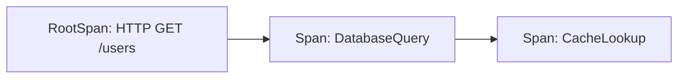

# OpenTelemetry 根Span创建

## 介绍

在分布式系统中，**Span**是OpenTelemetry的核心概念之一，代表一个独立的工作单元（如API请求或数据库调用）。**根Span（Root Span）**是追踪链路的起点，没有父Span，通常由服务的入口点（如HTTP请求处理器）创建。理解根Span的创建是构建完整分布式追踪的基础。

## 核心概念

1. **Span上下文**：包含Trace ID（唯一标识追踪链路）、Span ID（当前Span的唯一标识）和父Span ID（根Span的父ID为空）。
2. **TracerProvider**：用于创建`Tracer`实例的工厂。
3. **Tracer**：实际创建Span的工具。

## 创建根Span的步骤

### 1. 初始化OpenTelemetry
首先需要配置`TracerProvider`（通常全局唯一）：

```javascript
const { NodeTracerProvider } = require('@opentelemetry/sdk-trace-node');
const provider = new NodeTracerProvider();
provider.register(); // 注册为全局TracerProvider
```

### 2. 创建Tracer实例
通过`TracerProvider`获取`Tracer`：

```javascript
const { trace } = require('@opentelemetry/api');
const tracer = trace.getTracer('my-service-tracer');
```

### 3. 创建根Span
使用`tracer.startSpan()`创建根Span（不传递上下文时自动成为根Span）：

```javascript
const rootSpan = tracer.startSpan('HTTP GET /users');
// ...执行业务逻辑
rootSpan.end(); // 必须显式结束Span
```

## 实际案例：Express.js中的根Span

以下是在Express中间件中创建根Span的完整示例：

```javascript
const express = require('express');
const app = express();

app.use((req, res, next) => {
  // 创建根Span（HTTP请求作为追踪起点）
  const span = tracer.startSpan(`HTTP ${req.method} ${req.path}`, {
    attributes: {
      'http.method': req.method,
      'http.path': req.path
    }
  });

  // 将Span上下文注入请求对象
  req.context = trace.setSpan(trace.contextActive(), span);

  res.on('finish', () => {
    span.setAttribute('http.status_code', res.statusCode);
    span.end(); // 请求结束时完成Span
  });

  next();
});
```

## 可视化追踪链路



## 常见问题

:::caution 注意
- **忘记结束Span**：会导致内存泄漏和追踪数据不完整。
- **错误的上下文传播**：手动创建子Span时需确保传递正确的父上下文。
:::

## 总结

根Span是分布式追踪的起点，通过`tracer.startSpan()`创建且不指定父上下文。关键要点：
1. 根Span代表整个追踪链路的初始操作
2. 必须在业务逻辑完成后调用`span.end()`
3. 通过属性（Attributes）记录操作的元数据

## 扩展练习
1. 尝试在Koa或Fastify框架中实现根Span创建
2. 为根Span添加自定义属性（如用户ID或请求体大小）
3. 使用Jaeger或Zipkin查看生成的追踪数据

## 附加资源
- [OpenTelemetry JavaScript文档](https://opentelemetry.io/docs/instrumentation/js/)
- [W3C Trace Context规范](https://www.w3.org/TR/trace-context/)