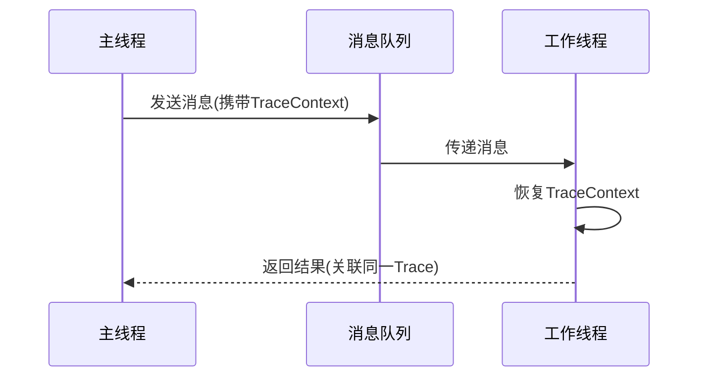

# OpenTelemetry 异步跟踪

## 介绍

在现代分布式系统中，异步操作（如消息队列、定时任务、事件驱动架构）是常见模式。OpenTelemetry提供了对异步代码的跟踪支持，通过**上下文传播**机制确保跨异步边界的调用链路完整。本文将介绍如何在Node.js/Python等语言中实现异步跟踪。

:::note 关键概念
异步跟踪的核心是**上下文保存与恢复**。当一个异步操作被调度时，必须捕获当前上下文；当回调执行时，需恢复上下文以保证跟踪连续性。
:::

## 基础原理

### 上下文传播流程


## 代码示例

### Node.js示例（使用AsyncHooks）

```javascript
const { trace, context } = require('@opentelemetry/api');

async function processOrder(orderId) {
  // 创建新span
  const span = trace.getTracer('shop').startSpan('processOrder');
  
  await context.with(trace.setSpan(context.active(), span), async () => {
    // 异步操作1
    await sendConfirmationEmail();
    
    // 异步操作2
    await updateInventory();
  });
  
  span.end();
}

// 即使在不同事件循环中，上下文仍能保持
async function sendConfirmationEmail() {
  const span = trace.getTracer('shop').startSpan('sendEmail');
  // ...发送逻辑
  span.end();
}
```

### Python示例（多线程场景）

```python
from opentelemetry import trace
from opentelemetry.context import attach, detach

def background_task(context):
    token = attach(context)  # 恢复上下文
    tracer = trace.get_tracer(__name__)
    with tracer.start_as_current_span("async_task"):
        # 执行任务...
    detach(token)

# 主线程
with tracer.start_as_current_span("main"):
    ctx = trace.get_current_span().get_span_context()
    threading.Thread(target=background_task, args=(ctx,)).start()
```

## 实际应用场景

### 案例：电商订单处理
1. 用户下单（HTTP请求生成Trace A）
2. 订单服务异步通知：
   - 库存服务（Trace A继续）
   - 支付服务（Trace A继续）
   - 物流服务（Trace A继续）
3. 所有异步操作在追踪系统中显示为同一调用链

:::warning 常见错误
忘记在异步任务开始时恢复上下文，会导致：
- 新建无关的Trace
- 丢失父子Span关系
- 无法关联业务逻辑
:::

## 最佳实践

1. **上下文传递**：
   - 消息队列：将`TraceContext`注入消息头
   ```javascript
   // RabbitMQ示例
   channel.publish({
     headers: {
       'traceparent': propagation.inject(context.active())
     }
   });
   ```

2. **错误处理**：
   ```python
   async def async_operation():
       span = tracer.start_span("async_op")
       try:
           # 业务逻辑
       except Exception as ex:
           span.record_exception(ex)
           span.set_status(Status(StatusCode.ERROR))
       finally:
           span.end()
   ```

3. **性能考量**：
   - 避免在高频异步操作中创建过多Span
   - 对批处理操作使用单个Span

## 总结

OpenTelemetry的异步跟踪能力使得以下场景成为可能：
- 跨进程/线程的完整调用链
- 消息队列系统的端到端追踪
- 定时任务与主业务的关联分析

关键要点：
- 始终在异步边界传递上下文
- 使用语言特定的上下文管理API（如Node.js的`AsyncLocalStorage`）
- 在SDK配置中启用适当的传播器（如W3C TraceContext）

## 扩展资源

1. 官方文档：
   - [Node.js异步跟踪指南](https://opentelemetry.io/docs/instrumentation/js/async/)
   - [上下文传播规范](https://github.com/open-telemetry/opentelemetry-specification/blob/main/specification/context/README.md)

2. 实践练习：
   - 修改现有代码，使setTimeout回调能继承父Span
   - 实现Kafka消息生产/消费的跟踪关联

3. 调试工具：
   ```bash
   # 查看传播的traceparent
   OTEL_LOG_LEVEL=debug node your-app.js
   ```