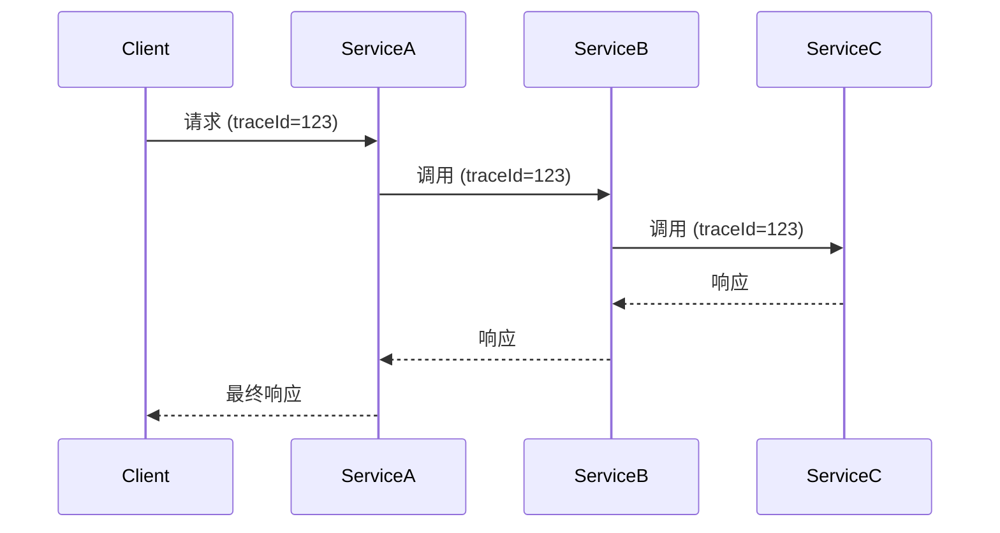

# OpenTelemetry 与微服务

## 介绍

在现代微服务架构中，服务被拆分为多个小型、独立的组件。这种架构虽然提高了灵活性和可扩展性，但也带来了新的挑战——如何跟踪请求在多个服务间的流转？如何快速定位性能瓶颈？OpenTelemetry作为云原生可观测性标准，提供了解决这些问题的工具链。

## 为什么微服务需要OpenTelemetry？

微服务架构的特点包括：
- 服务间通过网络通信
- 单个业务请求可能涉及多个服务
- 故障可能发生在任何服务或网络环节

OpenTelemetry通过以下方式帮助应对这些挑战：
1. **分布式追踪**：可视化请求在服务间的流转路径
2. **指标收集**：监控各服务的性能指标
3. **日志聚合**：统一收集和分析日志数据

## 核心概念

### 1. 分布式追踪

当请求穿过多个服务时，OpenTelemetry会生成一个唯一的`traceId`，并在每个服务中创建`span`记录处理细节。这些span通过`context propagation`（上下文传播）关联起来。



### 2. 上下文传播

OpenTelemetry使用`W3C Trace Context`标准在服务间传递追踪信息。常见的传播方式包括：
- HTTP头（`traceparent`）
- gRPC元数据
- 消息队列属性

## 代码示例

### 基础Node.js微服务追踪

安装所需包：
```bash
npm install @opentelemetry/sdk-node \
            @opentelemetry/auto-instrumentations-node \
            @opentelemetry/exporter-trace-otlp-http
```

初始化追踪：

```javascript
const { NodeSDK } = require('@opentelemetry/sdk-node');
const { getNodeAutoInstrumentations } = require('@opentelemetry/auto-instrumentations-node');
const { OTLPTraceExporter } = require('@opentelemetry/exporter-trace-otlp-http');

const sdk = new NodeSDK({
  traceExporter: new OTLPTraceExporter({
    url: 'http://collector:4318/v1/traces'
  }),
  instrumentations: [getNodeAutoInstrumentations()]
});

sdk.start();
```

### 自定义Span创建

```javascript
const { trace } = require('@opentelemetry/api');

function processOrder(orderId) {
  const tracer = trace.getTracer('order-service');
  return tracer.startActiveSpan('processOrder', (span) => {
    try {
      span.setAttribute('order.id', orderId);
      // 业务逻辑...
      return { status: 'processed' };
    } finally {
      span.end();
    }
  });
}
```

## 实际应用场景

### 电商系统案例

考虑一个包含以下服务的电商系统：
1. 用户服务
2. 商品服务
3. 订单服务
4. 支付服务

使用OpenTelemetry后，我们可以：
1. 追踪从"加入购物车"到"支付完成"的完整流程
2. 识别哪个服务导致延迟（如支付服务响应慢）
3. 分析跨服务的错误传播路径

:::tip 最佳实践
1. 为所有服务使用相同的采样策略
2. 标准化span和属性命名（如`service.name`）
3. 将追踪数据与日志、指标关联
:::

## 总结

OpenTelemetry为微服务架构提供了：
- **端到端可视化**：理解请求在系统中的完整路径
- **性能分析**：识别瓶颈服务
- **故障排查**：快速定位问题根源
- **统一观测**：整合追踪、指标和日志

## 延伸学习

1. 实践：在本地搭建多服务环境并配置OpenTelemetry
2. 探索：将数据导出到Jaeger或Zipkin进行可视化
3. 进阶：研究OpenTelemetry的自动仪表化原理

:::caution 注意
生产环境中应考虑：
- 采样策略以避免数据爆炸
- 敏感数据的过滤
- 导出器的性能影响
:::