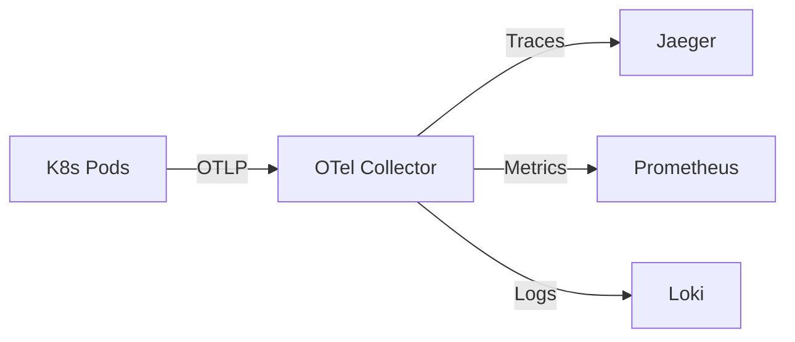
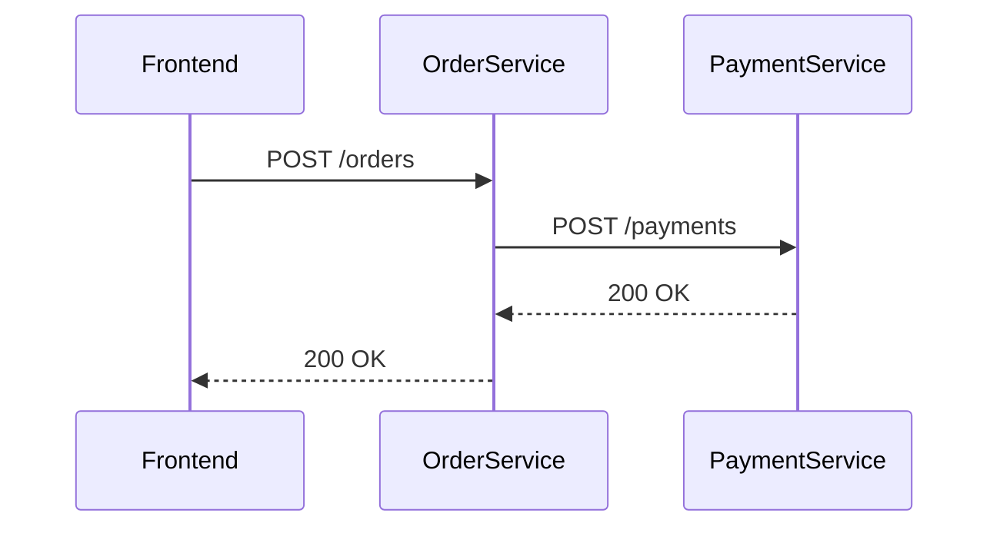

# OpenTelemetry 与Kubernetes

## 介绍

OpenTelemetry（简称OTel）是一个开源的观测性框架，用于生成、收集和管理遥测数据（如追踪、指标和日志）。Kubernetes（K8s）是流行的容器编排平台，两者结合可以构建高度可观测的云原生应用。本文将介绍如何在Kubernetes中部署OpenTelemetry Collector，并通过实际案例展示其应用场景。

## 核心概念

### 1. OpenTelemetry Collector架构
OpenTelemetry Collector是数据处理中枢，包含以下组件：
- **Receivers**：接收数据（如OTLP、Jaeger、Prometheus格式）
- **Processors**：过滤、转换数据（如批量处理、添加属性）
- **Exporters**：导出数据到后端（如Jaeger、Prometheus、日志系统）



### 2. Kubernetes中的部署模式
- **Sidecar模式**：每个Pod部署一个Collector，隔离性强但资源占用高。
- **DaemonSet模式**：每个Node部署一个Collector，资源利用率高。
- **Deployment模式**：集中式Collector服务，适合大规模集群。

## 实践步骤

### 步骤1：安装OpenTelemetry Operator
Kubernetes Operator简化了OTel组件的部署：

```bash
helm repo add open-telemetry https://open-telemetry.github.io/opentelemetry-helm-charts
helm install opentelemetry-operator open-telemetry/opentelemetry-operator
```

### 步骤2：配置Collector
创建`otel-collector.yaml`定义DaemonSet模式的Collector：

```yaml
apiVersion: opentelemetry.io/v1alpha1
kind: OpenTelemetryCollector
metadata:
  name: otel-daemonset
spec:
  mode: daemonset
  config: |
    receivers:
      otlp:
        protocols:
          grpc:
          http:
    processors:
      batch:
    exporters:
      logging:
        logLevel: debug
      jaeger:
        endpoint: "jaeger-all-in-one:14250"
        tls:
          insecure: true
    service:
      pipelines:
        traces:
          receivers: [otlp]
          processors: [batch]
          exporters: [jaeger, logging]
```

:::tip
生产环境中建议启用TLS加密和资源限制（如CPU/内存配额）。
:::

### 步骤3：应用自动注入
通过注解实现自动注入Collector Sidecar：

```yaml
apiVersion: apps/v1
kind: Deployment
metadata:
  name: my-app
spec:
  template:
    metadata:
      annotations:
        instrumentation.opentelemetry.io/inject-sdk: "true"
```

## 实际案例：电商应用监控

### 场景描述
一个包含以下服务的电商应用：
- 前端（React）
- 订单服务（Node.js）
- 支付服务（Java）

### 关键配置
1. **跨服务追踪**：通过`traceparent`头传递上下文
2. **K8s属性增强**：添加Pod名称、Namespace等元数据
   ```yaml
   processors:
     k8sattributes:
       passthrough: true
   ```

### 效果展示
在Jaeger中看到的完整调用链：


## 常见问题解决

:::caution 问题1：数据丢失
**现象**：部分Span未出现在Jaeger中<br />
**解决方案**：
1. 检查Collector日志：`kubectl logs <collector-pod>`
2. 增加批处理超时：
   ```yaml
   processors:
     batch:
       timeout: 10s
   ```
:::

## 总结

通过本文你学到了：
- OpenTelemetry Collector在K8s中的三种部署模式
- 使用Operator简化管理的实践方法
- 如何通过K8s属性增强观测数据

## 进阶练习
1. 尝试将指标数据导出到Prometheus
2. 为Collector配置持久化存储（如使用OpenSearch）
3. 实现基于指标的自动扩缩容（HPA）

## 扩展阅读
- [OpenTelemetry官方Kubernetes指南](https://opentelemetry.io/docs/kubernetes/)
- [Kubernetes观测性最佳实践](https://kubernetes.io/docs/concepts/cluster-administration/system-metrics/)