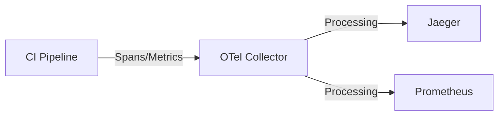

## 介绍

在现代软件开发中，持续集成和持续交付（CI/CD）是快速交付高质量软件的关键实践。而OpenTelemetry作为云原生可观测性的标准，可以帮助团队在CI/CD管道中监控构建、测试和部署过程，快速发现并解决问题。本文将介绍如何将OpenTelemetry与CI/CD工具（如Jenkins、GitHub Actions等）集成，并通过实际案例展示其价值。

## 为什么需要OpenTelemetry in CI/CD?

传统CI/CD管道通常只关注“是否成功”，而缺乏以下问题的答案：
- **构建阶段**：为什么这次构建比上次慢了3分钟？
- **测试阶段**：哪些测试用例耗时最长？是否存在资源竞争？
- **部署阶段**：新版本上线后，性能指标如何变化？

OpenTelemetry通过收集**指标(Metrics)**、**日志(Logs)**和**追踪(Traces)**，为CI/CD管道提供深度洞察。

## 基础集成步骤

### 1. 在CI/CD工具中安装OpenTelemetry Collector

以GitHub Actions为例：

```yaml
# .github/workflows/build.yml
steps:
  - name: Setup OpenTelemetry
    uses: open-telemetry/opentelemetry-action@v1
    with:
      otel_endpoint: "http://your-collector:4317"
```

### 2. 为关键阶段生成追踪

```python
# 构建脚本示例
from opentelemetry import trace

tracer = trace.get_tracer("ci.pipeline.tracer")

def run_tests():
    with tracer.start_as_current_span("run_unit_tests"):
        # 执行测试代码
        pass
```

### 3. 收集并可视化数据

使用如下Mermaid图表示数据流向：



## 实际应用案例

### 案例：优化慢速构建

**问题**：某团队的构建时间从平均5分钟波动到15分钟，但日志未显示明显错误。

**解决方案**：
1. 在构建脚本中添加OpenTelemetry检测：
   ```go
   func build() {
       ctx, span := tracer.Start(context.Background(), "docker_build")
       defer span.End()
       // 添加构建时长属性
       span.SetAttributes(attribute.Int("image.size.mb", 230))
   }
   ```
2. 发现Docker构建阶段耗时异常，进一步追踪显示大镜像下载是瓶颈。
3. 通过优化镜像分层，构建时间恢复至6分钟。

:::tip
在CI中检测环境变量（如`CPU_USAGE`、`MEMORY_LIMIT`）可以帮助区分是代码问题还是基础设施问题。
:::

## 高级模式

### 1. 变更影响分析

通过将`git.commit.id`作为Span属性，可以在部署后直接关联：
- 特定代码提交
- 对应的构建质量
- 生产环境性能变化

```java
Span.current().setAttribute("git.commit", System.getenv("GIT_SHA"));
```

### 2. 自动化质量门禁

在Prometheus中设置警报规则，当关键指标超出阈值时自动终止部署：
```yaml
# prometheus/rules.yml
- alert: HighTestFailureRate
  expr: rate(test_failures_total[5m]) > 0.1
  labels:
    severity: critical
  annotations:
    summary: "Aborting deployment - test failure rate {{ $value }}"
```

## 总结

将OpenTelemetry集成到CI/CD管道中可以：
- 提供构建、测试、部署的**端到端可视化**
- 通过历史数据快速**定位性能退化**
- 实现**基于指标的自动化决策**

## 延伸学习

1. [OpenTelemetry CI/CD Specification](https://opentelemetry.io/docs/concepts/ci-cd/)
2. 练习：在Jenkins中配置OpenTelemetry并追踪一个失败的构建
3. 高级话题：将CI数据与生产环境追踪关联（Deployment Marker）

:::caution
确保CI/CD管道中的OpenTelemetry采样率设置为100%，因为管道数据量通常远小于生产环境。
:::