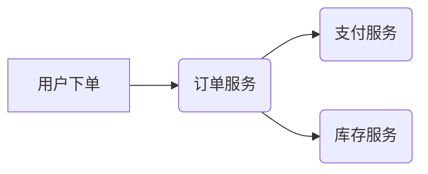

# OpenTelemetry 与云原生应用

## 介绍

OpenTelemetry（简称OTel）是一个**开源的可观测性框架**，用于生成、收集和管理**分布式系统的遥测数据**（如日志、指标和链路追踪）。在云原生应用中，服务通常以微服务架构部署，跨多个容器和节点运行，这使得传统的监控方式难以满足需求。OpenTelemetry通过标准化数据采集和传输，帮助开发者快速定位问题并优化性能。

:::note 关键术语
- **云原生应用**：基于容器、微服务和动态编排（如Kubernetes）构建的应用。
- **可观测性三大支柱**：日志（Logs）、指标（Metrics）、链路追踪（Traces）。
:::

---

## 核心概念

### 1. OpenTelemetry的组件
OpenTelemetry包含以下核心组件：
- **API层**：定义数据采集的接口（如`Span`、`Meter`）。
- **SDK层**：实现API的具体逻辑（如采样、数据导出）。
- **导出器（Exporters）**：将数据发送到后端（如Jaeger、Prometheus）。

### 2. 与云原生的集成
云原生环境的特点（如弹性伸缩、服务网格）要求可观测性工具具备：
- **低侵入性**：通过自动注入（如Sidecar）减少代码修改。
- **多语言支持**：兼容Java、Go、Python等云原生常用语言。
- **动态配置**：适应Kubernetes等编排工具的弹性变化。

---

## 实战示例

### 示例1：在Kubernetes中部署OpenTelemetry Collector
以下是一个将OpenTelemetry Collector作为DaemonSet部署的配置片段：

```yaml
# otel-collector-daemonset.yaml
apiVersion: apps/v1
kind: DaemonSet
metadata:
  name: otel-collector
spec:
  template:
    spec:
      containers:
      - name: otel-collector
        image: otel/opentelemetry-collector
        args: ["--config=/etc/otel-config.yaml"]
        volumeMounts:
        - name: config
          mountPath: /etc/otel-config.yaml
```

:::tip 动态配置
通过ConfigMap动态更新采集规则，无需重启Pod：
```bash
kubectl create configmap otel-config --from-file=otel-config.yaml
```
:::

### 示例2：生成链路追踪（Go语言）
以下代码展示如何在Go微服务中创建链路追踪：

```go
package main

import (
	"context"
	"go.opentelemetry.io/otel"
	"go.opentelemetry.io/otel/exporters/jaeger"
	"go.opentelemetry.io/otel/sdk/trace"
)

func main() {
	// 初始化Jaeger导出器
	exporter, _ := jaeger.New(jaeger.WithCollectorEndpoint())
	tp := trace.NewTracerProvider(trace.WithBatcher(exporter))
	otel.SetTracerProvider(tp)

	// 创建Span
	ctx := context.Background()
	tr := otel.Tracer("example")
	_, span := tr.Start(ctx, "my-operation")
	defer span.End()
}
```

**输出结果**：在Jaeger UI中可以看到名为`my-operation`的Span记录。

---

## 实际应用场景

### 案例：电商平台的订单服务
假设一个电商平台包含以下服务：
1. **订单服务**（Go）
2. **支付服务**（Java）
3. **库存服务**（Python）

通过OpenTelemetry实现全链路追踪：


**解决的问题**：
- 快速定位支付超时是因为库存服务响应缓慢。
- 通过指标发现订单服务的CPU使用率异常升高。

---

## 总结

OpenTelemetry为云原生应用提供了：
1. **标准化**：统一日志、指标、追踪的数据格式。
2. **灵活性**：支持多种后端和分析工具。
3. **低开销**：通过采样和批处理减少性能影响。

---

## 扩展资源
1. [OpenTelemetry官方文档](https://opentelemetry.io/docs/)
2. 练习：在本地Minikube集群中部署OpenTelemetry Collector并导出数据到Prometheus。
3. 进阶：尝试使用`Auto-Instrumentation`自动为Python Flask应用添加追踪。