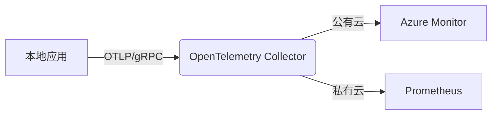
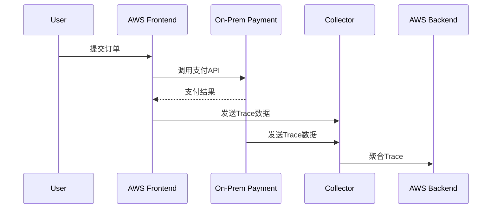

## 介绍

混合云环境结合了公有云和私有云的优势，但也带来了观测性（Observability）的挑战。OpenTelemetry作为云原生观测性工具的标准，能够统一跨异构环境的遥测数据收集。本文将介绍如何利用OpenTelemetry在混合云中实现端到端的可观测性。

:::note 关键概念
- **混合云**：同时使用公有云（如AWS/Azure）和私有云（如本地Kubernetes集群）的架构。
- **OpenTelemetry**：CNCF项目，提供与供应商无关的遥测数据（Traces, Metrics, Logs）收集框架。
:::

## 核心挑战与解决方案

### 挑战1：数据孤岛
混合云中，不同环境的观测数据通常孤立存储。OpenTelemetry通过以下方式解决：
1. **统一协议**：使用OTLP（OpenTelemetry Protocol）作为跨环境传输标准。
2. **标准化SDK**：所有环境使用相同的OpenTelemetry SDK进行插桩。

### 挑战2：网络复杂性


## 实战配置

### 步骤1：安装OpenTelemetry Collector
在所有环境中部署统一的Collector作为数据中转站：
```bash
# 使用Docker安装Collector
docker run -p 4317:4317 otel/opentelemetry-collector \
  --config=file:/etc/otel-config.yaml
```

### 步骤2：混合云配置示例
`otel-config.yaml` 配置片段：
```yaml
receivers:
  otlp:
    protocols:
      grpc:
        endpoint: 0.0.0.0:4317

processors:
  batch:
    timeout: 10s

exporters:
  logging:
    logLevel: debug
  # 公有云导出目标
  otlp/azure:
    endpoint: "otlp.northamerica.azure.com:443"
    tls:
      insecure: false
  # 私有云导出目标
  prometheus:
    endpoint: "private-prometheus:9090"

service:
  pipelines:
    traces:
      receivers: [otlp]
      processors: [batch]
      exporters: [logging, otlp/azure]
    metrics:
      receivers: [otlp]
      processors: [batch]
      exporters: [prometheus]
```

## 真实案例：电商混合云观测

**场景**：
- 前端服务运行在AWS EKS（公有云）
- 支付服务部署在本地OpenShift集群（私有云）

**实现效果**：


通过此配置，可以在Jaeger中看到跨云的完整调用链：
```
TraceID: 7a3b5c8d
├─ AWS Frontend (duration: 120ms)
└─ On-Prem Payment (duration: 80ms)
```

## 总结与进阶

### 关键收获
1. OpenTelemetry Collector是混合云观测的核心枢纽
2. OTLP协议消除了云环境间的协议差异
3. 统一的SDK确保数据模型一致性

### 扩展练习
1. 尝试在Minikube（本地）和Azure AKS中部署服务，并配置跨集群追踪
2. 为混合云环境添加自定义指标（如`cloud.provider`标签）

### 推荐资源
- OpenTelemetry官方文档：混合云部署指南
- CNCF案例研究：跨国企业的混合云可观测性实践
