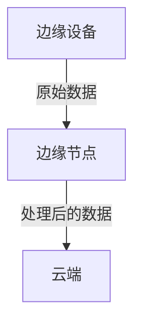

## 介绍

OpenTelemetry是一个开源的观测性框架，用于生成、收集和导出遥测数据（如指标、日志和跟踪）。边缘计算则将计算能力推向数据源附近，以减少延迟和带宽使用。结合两者，可以在分布式边缘环境中实现高效的可观测性。

本文将介绍如何利用OpenTelemetry在边缘计算场景中收集和分析数据，并提供实际示例和最佳实践。

---

## 为什么需要OpenTelemetry与边缘计算？

在边缘计算中，设备分布广泛且可能位于网络条件较差的区域。传统的集中式监控工具难以应对以下挑战：
- **高延迟**：数据上传到云端可能导致延迟。
- **带宽限制**：大量原始数据可能占用过多带宽。
- **离线支持**：边缘设备可能在断网时仍需运行。

OpenTelemetry通过以下方式解决这些问题：
1. **本地数据预处理**：在边缘节点上过滤和聚合数据。
2. **灵活导出**：支持将数据导出到本地存储或云端。
3. **轻量级SDK**：适合资源受限的边缘设备。

---

## 核心概念

### 1. OpenTelemetry组件
- **SDK**：嵌入到应用程序中，用于生成遥测数据。
- **Collector**：接收、处理和导出数据（可在边缘节点运行）。
- **导出器（Exporter）**：将数据发送到后端（如Prometheus、Jaeger）。

### 2. 边缘计算架构
典型的边缘架构分为三层：


---

## 实践示例

### 场景：边缘设备监控
假设有一个边缘设备（如传感器网关），需要监控其温度和网络状态。

#### 1. 安装OpenTelemetry SDK
```python
# 安装Python SDK
pip install opentelemetry-api opentelemetry-sdk opentelemetry-exporter-otlp
```

#### 2. 初始化跟踪和指标
```python
from opentelemetry import metrics, trace
from opentelemetry.sdk.metrics import MeterProvider
from opentelemetry.sdk.trace import TracerProvider

# 设置Provider
trace.set_tracer_provider(TracerProvider())
metrics.set_meter_provider(MeterProvider())
```

#### 3. 收集数据并导出到本地Collector
```python
from opentelemetry.exporter.otlp.proto.grpc.trace_exporter import OTLPSpanExporter
from opentelemetry.sdk.trace.export import BatchSpanProcessor

# 配置导出到本地Collector
exporter = OTLPSpanExporter(endpoint="http://localhost:4317")
span_processor = BatchSpanProcessor(exporter)
trace.get_tracer_provider().add_span_processor(span_processor)
```

#### 4. 在边缘节点运行Collector
```yaml
# otel-collector-config.yaml
receivers:
  otlp:
    protocols:
      grpc:
exporters:
  logging:
    logLevel: debug
service:
  pipelines:
    traces:
      receivers: [otlp]
      exporters: [logging]
```

启动Collector：
```bash
./otelcol --config=otel-collector-config.yaml
```

---

## 实际案例：智能工厂

在智能工厂中，边缘设备（如机械臂）通过OpenTelemetry实现：
1. **实时监控**：跟踪设备状态和故障。
2. **预测性维护**：分析历史指标预测故障。
3. **离线模式**：在网络中断时暂存数据，恢复后同步。

:::tip
边缘计算中建议使用`BatchSpanProcessor`以减少网络调用，而非`SimpleSpanProcessor`。
:::

---

## 总结

OpenTelemetry为边缘计算提供了：
- **低开销**的遥测数据收集。
- **灵活性**：支持多种导出目标和本地处理。
- **标准化**：与云原生工具无缝集成。

---

## 下一步

1. **练习**：在树莓派上部署OpenTelemetry Collector并监控传感器数据。
2. **延伸阅读**：
   - [OpenTelemetry官方文档](https://opentelemetry.io/docs/)
   - [边缘计算架构模式](https://learn.microsoft.com/en-us/azure/architecture/patterns/category/edge)

:::caution
确保边缘设备的资源（CPU/内存）足够运行OpenTelemetry SDK和Collector。
:::