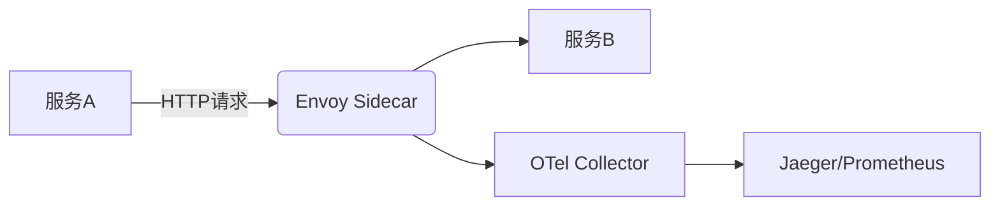

# OpenTelemetry 与服务网格

## 介绍

OpenTelemetry（简称OTel）是云原生领域标准的可观测性框架，而服务网格（如Istio、Linkerd）则管理微服务间的通信。两者的结合能提供**端到端的链路追踪**、**细粒度的指标监控**和**高效的故障排查能力**。本文将逐步讲解如何集成它们，并通过实际案例展示其价值。

:::note 关键概念
- **OpenTelemetry**: 用于生成、收集和导出遥测数据（追踪、指标、日志）。
- **服务网格**: 通过Sidecar代理（如Envoy）控制服务间流量，提供负载均衡、熔断等功能。
:::

---

## 为什么需要集成？

服务网格本身可能提供基础监控（如Istio的Prometheus指标），但存在以下局限性：
1. **数据孤岛**: 网格数据与业务代码的遥测数据分离。
2. **语言限制**: 网格通常只监控网络层，无法深入应用内部（如Java/Python的业务逻辑）。
3. **标准化缺失**: 各网格实现自己的监控格式，难以统一分析。

OpenTelemetry通过以下方式弥补：
- **统一数据模型**: 使用W3C TraceContext标准传递链路信息。
- **多语言支持**: 支持Java、Go、Python等主流语言的SDK。
- **灵活导出**: 数据可发送至Jaeger、Prometheus等后端。

---

## 集成方案

### 方案1：Sidecar自动注入（推荐）
服务网格的Sidecar（如Envoy）可自动捕获网络层遥测数据，再通过OTel Collector统一处理。



### 方案2：应用层手动集成
在业务代码中显式调用OTel SDK，补充网格未覆盖的上下文（如数据库调用）。

```go
// Go示例：创建自定义Span
func handleRequest(ctx context.Context) {
  tracer := otel.Tracer("serviceA")
  ctx, span := tracer.Start(ctx, "business-logic")
  defer span.End()
  // 业务逻辑...
}
```

---

## 实战案例：Istio + OpenTelemetry

### 步骤1：启用Istio的OTel集成
在Istio配置中启用OpenTelemetry导出：
```yaml
# istio-config.yaml
meshConfig:
  defaultProviders:
    tracing: ["otel"]
  extensionProviders:
  - name: otel
    opentelemetry:
      service: otel-collector.observability.svc.cluster.local
      port: 4317
```

### 步骤2：部署OTel Collector
```yaml
# otel-collector.yaml
receivers:
  otlp:
    protocols:
      grpc:
exporters:
  jaeger:
    endpoint: "jaeger:14250"
service:
  pipelines:
    traces:
      receivers: [otlp]
      exporters: [jaeger]
```

### 步骤3：验证结果
1. 发送请求到服务网格内的应用。
2. 在Jaeger中查看**完整的调用链**，包含：
   - Envoy生成的网络层Span（如`istio-ingressgateway`）
   - 应用层自定义Span（如`checkout-service`）

---

## 常见问题

:::warning 注意
- **性能影响**: 全采样可能增加延迟，建议生产环境使用动态采样。
  ```python
  # Python动态采样示例
  from opentelemetry.sdk.trace.sampling import DynamicSampler
  sampler = DynamicSampler(rate=0.1)  # 10%采样率
  ```
- **数据冗余**: 网格和应用可能生成重复Span，需在Collector中过滤。
:::

---

## 总结与练习

### 核心收获
1. 服务网格提供基础设施层的可观测性，而OTel补充应用层细节。
2. 两者集成后能实现**跨服务的全栈追踪**。

### 练习建议
1. 在本地KinD集群中部署Istio + OTel Collector。
2. 修改示例代码，添加一个自定义Span（如`payment-processing`）。
3. 尝试在Jaeger中对比有无自定义Span的差异。

### 扩展阅读
- [Istio Telemetry官方文档](https://istio.io/latest/docs/tasks/observability/)
- [OpenTelemetry服务网格集成规范](https://opentelemetry.io/docs/concepts/integrations/)