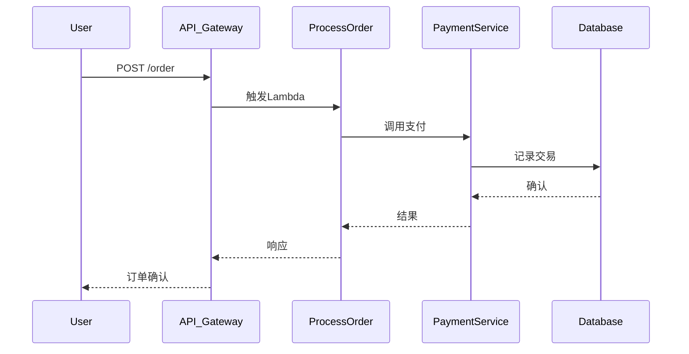

## 介绍

无服务器架构（Serverless）通过事件驱动的方式运行代码，无需管理底层基础设施。然而，其短暂的运行时间和动态扩展特性使得传统的监控工具难以适用。OpenTelemetry作为云原生可观测性标准，能够无缝集成无服务器环境，提供**分布式追踪**、**指标**和**日志**的统一收集方案。

:::note 核心概念
- **无服务器架构**：按需执行代码片段（如AWS Lambda、Azure Functions），无需管理服务器。
- **OpenTelemetry**：CNCF开源项目，提供与供应商无关的观测数据（Traces, Metrics, Logs）采集SDK和协议。
:::

---

## 为什么需要OpenTelemetry？

在无服务器环境中，函数实例可能仅存在几毫秒，传统监控工具无法捕捉完整生命周期。OpenTelemetry通过以下方式解决：
1. **轻量级SDK**：低开销集成到函数代码中。
2. **上下文传播**：跨函数调用的请求链路追踪。
3. **自动导出器**：将数据发送到后端（如Jaeger、Prometheus）。

---

## 集成步骤

### 1. 安装OpenTelemetry SDK

以Node.js的AWS Lambda为例：

```javascript
// 安装依赖
const { NodeTracerProvider } = require('@opentelemetry/sdk-trace-node');
const { AWSXRayPropagator } = require('@opentelemetry/propagator-aws-xray');
const { SimpleSpanProcessor } = require('@opentelemetry/sdk-trace-base');
const { OTLPTraceExporter } = require('@opentelemetry/exporter-trace-otlp-grpc');

// 初始化Tracer
const provider = new NodeTracerProvider();
provider.register({
  propagator: new AWSXRayPropagator()
});

// 配置导出到Jaeger
const exporter = new OTLPTraceExporter({ url: 'http://jaeger:4317' });
provider.addSpanProcessor(new SimpleSpanProcessor(exporter));
```

### 2. 包装Lambda函数

```javascript
const { trace } = require('@opentelemetry/api');

exports.handler = async (event) => {
  const tracer = trace.getTracer('lambda-tracer');
  return tracer.startActiveSpan('main-handler', (span) => {
    try {
      // 业务逻辑
      span.setAttribute('event', JSON.stringify(event));
      return { statusCode: 200 };
    } finally {
      span.end();
    }
  });
};
```

---

## 实际案例：电商订单处理

假设一个无服务器架构的订单处理流程：



通过OpenTelemetry追踪，可以可视化每个环节的延迟和错误，例如：
- 发现`PaymentService`的冷启动延迟过高。
- 追踪到数据库超时是由于连接池不足。

---

## 最佳实践

1. **采样策略**：在无服务器中启用动态采样，避免高流量时成本激增。
   ```javascript
   const { ParentBasedSampler, TraceIdRatioBasedSampler } = require('@opentelemetry/core');
   provider.addSpanProcessor(new SimpleSpanProcessor(exporter, {
     sampler: new ParentBasedSampler({
       root: new TraceIdRatioBasedSampler(0.1) // 10%采样率
     })
   }));
   ```

2. **指标聚合**：使用`OpenTelemetry Metrics API`统计函数执行时间和内存使用。

3. **日志关联**：通过`Trace ID`将日志与追踪关联。

:::warning 注意
避免在函数代码中存储状态！OpenTelemetry导出器应配置为异步模式，防止阻塞函数返回。
:::

---

## 总结

OpenTelemetry为无服务器架构提供了：
- **端到端可视化**：跨服务的请求链路追踪。
- **资源优化依据**：通过指标识别性能瓶颈。
- **故障排查能力**：结合日志和追踪快速定位问题。

---

## 扩展练习

1. 在AWS Lambda中部署OpenTelemetry Collector，将数据转发到Prometheus。
2. 尝试在Azure Functions中实现Python版的自动埋点。

## 推荐资源
- [OpenTelemetry官方文档](https://opentelemetry.io/docs/)
- [Serverless架构模式](https://serverlessland.com/patterns)