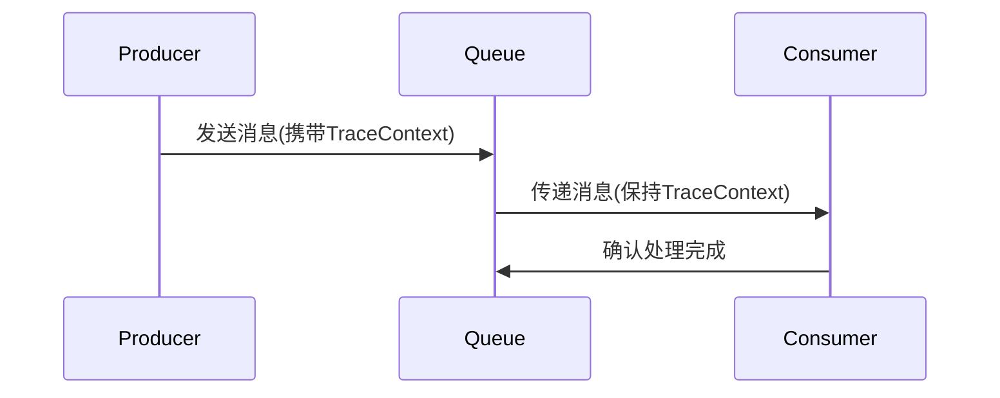
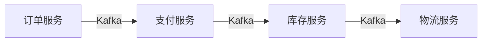

# OpenTelemetry 与消息队列

## 介绍

在现代分布式系统中，消息队列（如Kafka、RabbitMQ）是解耦服务的关键组件。OpenTelemetry作为云原生可观测性标准，可以无缝追踪消息的生产、传递和消费过程。本文将介绍如何通过OpenTelemetry实现消息队列的端到端追踪。

:::note 为什么需要追踪消息队列？
- 定位消息丢失或重复问题
- 分析消息处理延迟瓶颈
- 可视化服务间的异步依赖关系
:::

## 核心概念

### 1. 传播上下文（Context Propagation）

消息队列场景中，OpenTelemetry通过`Trace Context`在消息头中注入追踪信息：



### 2. 语义约定（Semantic Conventions）

OpenTelemetry定义了消息队列的标准属性：
- `messaging.system`: 队列类型（kafka/rabbitmq等）
- `messaging.destination`: 队列/主题名称
- `messaging.operation`: 生产/消费操作

## 代码实现示例

### Python示例（使用Kafka）

#### 生产者端
```python
from opentelemetry import trace
from opentelemetry.propagate import inject
from kafka import KafkaProducer

producer = KafkaProducer(bootstrap_servers='localhost:9092')
tracer = trace.get_tracer(__name__)

def send_message(topic, message):
    with tracer.start_as_current_span("produce_message") as span:
        headers = []
        # 注入追踪上下文到消息头
        inject(headers)
        producer.send(
            topic, 
            value=message.encode(),
            headers=headers
        )
        span.set_attributes({
            "messaging.system": "kafka",
            "messaging.destination": topic
        })
```

#### 消费者端
```python
from opentelemetry import trace
from opentelemetry.propagate import extract
from kafka import KafkaConsumer

consumer = KafkaConsumer('my_topic')
tracer = trace.get_tracer(__name__)

for msg in consumer:
    headers = dict(msg.headers)
    ctx = extract(headers)
    
    with tracer.start_as_current_span(
        "consume_message",
        context=ctx
    ) as span:
        process_message(msg.value)
        span.set_attributes({
            "messaging.system": "kafka",
            "messaging.destination": msg.topic,
            "messaging.message_id": msg.offset
        })
```

## 实际应用场景

### 电商订单处理系统


通过OpenTelemetry可以：
1. 追踪订单在各个环节的状态
2. 发现哪个服务处理消息最慢
3. 当订单卡顿时快速定位问题环节

## 常见问题排查

:::warning 注意上下文丢失
如果发现追踪链断裂，检查：
- 消息头是否完整传递
- 消费者是否正确提取上下文
- 中间件是否过滤了自定义头
:::

## 总结

通过本文你学会了：
- OpenTelemetry如何与消息队列集成
- 上下文传播的实际实现方式
- 消息队列的标准语义属性
- 真实场景中的问题排查方法

## 扩展练习

1. 尝试在RabbitMQ中实现相同的追踪逻辑
2. 在Jaeger中观察消息的端到端追踪
3. 为消息处理延迟添加自定义指标

## 附加资源

- [OpenTelemetry消息队列规范](https://github.com/open-telemetry/opentelemetry-specification/blob/main/specification/trace/semantic_conventions/messaging.md)
- [Kafka客户端自动检测库](https://opentelemetry.io/docs/instrumentation/python/kafka/)