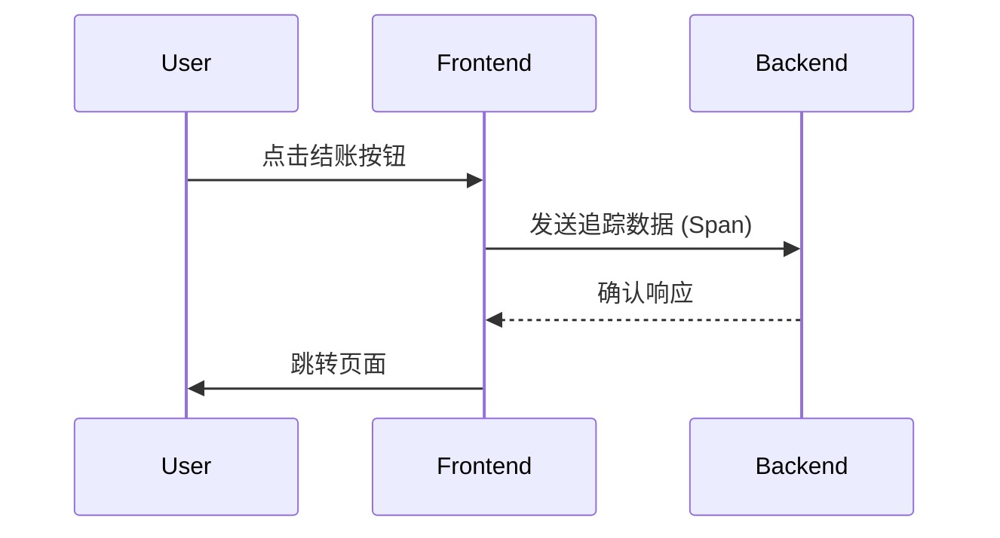

## 引言

OpenTelemetry 是一个开源的观测性框架，用于生成、收集和导出遥测数据（如指标、日志和追踪）。它不仅适用于后端服务，还能完美集成到前端应用中，帮助开发者监控用户行为、性能问题和错误。本文将介绍如何在前端项目中集成 OpenTelemetry，并展示其实际应用场景。

---

## 为什么需要前端监控？

前端监控能帮助开发者：
- 追踪页面加载性能
- 捕获用户交互行为
- 诊断运行时错误
- 分析用户体验瓶颈

通过 OpenTelemetry，这些数据可以统一收集并与后端服务关联，形成完整的请求链路追踪。

---

## 基础概念

### 1. OpenTelemetry 的核心组件
- **Tracer**：用于创建分布式追踪的 Span。
- **Meter**：用于记录指标（如页面加载时间）。
- **Context Propagation**：在前后端之间传递追踪上下文（如通过 HTTP Headers）。

### 2. 前端监控数据类型
- **自动收集数据**：页面加载时间、资源加载、AJAX 请求。
- **手动收集数据**：用户点击、自定义业务逻辑事件。

---

## 集成 OpenTelemetry 到前端

### 1. 安装依赖
```bash
npm install @opentelemetry/api @opentelemetry/sdk-trace-web @opentelemetry/auto-instrumentations-web
```

### 2. 初始化 OpenTelemetry
以下是一个基础配置示例：
```javascript
import { WebTracerProvider } from '@opentelemetry/sdk-trace-web';
import { DocumentLoadInstrumentation } from '@opentelemetry/instrumentation-document-load';
import { UserInteractionInstrumentation } from '@opentelemetry/instrumentation-user-interaction';
import { registerInstrumentations } from '@opentelemetry/instrumentation';

// 创建 Tracer Provider
const provider = new WebTracerProvider();

// 注册自动检测工具
registerInstrumentations({
  instrumentations: [
    new DocumentLoadInstrumentation(),
    new UserInteractionInstrumentation(),
  ],
});

// 启动 OpenTelemetry
provider.register();
```

### 3. 手动创建 Span
```javascript
import { trace } from '@opentelemetry/api';

const tracer = trace.getTracer('my-frontend-app');

// 记录用户点击事件
function handleButtonClick() {
  const span = tracer.startSpan('button-click');
  span.setAttribute('button.id', 'submit-btn');
  
  // 模拟业务逻辑
  setTimeout(() => {
    span.end();
  }, 1000);
}
```

---

## 实际案例：追踪页面性能

### 场景描述
假设你需要监控用户从首页到结账页面的加载时间和交互延迟。

### 实现步骤
1. **自动收集页面加载数据**：
   ```javascript
   // 初始化时启用 DocumentLoadInstrumentation
   registerInstrumentations({
     instrumentations: [new DocumentLoadInstrumentation()],
   });
   ```

2. **手动记录关键业务事件**：
   ```javascript
   // 在结账按钮点击时记录事件
   checkoutButton.addEventListener('click', () => {
     const span = tracer.startSpan('checkout-start');
     span.setAttribute('payment.method', 'credit-card');
   });
   ```

3. **可视化结果**：
   数据会通过 OpenTelemetry Collector 导出到后端（如 Jaeger 或 Prometheus），最终显示为类似下图：



---

## 注意事项

:::caution
1. **隐私合规**：确保不收集敏感用户数据（如输入内容）。
2. **性能开销**：避免在高频事件（如鼠标移动）上创建过多 Span。
3. **采样策略**：在生产环境中配置采样率以减少数据量。
:::

---

## 总结

通过 OpenTelemetry，前端开发者可以：
- 统一前后端监控数据
- 快速定位性能瓶颈
- 提升用户体验分析能力

### 下一步练习
1. 尝试在 React/Vue 项目中集成 OpenTelemetry。
2. 配置将数据导出到 Jaeger 并查看追踪链路。
3. 实现一个自定义 Instrumentation 来监控特定组件。

### 扩展阅读
- [OpenTelemetry 官方文档](https://opentelemetry.io/docs/)
- [前端监控最佳实践](https://developer.mozilla.org/en-US/docs/Web/Performance/Monitoring)