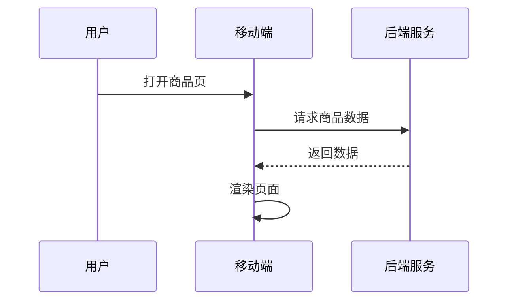

## 引言

OpenTelemetry（简称OTel）是一个开源的观测性框架，用于生成、收集和导出遥测数据（如追踪、指标和日志）。在移动应用开发中，通过集成OpenTelemetry，开发者可以全面监控应用性能、用户行为及后端服务依赖，快速定位问题并优化体验。本文将介绍如何在iOS和Android应用中集成OpenTelemetry，并通过实际案例展示其价值。

## 核心概念

### 1. 移动监控的三要素
OpenTelemetry为移动应用提供以下观测能力：
- **分布式追踪**：记录请求在移动端、后端服务间的流转路径。
- **指标收集**：监控CPU、内存、网络请求耗时等关键指标。
- **日志关联**：将日志与特定请求或用户会话关联。

### 2. 移动端特殊考量
移动环境与服务器端不同，需注意：
- 网络不稳定性
- 设备资源限制
- 用户隐私合规（如GDPR）

## 集成步骤

### Android端配置示例
以下是在Android应用中添加OpenTelemetry的步骤：

1. 添加依赖（`build.gradle`）：
```kotlin
dependencies {
    implementation 'io.opentelemetry:opentelemetry-sdk:1.25.0'
    implementation 'io.opentelemetry:opentelemetry-exporter-otlp:1.25.0'
}
```

2. 初始化SDK：
```kotlin
val sdk = OpenTelemetrySdk.builder()
    .setTracerProvider(
        SdkTracerProvider.builder()
            .addSpanProcessor(BatchSpanProcessor.builder(OtlpGrpcSpanExporter.builder().build()).build())
    .build()
```

### iOS端配置示例
通过Swift Package Manager添加依赖：
1. 在Xcode中添加包依赖：
   ```
   https://github.com/open-telemetry/opentelemetry-swift
   ```

2. 初始化代码：
```swift
import OpenTelemetryApi
import OpenTelemetrySdk

let exporter = OtlpHttpTraceExporter(endpoint: "https://collector.example.com")
let spanProcessor = SimpleSpanProcessor(spanExporter: exporter)
OpenTelemetry.registerTracerProvider(
    tracerProvider: TracerProviderBuilder()
        .add(spanProcessor: spanProcessor)
        .build()
)
```

## 实际案例：电商应用监控

### 场景描述
一个电商App需要监控以下行为：
1. 商品页加载耗时
2. 支付流程的失败率
3. 网络请求错误分类

### 关键代码实现
在商品页添加自定义Span：
```kotlin
// Android示例
val tracer = sdk.getTracer("com.example.shop")
val span = tracer.spanBuilder("ProductDetailLoad").startSpan()
try {
    // 加载商品数据...
    span.setAttribute("product.id", "12345")
} finally {
    span.end()
}
```

### 可视化效果
通过Jaeger查看追踪数据：


## 最佳实践

:::tip 移动端优化建议
1. **采样策略**：在低端设备上降低采样率
2. **批处理上报**：减少网络请求次数
3. **敏感数据过滤**：自动移除用户个人信息
:::

## 总结

OpenTelemetry为移动应用提供了标准化的观测方案，通过本文的学习，你应该能够：
- 理解移动监控的核心需求
- 在Android/iOS应用中集成OTel SDK
- 通过实际案例验证监控效果

## 扩展资源

1. [OpenTelemetry官方文档](https://opentelemetry.io/docs/)
2. 练习：为你的App添加一个"用户登录耗时"监控Span
3. 社区工具推荐：
   - Jaeger（追踪可视化）
   - Prometheus（指标存储）
``` 

注意：实际使用时请移除代码块外的```mdx标记，此处仅用于展示格式要求。所有代码片段均使用``包裹，mermaid图表使用