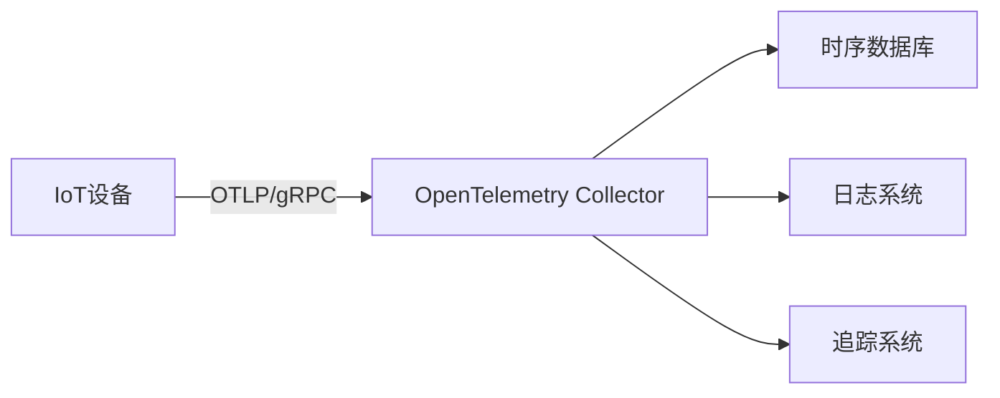

# OpenTelemetry 与IoT设备监控

## 介绍

OpenTelemetry 是一个开源的观测性框架，用于生成、收集和管理遥测数据（如指标、日志和追踪）。在物联网(IoT)场景中，设备数量庞大且分布广泛，传统的监控手段难以满足需求。通过OpenTelemetry，我们可以标准化设备数据的采集和分析流程，实现高效的设备监控。

本教程将介绍如何利用OpenTelemetry监控IoT设备，包括：
- 设备数据的自动收集
- 跨设备请求的分布式追踪
- 实时指标可视化

## 核心概念

### 1. IoT监控的挑战
IoT设备通常具有以下特点：
- 资源受限（低功耗、低算力）
- 网络条件不稳定
- 协议多样化（MQTT、CoAP等）

OpenTelemetry通过轻量级的SDK和标准化协议（如OTLP）解决了这些问题。

### 2. OpenTelemetry组件


## 实战配置

### 1. 设备端SDK安装
以Python为例（适用于Raspberry Pi等设备）：

```python
# 安装SDK
pip install opentelemetry-api opentelemetry-sdk opentelemetry-exporter-otlp

# 基础配置
from opentelemetry import trace
from opentelemetry.sdk.trace import TracerProvider
from opentelemetry.sdk.resources import Resource
from opentelemetry.exporter.otlp.proto.grpc.trace_exporter import OTLPSpanExporter

resource = Resource(attributes={
    "service.name": "iot-device-123",
    "device.model": "RPi-4"
})

trace.set_tracer_provider(TracerProvider(resource=resource))
otlp_exporter = OTLPSpanExporter(endpoint="http://collector:4317")
trace.get_tracer_provider().add_span_processor(
    BatchSpanProcessor(otlp_exporter)
```

### 2. 收集器配置
`collector-config.yaml`示例：

```yaml
receivers:
  otlp:
    protocols:
      grpc:
      http:

processors:
  batch:
    timeout: 10s

exporters:
  logging:
    logLevel: debug
  prometheus:
    endpoint: "0.0.0.0:8889"

service:
  pipelines:
    traces:
      receivers: [otlp]
      processors: [batch]
      exporters: [logging]
    metrics:
      receivers: [otlp]
      processors: [batch]
      exporters: [prometheus]
```

## 实际案例：智能农业监控

### 场景描述
监控分布在农田中的传感器节点，采集：
- 土壤湿度（指标）
- 设备状态（日志）
- 数据传输路径（追踪）

### 关键代码实现
```python
from opentelemetry import metrics

meter = metrics.get_meter("agriculture.monitor")
soil_moisture = meter.create_gauge(
    name="soil.moisture",
    description="Current soil moisture level",
    unit="%"
)

# 模拟数据更新
def update_sensor(value):
    soil_moisture.set(value, {"location": "field-A12"})
    print(f"Updated moisture: {value}%")
```

## 数据可视化

:::tip
使用Grafana + Prometheus的组合可以创建如下仪表板：
- 设备在线状态地图
- 历史数据趋势图
- 异常告警面板
```

## 总结

通过本教程，你学会了：
1. OpenTelemetry在IoT场景中的核心价值
2. 设备端SDK的基础配置方法
3. 收集器的管道配置
4. 实际农业监控案例的实现

## 扩展练习

1. 尝试在ESP32等微控制器上部署轻量级SDK
2. 创建包含温度/湿度指标的复合仪表板
3. 实现基于追踪数据的网络拓扑分析

## 附加资源

- [OpenTelemetry官方文档](https://opentelemetry.io/docs/)
- [IoT设备最佳实践指南](https://github.com/open-telemetry/opentelemetry-io)
- [MQTT协议集成示例](https://github.com/open-telemetry/opentelemetry-python-contrib/tree/main/examples/mqtt)