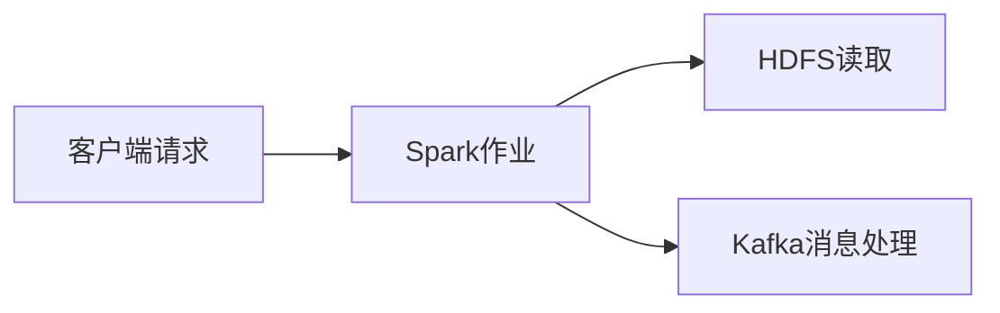
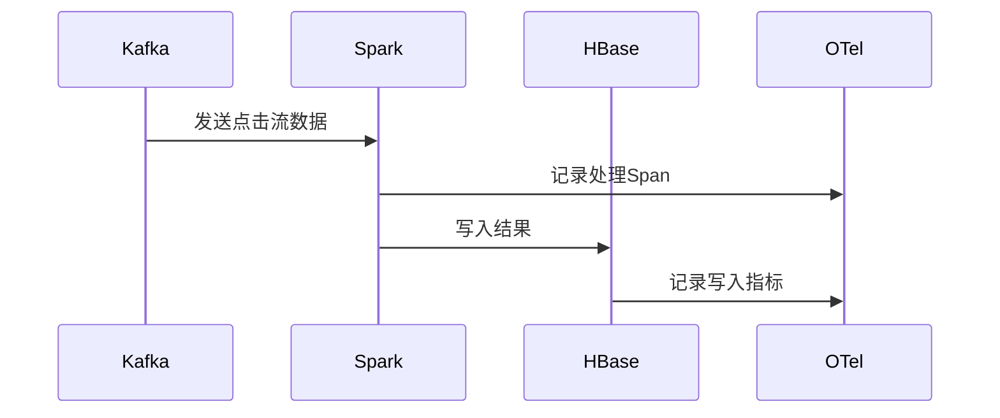

# OpenTelemetry 与大数据系统

## 介绍

OpenTelemetry是一个开源的观测性框架，用于生成、收集和导出遥测数据（如追踪、指标和日志）。在大数据系统中，由于数据处理的分布式特性，观测性尤为重要。本文将介绍如何利用OpenTelemetry监控大数据系统，并通过实际案例展示其应用。

## 为什么需要OpenTelemetry？

大数据系统通常由多个组件（如Hadoop、Spark、Kafka等）组成，这些组件分布在不同的节点上。传统的监控工具难以覆盖整个系统的观测需求，而OpenTelemetry提供了统一的解决方案：

1. **分布式追踪**：跟踪请求在多个服务间的流转路径。
2. **指标收集**：监控系统性能（如延迟、吞吐量）。
3. **日志聚合**：集中管理分散的日志数据。

## 核心概念

### 1. 分布式追踪

在大数据系统中，一个作业可能跨越多个服务。OpenTelemetry通过`Span`（单个操作）和`Trace`（一组关联的Span）来建模这种关系。



### 2. 指标与日志

- **指标**：如Spark Executor的CPU使用率、Kafka队列积压量。
- **日志**：通过OpenTelemetry Collector统一收集，关联到特定Trace。

## 代码示例：Spark集成

以下是一个使用OpenTelemetry监控PySpark作业的示例：

```python
from opentelemetry import trace
from opentelemetry.sdk.trace import TracerProvider
from opentelemetry.sdk.trace.export import BatchSpanProcessor
from opentelemetry.exporter.otlp.proto.grpc.trace_exporter import OTLPSpanExporter

# 初始化OpenTelemetry
trace.set_tracer_provider(TracerProvider())
tracer = trace.get_tracer(__name__)
span_processor = BatchSpanProcessor(OTLPSpanExporter())
trace.get_tracer_provider().add_span_processor(span_processor)

# 在Spark作业中使用
def process_data(df):
    with tracer.start_as_current_span("process_data"):
        # 数据处理逻辑
        result = df.groupBy("category").count()
        return result
```

**输出结果**：  
在Jaeger或Zipkin等工具中，可以看到完整的作业执行链路。

## 实际案例：电商数据分析平台

### 场景描述
一个电商平台使用Spark分析用户行为数据，流程如下：
1. 从Kafka消费点击流数据
2. 用Spark进行聚合计算
3. 结果写入HBase

### OpenTelemetry 实现
1. **追踪Kafka消费**：记录消息处理延迟。
2. **监控Spark阶段**：标记慢任务。
3. **HBase写入指标**：跟踪写入耗时。



## 总结

通过OpenTelemetry，大数据系统可以获得：
- **端到端可见性**：追踪数据流经的所有组件。
- **性能优化依据**：定位瓶颈（如慢查询）。
- **统一观测**：整合追踪、指标和日志。

## 扩展资源

1. [OpenTelemetry官方文档](https://opentelemetry.io/docs/)
2. [Spark与OpenTelemetry集成指南](https://spark.apache.org/docs/latest/monitoring.html)
3. 练习：尝试在本地Spark作业中添加OpenTelemetry追踪。

:::tip
使用OpenTelemetry Collector可以轻松将数据导出到Prometheus、Jaeger等后端，无需修改应用代码！
:::