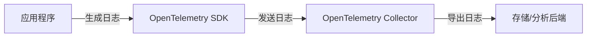

# OpenTelemetry 日志概述

## 介绍

OpenTelemetry（简称OTel）是一个开源的**可观测性框架**，用于生成、收集和管理**日志（Logs）**、**指标（Metrics）**和**追踪（Traces）**。本文将重点介绍其中的**日志**功能，帮助初学者理解如何通过OpenTelemetry实现高效的日志整合与分析。

日志是记录应用程序运行时事件的关键工具，而OpenTelemetry提供了一种标准化的方式，将日志与其他可观测性数据（如指标和追踪）关联起来，从而简化问题排查和系统监控。

:::note
**关键术语**：
- **日志（Logs）**：记录离散事件的文本数据（如错误消息、调试信息）。
- **OpenTelemetry Collector**：负责接收、处理和导出日志数据的核心组件。
:::

---

## 核心概念

### 1. 日志数据模型
OpenTelemetry的日志数据模型基于以下字段：
- **时间戳（Timestamp）**：事件发生的时间。
- **严重程度（Severity）**：如 `INFO`、`ERROR`、`DEBUG`。
- **消息体（Body）**：日志的具体内容。
- **属性（Attributes）**：键值对形式的附加上下文（如 `user_id=123`）。

示例日志结构：
```json
{
  "timestamp": "2023-10-01T12:00:00Z",
  "severity": "ERROR",
  "body": "Failed to connect to database",
  "attributes": {
    "service.name": "auth-service",
    "error.code": "DB_CONN_REFUSED"
  }
}
```

### 2. 日志收集流程
OpenTelemetry的日志处理流程分为三步：
1. **日志生成**：应用程序通过SDK或日志库（如Winston、Log4j）发出日志。
2. **日志收集**：OpenTelemetry Collector接收日志，并支持过滤、转换等操作。
3. **日志导出**：将处理后的日志发送到后端系统（如Loki、Elasticsearch）。



---

## 实际案例

### 案例：Node.js应用集成OpenTelemetry日志
以下是一个使用Winston日志库与OpenTelemetry结合的示例：

1. **安装依赖**：
```bash
npm install winston @opentelemetry/sdk-node @opentelemetry/exporter-logs-console
```

2. **配置日志收集**：
```javascript
const { NodeSDK } = require('@opentelemetry/sdk-node');
const { ConsoleLogRecordExporter } = require('@opentelemetry/exporter-logs-console');
const { WinstonInstrumentation } = require('@opentelemetry/instrumentation-winston');
const winston = require('winston');

// 创建OpenTelemetry SDK实例
const sdk = new NodeSDK({
  logRecordProcessor: new SimpleLogRecordProcessor(new ConsoleLogRecordExporter()),
  instrumentations: [new WinstonInstrumentation()]
});

sdk.start();

// 使用Winston记录日志
const logger = winston.createLogger({
  transports: [new winston.transports.Console()],
});

logger.error('Payment failed', { user_id: 42 });
```

3. **输出结果**：
控制台会显示增强后的日志，包含OpenTelemetry添加的上下文（如`trace_id`）：
```json
{
  "body": "Payment failed",
  "severity": "ERROR",
  "attributes": { "user_id": 42 },
  "trace_id": "abc123...",
  "span_id": "def456..."
}
```

---

## 总结

OpenTelemetry的日志功能通过以下方式简化可观测性：
1. **标准化格式**：统一日志结构，便于跨工具分析。
2. **上下文关联**：将日志与追踪、指标关联（如通过`trace_id`）。
3. **灵活导出**：支持多种后端（如Prometheus、Grafana Loki）。

:::tip
**下一步学习**：
- 尝试将日志导出到[Grafana Loki](https://grafana.com/docs/loki/latest/)。
- 探索如何通过`attributes`实现日志的动态过滤。
:::