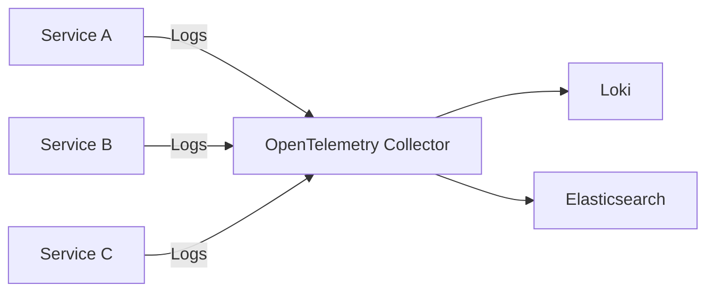

## 介绍

OpenTelemetry日志API是[OpenTelemetry](https://opentelemetry.io/)项目的一部分，旨在为日志记录提供标准化的接口和工具。通过OpenTelemetry日志API，开发者可以以统一的方式收集、处理和导出应用程序日志，同时与其他可观测性数据（如指标和追踪）无缝集成。

日志是应用程序运行时的重要信息来源，用于调试、监控和审计。传统的日志记录方式通常依赖于特定语言或框架的日志库，导致日志格式和传输方式的不一致。OpenTelemetry日志API通过提供跨语言、跨平台的标准化解决方案，解决了这一问题。

## 核心概念

### 日志记录器（Logger）

日志记录器是OpenTelemetry日志API的核心组件，负责创建和发出日志记录。每个日志记录器通常与特定的“名称”或“范围”相关联，用于标识日志的来源。

```javascript
const { logs } = require('@opentelemetry/api-logs');
const logger = logs.getLogger('my-application');
```

### 日志记录（LogRecord）

日志记录是日志API中的基本单位，包含以下关键属性：
- **时间戳（Timestamp）**：日志生成的时间。
- **严重程度（Severity）**：日志的级别（如DEBUG、INFO、ERROR等）。
- **消息（Message）**：日志的主要内容。
- **属性（Attributes）**：附加的键值对，提供上下文信息。

### 日志处理器（LogProcessor）和导出器（LogExporter）

日志处理器负责处理日志记录，并将其传递给导出器。导出器则将日志发送到后端系统（如Loki、Elasticsearch等）。

## 基本用法

以下是一个使用OpenTelemetry日志API记录日志的简单示例（以Node.js为例）：

```javascript
const { logs } = require('@opentelemetry/api-logs');
const { ConsoleLogExporter, SimpleLogProcessor } = require('@opentelemetry/sdk-logs');

// 创建日志导出器和处理器
const exporter = new ConsoleLogExporter();
const processor = new SimpleLogProcessor(exporter);

// 初始化日志提供者
const loggerProvider = new logs.LoggerProvider();
loggerProvider.addLogProcessor(processor);

// 获取日志记录器
const logger = loggerProvider.getLogger('my-app');

// 记录一条日志
logger.emit({
  severityNumber: logs.SeverityNumber.INFO,
  severityText: 'INFO',
  body: 'This is a log message',
  attributes: { key: 'value' },
});
```

**输出示例：**
```
{
  severityNumber: 9,
  severityText: 'INFO',
  body: 'This is a log message',
  attributes: { key: 'value' },
  timestamp: 1620000000000
}
```

## 实际应用场景

### 场景：微服务日志聚合

在微服务架构中，每个服务可能使用不同的编程语言和日志库。通过OpenTelemetry日志API，可以将所有服务的日志统一格式并发送到中央日志系统（如Grafana Loki或Elasticsearch）。以下是一个分布式系统的日志流示意图：



### 场景：错误诊断

通过将日志与追踪（Trace）关联，可以快速定位问题。例如：
```javascript
logger.emit({
  severityNumber: logs.SeverityNumber.ERROR,
  severityText: 'ERROR',
  body: 'Failed to process request',
  attributes: {
    'traceId': 'abc123',
    'error.stack': '...'
  },
});
```

## 总结

OpenTelemetry日志API提供了一种标准化、跨平台的日志记录方式，帮助开发者更高效地收集和分析日志。通过与其他OpenTelemetry组件（如指标和追踪）集成，可以构建完整的可观测性解决方案。

:::tip 练习
1. 尝试在本地运行一个Node.js应用，并使用OpenTelemetry日志API记录日志。
2. 配置一个日志导出器，将日志发送到控制台或文件。
:::

## 附加资源
- [OpenTelemetry官方文档](https://opentelemetry.io/docs/)
- [OpenTelemetry日志API规范](https://github.com/open-telemetry/opentelemetry-specification/blob/main/specification/logs/overview.md)