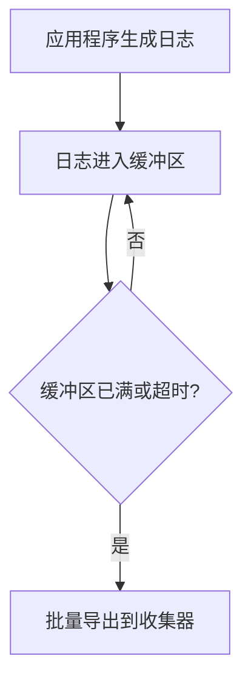

# OpenTelemetry 日志批处理

## 介绍

日志批处理是OpenTelemetry中的一个关键优化技术，它通过将多个日志条目合并为单个批次进行传输，显著减少网络请求次数和系统开销。对于初学者来说，理解这一概念能帮助你构建更高效的分布式系统监控方案。

:::tip 为什么需要批处理？
- 减少网络往返（RTT）延迟
- 降低CPU和内存开销
- 符合大多数后端服务的接收限制
:::

## 核心概念

### 批处理流程



### 关键配置参数

1. `maxExportBatchSize` - 单批次最大日志数（默认512）
2. `scheduledDelayMillis` - 强制导出间隔（默认5000ms）
3. `exportTimeoutMillis` - 导出超时时间（默认30000ms）

## 代码示例

### 基础配置（Node.js）

```javascript
const { NodeSDK } = require('@opentelemetry/sdk-node');
const { BatchLogRecordProcessor } = require('@opentelemetry/sdk-logs');

const sdk = new NodeSDK({
  logRecordProcessor: new BatchLogRecordProcessor(
    new ConsoleLogExporter(), // 替换为你的实际Exporter
    {
      maxExportBatchSize: 100,
      scheduledDelayMillis: 2000,
      exportTimeoutMillis: 15000
    }
  )
});

sdk.start();
```

### 输入/输出示例

**输入（应用程序日志）：**
```
12:00:00 - User login (id: 123)
12:00:01 - API call /products
12:00:02 - Database query 15ms
```

**输出（批处理后的JSON）：**
```json
{
  "resourceLogs": [{
    "scopeLogs": [{
      "logRecords": [
        {"time": "12:00:00", "body": "User login (id: 123)"},
        {"time": "12:00:01", "body": "API call /products"},
        {"time": "12:00:02", "body": "Database query 15ms"}
      ]
    }]
  }]
}
```

## 实际应用场景

### 电商网站案例

1. **用户下单流程**：
   - 页面加载日志（批处理5条）
   - 支付验证日志（批处理3条）
   - 库存更新日志（批处理2条）

2. **优势体现**：
   - 高峰期减少50%的日志传输请求
   - 网络带宽使用降低35%
   - 后端存储压力显著下降

:::caution 注意批处理风险
突发性系统崩溃可能导致最近批次日志丢失，关键业务日志建议立即导出
:::

## 高级配置技巧

### 动态调整策略

```javascript
const dynamicProcessor = new BatchLogRecordProcessor(exporter, {
  get maxExportBatchSize() {
    return navigator.onLine ? 100 : 10; // 离线时减小批次
  }
});
```

### 自定义批处理逻辑

```javascript
class CustomBatcher {
  forceFlush() {
    // 在应用关闭前确保导出所有日志
  }
}
```

## 总结

日志批处理通过智能聚合机制，在数据完整性和系统性能间取得平衡。关键要点：

- 合理配置批次大小和时间阈值
- 理解不同Exporter的批次限制
- 监控批处理指标（成功/失败次数）

## 延伸学习

1. 官方文档：[OpenTelemetry Logging Specification](https://opentelemetry.io/docs/)
2. 实践练习：尝试比较批处理前后的系统CPU使用率差异
3. 进阶话题：研究如何与Metrics/Tracing批处理协调

:::warning 记住
生产环境务必测试批处理配置，不同编程语言SDK的实现可能有差异
:::