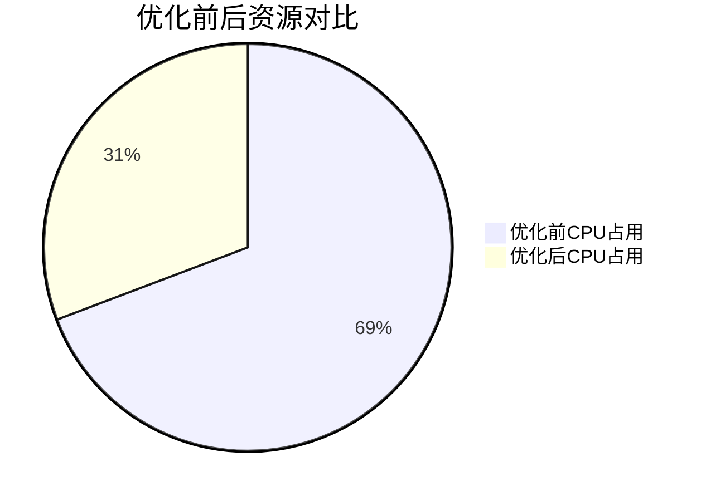

# OpenTelemetry 日志性能优化

## 介绍

OpenTelemetry是一个开源的观测性框架，用于生成、收集和导出日志、指标和追踪数据。在分布式系统中，日志是理解系统行为的关键部分。然而，不当的日志配置可能导致性能问题，如高内存占用或网络延迟。本文将介绍如何优化OpenTelemetry日志收集的性能。

:::note
**什么是日志性能优化？**  
通过调整日志采样率、批处理策略和传输协议等参数，减少日志系统对应用程序性能的影响。
:::

---

## 核心优化策略

### 1. 日志采样（Sampling）

**问题**：全量日志会消耗大量存储和带宽。  
**解决方案**：通过采样只收集部分日志。

```python
from opentelemetry import trace
from opentelemetry.sdk.trace import TracerProvider
from opentelemetry.sdk.trace.export import BatchSpanProcessor
from opentelemetry.sdk.trace.sampling import TraceIdRatioBased

# 设置50%的采样率
sampler = TraceIdRatioBased(0.5)
provider = TracerProvider(sampler=sampler)
trace.set_tracer_provider(provider)
```

:::tip
采样率需根据业务需求调整。例如，生产环境可能用10%，而调试阶段用100%。
:::

---

### 2. 批处理与压缩

**问题**：频繁发送小日志包会增加网络开销。  
**解决方案**：使用批处理并启用压缩。

```yaml
# OpenTelemetry Collector配置示例（file: otel-collector-config.yaml）
exporters:
  otlp:
    endpoint: "otel-collector:4317"
    compression: gzip
    sending_queue:
      queue_size: 1000
    retry_on_failure:
      enabled: true
```

---

### 3. 日志级别过滤

**问题**：DEBUG日志在生产环境中可能过多。  
**解决方案**：动态调整日志级别。

```go
import (
  "go.opentelemetry.io/otel/sdk/log"
)

// 仅记录WARN及以上级别的日志
processor := log.NewBatchProcessor(
  exporter,
  log.WithLevel(log.WarnLevel),
)
```

---

## 实际案例

### 场景：电商订单服务
- **问题**：订单高峰期间日志量激增，导致Collector CPU占用90%+。
- **优化步骤**：
  1. 将采样率从100%降至20%。
  2. 启用Gzip压缩，减少60%网络流量。
  3. 过滤掉DEBUG级别的健康检查日志。
- **结果**：CPU占用降至40%，日志延迟从5s缩短到1s。



---

## 总结

| 优化手段          | 适用场景                  | 预期效果               |
|-------------------|--------------------------|-----------------------|
| 采样              | 高流量生产环境           | 减少50%+日志量        |
| 批处理+压缩       | 网络带宽受限             | 降低60%+传输体积      |
| 日志级别过滤      | 非调试环境               | 减少无关日志存储      |

---

## 延伸练习
1. 在本地部署OpenTelemetry Collector，尝试调整`batch_size`参数观察内存变化。
2. 使用`Wireshark`对比启用Gzip前后的网络包大小差异。

## 附加资源
- [OpenTelemetry官方文档](https://opentelemetry.io/docs/)
- 《分布式系统观测性实践》第5章