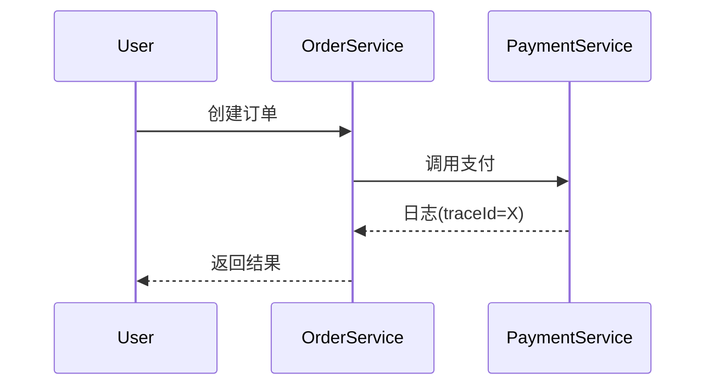

## 介绍

OpenTelemetry日志桥接（Log Bridge）是一种将传统日志框架（如Log4j、SLF4J）与OpenTelemetry集成的技术。它允许开发者在不重写现有日志代码的情况下，将日志数据自动转换为OpenTelemetry的日志模型，并发送到支持OTLP协议的后端（如Jaeger、Prometheus）。

:::tip 为什么需要桥接？
传统日志系统缺乏结构化、上下文关联等能力，而OpenTelemetry提供了跨服务的链路追踪和指标整合。桥接器填补了这一鸿沟。
:::

## 核心概念

### 1. 桥接器工作原理


### 2. 支持的日志框架
- Java: Log4j, Logback, JUL
- Python: logging
- Go: logrus, zap

## 实战示例

### Java + Log4j2 桥接配置
1. 添加Maven依赖：
```xml
<dependency>
    <groupId>io.opentelemetry.instrumentation</groupId>
    <artifactId>opentelemetry-log4j-2.17</artifactId>
    <version>1.28.0</version>
</dependency>
```

2. 修改`log4j2.xml`：
```xml
<Configuration>
    <Appenders>
        <OpenTelemetry name="otelAppender"/>
    </Appenders>
    <Loggers>
        <Root level="info">
            <AppenderRef ref="otelAppender"/>
        </Root>
    </Loggers>
</Configuration>
```

3. 输出效果对比：
```
传统日志：
2023-01-01 INFO com.example.Service - User login

OpenTelemetry日志：
{
  "timestamp": "2023-01-01T00:00:00Z",
  "severity": "INFO",
  "body": "User login",
  "attributes": {
    "code.function": "authenticate",
    "thread.name": "main"
  },
  "traceId": "abc123",
  "spanId": "def456"
}
```

## 高级配置

### 添加上下文信息
通过MDC（Mapped Diagnostic Context）增强日志：
```java
try (Scope scope = Span.current().makeCurrent()) {
    MDC.put("traceId", Span.current().getSpanContext().getTraceId());
    logger.info("Payment processed");
}
```

### 采样控制
在`application.properties`中配置：
```properties
otel.logs.exporter=otlp
otel.traces.sampler=parentbased_always_on
```

## 实际应用场景

**电商系统案例**：
1. 用户下单时生成`traceId`
2. 支付服务通过桥接器记录日志
3. 物流服务通过相同`traceId`关联日志
4. 在Grafana中查看完整事务流



## 总结

关键收获：
- 桥接器实现零代码改造的日志升级
- 保留现有日志投资的同时获得分布式追踪能力
- 统一的可观测性数据模型

## 延伸学习

推荐练习：
1. 在Spring Boot中配置Logback桥接
2. 将日志导出到Loki+Prometheus+Grafana栈
3. 比较原生OpenTelemetry日志API与桥接方案的性能

官方资源：
- [OpenTelemetry日志规范](https://opentelemetry.io/docs/specs/otel/logs/)
- [Java桥接器GitHub](https://github.com/open-telemetry/opentelemetry-java-instrumentation)