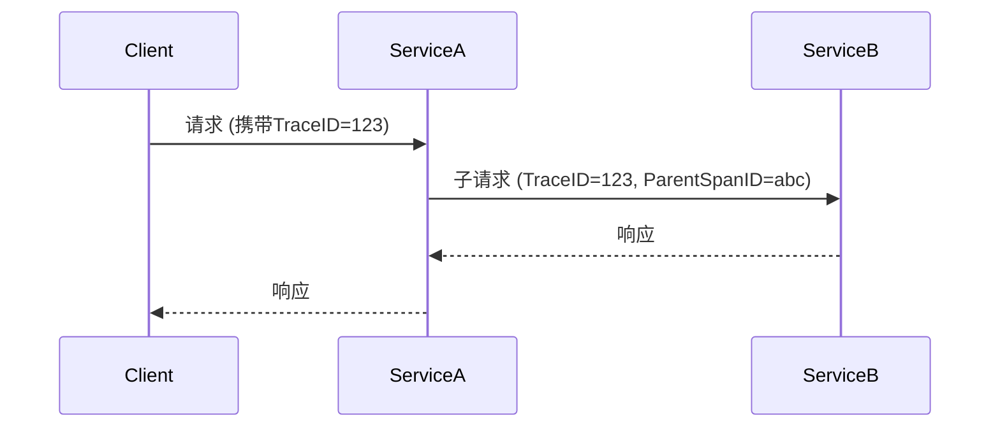

# OpenTelemetry 日志上下文关联

## 介绍

在现代分布式系统中，一个用户请求可能跨越多个服务。当出现问题时，如何追踪请求在不同服务中的完整路径？OpenTelemetry的**日志上下文关联**（Log Context Propagation）通过唯一的TraceID和SpanID将分散的日志串联起来，形成完整的请求轨迹。

:::tip 关键概念
- **TraceID**：唯一标识整个请求链
- **SpanID**：标识请求在单个服务中的操作
- **上下文传播**：将TraceID/SpanID自动注入日志
:::

## 基础原理

OpenTelemetry使用W3C Trace Context标准在服务间传递上下文信息。当服务记录日志时，SDK会自动将当前上下文信息注入日志条目。



## 实现步骤

### 1. 安装必要库

```bash
npm install @opentelemetry/api @opentelemetry/sdk-node @opentelemetry/auto-instrumentations-node
```

### 2. 初始化OpenTelemetry

```javascript
// tracing.js
const { NodeSDK } = require('@opentelemetry/sdk-node');
const { getNodeAutoInstrumentations } = require('@opentelemetry/auto-instrumentations-node');

const sdk = new NodeSDK({
  traceExporter: new ConsoleSpanExporter(),
  instrumentations: [getNodeAutoInstrumentations()]
});

sdk.start();
```

### 3. 配置日志注入

```javascript
// logger.js
const { context, trace } = require('@opentelemetry/api');
const winston = require('winston');

const logger = winston.createLogger({
  format: winston.format.combine(
    winston.format((info) => {
      const span = trace.getSpan(context.active());
      if (span) {
        info.traceId = span.spanContext().traceId;
        info.spanId = span.spanContext().spanId;
      }
      return info;
    })(),
    winston.format.json()
  ),
  transports: [new winston.transports.Console()]
});
```

## 实际案例

假设一个电商订单流程涉及三个服务：

1. **API网关**接收 `/create-order` 请求
2. **库存服务**检查商品库存
3. **支付服务**处理付款

```javascript
// 订单服务代码示例
app.post('/create-order', async (req, res) => {
  logger.info('开始创建订单'); // 自动包含TraceID
  
  // 调用库存服务
  await fetch('http://inventory/check', {
    headers: {
      // 上下文自动通过headers传播
    }
  });

  logger.error('库存检查失败'); // 与前面日志相同的TraceID
});
```

## 查看关联日志

在日志系统中搜索TraceID，可以看到跨服务的完整日志流：

```
# API网关
{"traceId":"abc123","message":"收到订单请求","service":"gateway"}

# 订单服务 
{"traceId":"abc123","message":"开始创建订单","service":"order"}

# 库存服务
{"traceId":"abc123","message":"库存检查","sku":"ITEM_001","service":"inventory"}
```

## 总结

OpenTelemetry的日志上下文关联提供了：
- 端到端的请求追踪能力
- 快速定位跨服务问题的根源
- 无需手动传递跟踪标识符

:::note 最佳实践
1. 在所有服务中统一使用W3C Trace Context标准
2. 将TraceID显示在日志系统的用户界面中
3. 日志级别ERROR/WARN必须包含TraceID
:::

## 扩展学习

- [W3C Trace Context规范](https://www.w3.org/TR/trace-context/)
- 练习：在本地搭建两个Node.js服务，实现日志自动关联
- 高级话题：将TraceID与业务指标关联分析