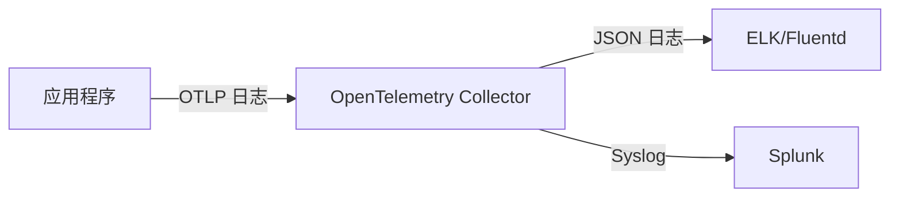

## 介绍

OpenTelemetry（简称OTel）是一个开源的观测性框架，用于生成、收集和导出遥测数据（如日志、指标和追踪）。传统日志系统（如ELK、Fluentd或Splunk）通常独立运行，而通过整合OpenTelemetry，可以实现更高效的日志收集、关联和分析。

本指南将介绍如何将OpenTelemetry与传统日志系统整合，并展示实际应用场景。

---

## 为什么需要整合？

传统日志系统通常：
- 仅处理纯文本日志，缺乏结构化数据。
- 难以与其他观测数据（如指标、追踪）关联。
- 需要手动配置日志收集器（如Filebeat或Fluentd）。

OpenTelemetry提供了：
- **统一的数据模型**：日志、指标、追踪使用相同的协议（如OTLP）。
- **自动上下文传播**：将请求的追踪ID与日志关联。
- **灵活的导出器**：支持将日志发送到多种后端（如Prometheus、Loki、ELK）。

---

## 整合方案

### 方案1：通过OpenTelemetry Collector中转

OpenTelemetry Collector是一个中间组件，可以将OTel格式的日志转换为传统日志系统支持的格式（如JSON或Syslog）。



#### 配置示例

1. **应用程序发送OTLP日志**  
   使用OpenTelemetry SDK配置日志导出器：

```python
from opentelemetry import trace
from opentelemetry.sdk._logs import LogEmitterProvider
from opentelemetry.sdk._logs.export import BatchLogProcessor
from opentelemetry.exporter.otlp.proto.grpc._log_exporter import OTLPLogExporter

log_emitter_provider = LogEmitterProvider()
log_emitter = log_emitter_provider.get_log_emitter("my-app")
otlp_exporter = OTLPLogExporter(endpoint="http://collector:4317")
log_emitter_provider.add_log_processor(BatchLogProcessor(otlp_exporter))
```

2. **Collector配置转换**  
   编辑Collector的配置文件（`otel-collector-config.yaml`）：

```yaml
receivers:
  otlp:
    protocols:
      grpc:
exporters:
  logging:
    logLevel: debug
  elasticsearch:
    endpoints: ["http://elasticsearch:9200"]
    logs_index: "otel-logs"
processors:
  batch:
service:
  pipelines:
    logs:
      receivers: [otlp]
      processors: [batch]
      exporters: [elasticsearch, logging]
```

---

### 方案2：直接导出到传统日志系统

如果传统日志系统支持OTLP（如Grafana Loki），可以直接从应用程序导出日志：

```go
package main

import (
	"go.opentelemetry.io/otel"
	"go.opentelemetry.io/otel/exporters/otlp/otlplog/otlploghttp"
	"go.opentelemetry.io/otel/sdk/log"
)

func main() {
	exporter, _ := otlploghttp.NewExporter(
		otlploghttp.WithEndpoint("loki:3100"),
		otlploghttp.WithInsecure(),
	)
	loggerProvider := log.NewLoggerProvider(log.WithBatcher(exporter))
	otel.SetLoggerProvider(loggerProvider)
}
```

---

## 实际案例

### 案例：电商平台的错误追踪

一个电商平台需要将应用程序错误日志与用户请求的追踪ID关联：

1. **问题**：传统日志中无法快速定位某个失败请求的完整上下文。
2. **解决方案**：  
   - 使用OpenTelemetry在日志中注入追踪ID。
   - 通过Collector将日志发送到ELK，并在Kibana中筛选特定追踪ID的日志。

```json
// 日志示例（ELK中存储的格式）
{
  "timestamp": "2023-10-01T12:00:00Z",
  "severity": "ERROR",
  "message": "Payment failed",
  "trace_id": "4bf92f3577b34da6a3ce929d0e0e4736",
  "user_id": "12345"
}
```

---

## 总结

| 传统日志系统 | OpenTelemetry整合后 |
|--------------|---------------------|
| 独立运行，难以关联其他数据 | 统一日志、指标、追踪 |
| 手动配置收集器 | 自动上下文传播 |
| 仅支持文本或JSON | 支持OTLP协议 |

:::tip 下一步
- 尝试将你的应用程序日志通过OpenTelemetry导出到ELK或Loki。
- 探索如何在日志中注入追踪ID（参考[OpenTelemetry文档](https://opentelemetry.io/docs/)）。
:::

## 附加资源

1. [OpenTelemetry官方文档](https://opentelemetry.io/docs/)
2. [ELK Stack指南](https://www.elastic.co/guide/index.html)
3. [Grafana Loki日志集成](https://grafana.com/docs/loki/latest/)