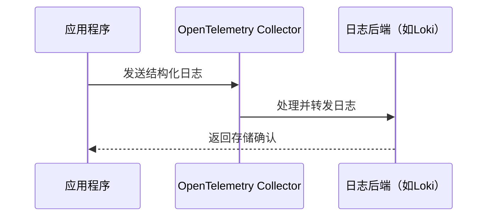

## 介绍

OpenTelemetry（简称OTel）是一个开源的观测性框架，用于生成、收集和管理遥测数据（如日志、指标和跟踪）。日志是其中关键的一部分，它记录了应用程序运行时的详细信息，帮助开发者诊断问题。本文将详细介绍OpenTelemetry的日志格式，包括其核心字段、结构以及如何在实际项目中使用。

:::note
OpenTelemetry日志格式基于通用日志模型设计，可以与多种日志收集工具（如Loki、Elasticsearch等）无缝集成。
:::

## 核心字段

OpenTelemetry日志格式包含以下核心字段：

1. **时间戳（Timestamp）**：日志事件发生的时间，通常为Unix时间戳。
2. **严重程度（Severity）**：日志的级别（如DEBUG、INFO、WARN、ERROR等）。
3. **消息体（Body）**：日志的具体内容。
4. **属性（Attributes）**：键值对形式的附加信息，用于丰富日志上下文。
5. **资源（Resource）**：描述日志来源的元数据（如服务名称、主机名等）。

### 示例结构

```json
{
  "timestamp": "2023-05-15T12:34:56Z",
  "severity": "ERROR",
  "body": "Failed to connect to database",
  "attributes": {
    "error.code": "DB_CONN_REFUSED",
    "retry.count": 3
  },
  "resource": {
    "service.name": "payment-service",
    "host.name": "server-01"
  }
}
```

## 实际应用

### 场景：记录HTTP请求错误
假设你的Web服务需要记录HTTP请求失败的日志，以下是使用OpenTelemetry日志格式的示例：

```python
from opentelemetry import trace
from opentelemetry.sdk._logs import LogEmitterProvider

log_emitter = LogEmitterProvider().get_log_emitter(__name__)

def log_failed_request(url, status_code, error_message):
    log_emitter.emit_log(
        severity="ERROR",
        body=f"Request to {url} failed with status {status_code}",
        attributes={
            "http.url": url,
            "http.status_code": status_code,
            "error.message": error_message
        }
    )
```

调用函数后，生成的日志格式如下：
```json
{
  "severity": "ERROR",
  "body": "Request to https://api.example.com failed with status 500",
  "attributes": {
    "http.url": "https://api.example.com",
    "http.status_code": 500,
    "error.message": "Internal server error"
  }
}
```

### 与其他组件集成
OpenTelemetry日志可以通过以下流程与收集器和存储系统交互：



## 总结

OpenTelemetry日志格式通过标准化的字段设计，使得日志数据更易于分析和集成。关键点包括：
- 使用结构化字段（如`severity`、`attributes`）增强可读性。
- 通过`resource`字段标识日志来源。
- 支持与多种观测性工具链集成。

:::tip 练习
1. 尝试在本地环境中配置OpenTelemetry日志收集器，并输出一条包含自定义属性的日志。
2. 将日志导出到Jaeger或Grafana Loki，验证数据是否完整。
:::

## 扩展阅读
- [OpenTelemetry官方日志规范](https://opentelemetry.io/docs/reference/specification/logs/)
- [使用Python SDK记录日志的教程](https://opentelemetry.io/docs/instrumentation/python/logs/)