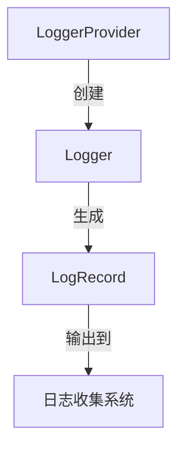

# OpenTelemetry 结构化日志

## 什么是结构化日志？

结构化日志（Structured Logging）是一种将日志数据组织为键值对（key-value pairs）的格式，而不是传统的纯文本行。与传统的非结构化日志相比，结构化日志更容易被机器解析和分析，同时也更便于人类阅读。

在OpenTelemetry中，结构化日志通过特定的日志记录器（Logger）实现，这些记录器能够将日志数据以统一格式输出，通常采用JSON格式。

:::tip 为什么需要结构化日志？
- 更易于自动化处理和分析
- 支持丰富的元数据（metadata）
- 与监控系统无缝集成
- 便于日志聚合和过滤
:::

## OpenTelemetry 日志基础

OpenTelemetry的日志系统由几个核心组件组成：

1. **LoggerProvider** - 日志记录器的工厂
2. **Logger** - 实际记录日志的接口
3. **LogRecord** - 包含日志消息和属性的数据结构



## 结构化日志实践

### 基本日志记录示例

以下是一个使用OpenTelemetry记录结构化日志的Python示例：

```python
from opentelemetry import trace
from opentelemetry.sdk._logs import (
    LogEmitterProvider,
    OTLPHandler,
    set_log_emitter_provider,
)
from opentelemetry.sdk._logs.export import ConsoleLogExporter, BatchLogProcessor
import logging

# 设置日志发射器
log_emitter_provider = LogEmitterProvider()
set_log_emitter_provider(log_emitter_provider)

exporter = ConsoleLogExporter()
log_emitter_provider.add_log_processor(BatchLogProcessor(exporter))

# 获取日志发射器
log_emitter = log_emitter_provider.get_log_emitter(__name__)

# 记录结构化日志
log_emitter.emit(
    "用户登录成功",
    severity=logging.INFO,
    attributes={
        "user.id": "user123",
        "login.method": "oauth2",
        "http.status_code": 200
    }
)
```

示例输出：
```json
{
  "timestamp": "2023-07-15T12:34:56Z",
  "severity": "INFO",
  "body": "用户登录成功",
  "attributes": {
    "user.id": "user123",
    "login.method": "oauth2",
    "http.status_code": 200
  }
}
```

### 日志与追踪关联

OpenTelemetry的强大之处在于可以将日志与追踪（trace）关联起来：

```python
tracer = trace.get_tracer(__name__)
with tracer.start_as_current_span("user-login") as span:
    log_emitter.emit(
        "用户认证开始",
        severity=logging.INFO,
        attributes={
            "user.id": "user123",
            "trace_id": span.get_span_context().trace_id,
            "span_id": span.get_span_context().span_id
        }
    )
    # 认证逻辑...
```

## 实际应用场景

### 场景1：电子商务订单处理

```python
def process_order(order_id):
    with tracer.start_as_current_span("process-order") as span:
        try:
            log_emitter.emit(
                "开始处理订单",
                severity=logging.INFO,
                attributes={
                    "order.id": order_id,
                    "trace_id": span.get_span_context().trace_id,
                    "span_id": span.get_span_context().span_id
                }
            )
            
            # 订单处理逻辑...
            
            log_emitter.emit(
                "订单处理完成",
                severity=logging.INFO,
                attributes={
                    "order.id": order_id,
                    "status": "completed",
                    "processing.time.ms": 150
                }
            )
            
        except Exception as e:
            log_emitter.emit(
                "订单处理失败",
                severity=logging.ERROR,
                attributes={
                    "order.id": order_id,
                    "error.type": type(e).__name__,
                    "error.message": str(e),
                    "trace_id": span.get_span_context().trace_id
                }
            )
            raise
```

### 场景2：微服务间通信

在微服务架构中，结构化日志可以帮助追踪跨服务的请求流：

```python
def handle_request(request):
    # 从上游服务获取追踪上下文
    ctx = extract(request.headers)
    
    with tracer.start_as_current_span("handle-request", context=ctx) as span:
        log_emitter.emit(
            "收到API请求",
            severity=logging.INFO,
            attributes={
                "http.method": request.method,
                "http.path": request.path,
                "trace_id": span.get_span_context().trace_id,
                "service.name": "payment-service"
            }
        )
        
        # 处理请求...
```

## 日志属性最佳实践

1. **使用一致的命名约定**：
   - 例如全部小写，用点号分隔（`user.id`）
   - 或者使用下划线（`user_id`）

2. **包含上下文信息**：
   - 请求ID、用户ID、会话ID等

3. **避免敏感数据**：
   - 不要记录密码、令牌等

4. **控制属性数量**：
   - 太多属性会降低可读性

:::caution 注意
避免在日志属性中使用动态键名，这会使日志查询变得困难。例如：
```python
# 不推荐
attributes = {f"param_{i}": value for i, value in enumerate(params)}

# 推荐
attributes = {"params": params}
```
:::

## 总结

OpenTelemetry的结构化日志功能为现代应用程序提供了强大的日志记录能力：

- 统一了日志格式，便于分析和处理
- 支持丰富的元数据
- 可以与追踪系统无缝集成
- 提高了日志的可观测性价值

## 进一步学习

1. [OpenTelemetry日志规范](https://opentelemetry.io/docs/reference/specification/logs/)
2. [OpenTelemetry Python SDK文档](https://opentelemetry-python.readthedocs.io/)
3. [结构化日志最佳实践](https://www.honeycomb.io/blog/structure-your-logs/)
4. [日志与追踪关联指南](https://opentelemetry.io/docs/concepts/correlation/)

## 练习

1. 修改上面的订单处理示例，添加更多有意义的日志属性
2. 尝试将OpenTelemetry日志导出到不同的后端（如文件、Elasticsearch等）
3. 创建一个简单的微服务，并在服务间传递追踪上下文
4. 比较结构化日志与传统文本日志在查询和分析时的差异