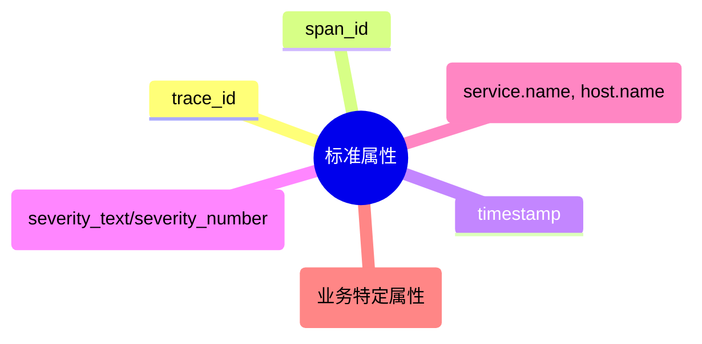

# OpenTelemetry 日志属性

## 介绍

OpenTelemetry日志属性（Log Attributes）是附加到日志记录中的键值对，用于提供上下文信息。它们帮助开发者理解日志事件的**何时、何地、为何**发生，是结构化日志的核心组成部分。与传统的纯文本日志相比，属性使得日志更易于搜索、过滤和分析。

:::tip 为什么需要日志属性？
- **上下文丰富**：记录请求ID、用户信息等附加数据
- **高效查询**：支持按属性过滤（如`error=true`）
- **跨系统关联**：通过TraceID实现日志与追踪的关联
```

## 基础概念

### 1. 属性结构
日志属性遵循`key=value`格式，其中：
- **Key**：字符串类型，推荐使用小写蛇形命名（如`user_id`）
- **Value**：支持多种类型：
  ```python
  # 示例：Python中的日志属性
  from opentelemetry import trace
  
  attributes = {
      "user.id": "u12345",
      "http.method": "GET",
      "error": True,          # 布尔值
      "retry_count": 3,       # 整数
      "latency_ms": 45.2      # 浮点数
  }
  ```

### 2. 核心属性
OpenTelemetry建议包含以下通用属性：



## 实际应用

### 案例：Web请求日志
```javascript
// Node.js示例：Express中间件添加日志属性
app.use((req, res, next) => {
  const span = trace.getActiveSpan();
  logger.emit({
    severityText: "INFO",
    body: "Incoming request",
    attributes: {
      "http.route": req.path,
      "http.method": req.method,
      "user.ip": req.ip,
      "trace_id": span?.spanContext().traceId // 关联追踪
    }
  });
  next();
});
```

:::note 输出示例
```json
{
  "timestamp": "2023-08-20T12:34:56Z",
  "severityText": "ERROR",
  "body": "Payment failed",
  "attributes": {
    "payment.transaction_id": "txn_67890",
    "error.stack": "TypeError: Cannot read property...",
    "user.tier": "premium"
  }
}
```
:::

## 最佳实践

1. **命名规范**：
   - 使用点号分层（如`user.account_id`）
   - 避免敏感数据（如密码、密钥）

2. **性能优化**：
   ```go
   // Go示例：避免字符串拼接
   logAttr := []attribute.KeyValue{
       attribute.String("user.id", userID),
       attribute.Int("retries", retryCount),
   } // 比fmt.Sprintf更高效
   ```

3. **与Resource/Span关联**：
   ```python
   # 将日志关联到当前Span
   with tracer.start_as_current_span("checkout"):
       logger.info("Payment processed", extra={
           "attributes": {
               "payment.amount": 99.99,
               "currency": "USD"
           }
       })
   ```

## 总结

OpenTelemetry日志属性通过结构化数据：
- 提升日志的**可读性**和**可操作性**
- 实现与追踪、指标的**无缝关联**
- 支持更强大的**日志分析工具**

## 延伸学习

- 练习：为你的应用添加以下属性：
  1. 请求处理耗时（`duration_ms`）
  2. 当前登录用户（`user.id`）
  3. 环境标识（`env`）

- 官方资源：
  - [OpenTelemetry日志规范](https://opentelemetry.io/docs/specs/otel/logs/)
  - [语义约定（Semantic Conventions）](https://opentelemetry.io/docs/specs/otel/resource/semantic_conventions/)