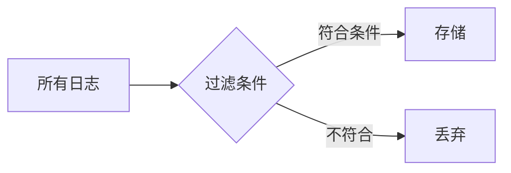

## 介绍

日志采样是OpenTelemetry中一项关键功能，它允许开发者在保持系统可观测性的同时，减少因全量日志收集带来的性能开销。通过智能地选择部分日志记录而非全部，采样能显著降低存储成本和处理负载，尤其适用于高流量系统。

## 为什么需要日志采样？

当系统规模扩大时，日志数据可能呈现指数级增长：
- 全量日志可能导致存储成本激增
- 网络传输带宽压力增大
- 后端分析系统处理延迟增加

采样通过保留代表性数据解决了这些问题，同时仍能提供足够的故障诊断信息。

## 采样策略类型

OpenTelemetry支持多种采样策略：

### 1. 头部采样（Head-based Sampling）
在日志生成时立即决定是否采样，常用方法包括：

```python
# 基于概率的采样示例（50%采样率）
from opentelemetry import trace
from opentelemetry.sdk.trace import TracerProvider
from opentelemetry.sdk.trace.export import (
    ConsoleSpanExporter,
    SimpleExportSpanProcessor,
)

trace.set_tracer_provider(TracerProvider())
tracer = trace.get_tracer(__name__)

# 配置50%采样率
sampler = trace.sampling.PROBABILITY_SAMPLER(0.5)
trace.get_tracer_provider().sampler = sampler

with tracer.start_as_current_span("sample-operation"):
    print("这条操作有50%概率被采样")
```

### 2. 尾部采样（Tail-based Sampling）
在收集所有日志后根据特定条件筛选，例如：
- 仅保留包含错误的日志
- 按请求延迟阈值筛选



## 配置采样率

采样率需要根据业务需求谨慎选择：

| 场景 | 推荐采样率 | 理由 |
|------|-----------|------|
| 生产环境 | 10-20% | 平衡开销与可观测性 |
| 调试阶段 | 100% | 需要完整数据 |
| 高错误率系统 | 错误日志100%+其他5% | 确保捕获所有异常 |

:::tip 采样率调整技巧
开始时设置较高采样率(如30%)，根据实际存储和分析需求逐步下调，同时监控关键指标是否仍可有效追踪。
:::

## 实际案例：电商系统日志采样

假设一个电商平台在促销期间面临每秒10,000请求：

```python
# 配置动态采样策略
from opentelemetry.sdk.trace.sampling import DynamicSampling

def dynamic_sampler(context):
    # 对支付相关操作100%采样
    if "payment" in context.name:
        return True
    # 对浏览商品操作10%采样
    elif "browse" in context.name:
        return random.random() < 0.1
    # 默认20%采样
    return random.random() < 0.2

trace.get_tracer_provider().sampler = DynamicSampling(dynamic_sampler)
```

此配置实现了：
- 关键支付流程全量记录
- 高频率浏览操作降采样
- 平衡系统负载与业务需求

## 常见问题解决

:::caution 采样导致问题遗漏怎么办？
1. 对错误日志实施100%采样
2. 配置采样率告警，当日志量突降时触发
3. 结合指标和追踪数据交叉验证
:::

## 总结与练习

日志采样是高效可观测性体系的核心组件。通过合理配置：

✓ 降低系统资源消耗<br />
✓ 保持关键问题可诊断能力<br />
✓ 实现成本与效益的最佳平衡

**练习建议**：
1. 在本地环境尝试不同采样率(10%, 50%, 100%)，比较日志文件大小差异
2. 创建自定义采样器，对特定HTTP状态码(如5xx)全量采样
3. 模拟高负载场景，测试不同采样策略对系统性能的影响

## 扩展阅读

- [OpenTelemetry官方采样文档](https://opentelemetry.io/docs/concepts/sampling/)
- 《分布式系统可观测性》中"有效采样策略"章节
- 采样算法研究论文：Dapper的"Adaptive Sampling"设计