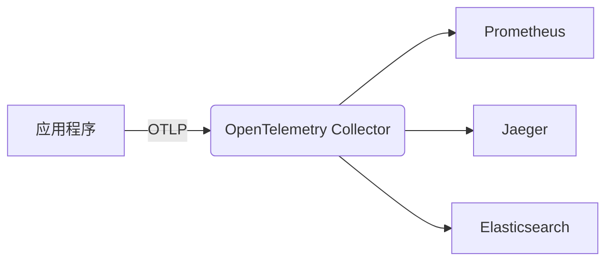
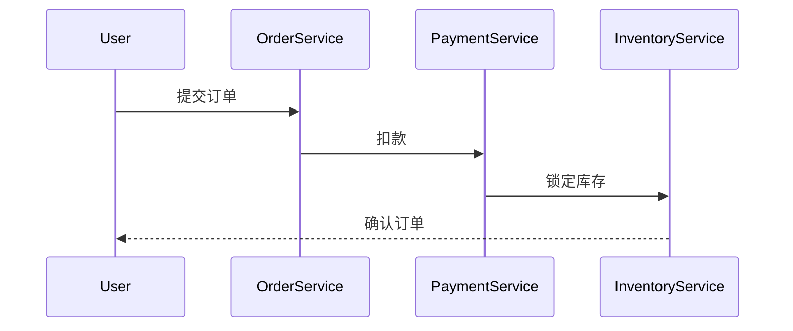

## 介绍

OpenTelemetry（简称OTel）是一个开源的**可观测性框架**，用于生成、收集和管理遥测数据（指标、日志、追踪）。本指南将帮助你制定清晰的实施策略，确保在项目中高效落地OpenTelemetry。

:::note 关键概念
- **Tracing**：记录请求在分布式系统中的流转路径。
- **Metrics**：量化系统性能（如CPU使用率、请求延迟）。
- **Logs**：记录离散事件（如错误信息）。
:::

---

## 第一步：规划数据收集

### 1. 确定遥测目标
明确你需要观测的内容：
```plaintext
1. 应用性能（如API响应时间）
2. 错误率（如HTTP 500错误）
3. 资源利用率（如内存占用）
```

### 2. 选择导出目标
OpenTelemetry数据可导出到多种后端：


---

## 第二步：基础代码集成

### 1. 安装SDK（以Node.js为例）
```bash
npm install @opentelemetry/api @opentelemetry/sdk-node
```

### 2. 初始化追踪器
```javascript
const { NodeSDK } = require('@opentelemetry/sdk-node');
const { ConsoleSpanExporter } = require('@opentelemetry/sdk-trace-node');

const sdk = new NodeSDK({
  traceExporter: new ConsoleSpanExporter(),
});

sdk.start();
```

:::tip 测试输出
启动应用后，控制台将打印类似以下追踪信息：
```json
{
  "traceId": "7ba9b3f1a9347e5d",
  "name": "HTTP GET /api",
  "duration": 42
}
```
:::

---

## 第三步：生产环境增强

### 1. 添加资源属性
标识服务环境：
```javascript
const { Resource } = require('@opentelemetry/resources');
const { SEMRESATTRS_SERVICE_NAME } = require('@opentelemetry/semantic-conventions');

const resource = new Resource({
  [SEMRESATTRS_SERVICE_NAME]: "payment-service",
  "environment": "production"
});
```

### 2. 采样策略配置
降低生产环境开销：
```javascript
const { ParentBasedSampler, TraceIdRatioSampler } = require('@opentelemetry/sdk-trace-node');

const sampler = new ParentBasedSampler({
  root: new TraceIdRatioSampler(0.5) // 采样50%的请求
});
```

---

## 实际案例：电商系统观测

### 场景描述
用户下单后出现延迟，需要追踪：
1. 订单服务 → 支付服务 → 库存服务的调用链
2. 各阶段耗时与错误

### 解决方案


通过OpenTelemetry可清晰看到：
- 支付服务耗时突增（可能因第三方API变慢）
- 库存服务返回429错误（限流触发）

---

## 总结与练习

### 关键要点
1. 先规划后实施，明确观测目标
2. 开发环境使用简单导出器（如Console），生产环境接入专业后端
3. 通过资源标识和采样策略优化性能

### 练习建议
1. 在本地启动Jaeger，将追踪数据导出到该平台
2. 为你的服务添加自定义指标（如`orders.processed`）
3. 尝试在Kubernetes中部署OpenTelemetry Collector

### 扩展阅读
- [OpenTelemetry官方文档](https://opentelemetry.io/docs/)
- 《Distributed Tracing in Practice》书籍