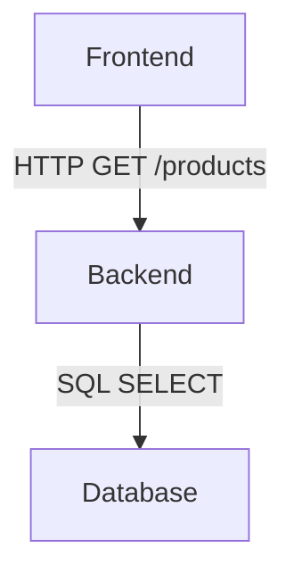

## 简介

OpenTelemetry（简称OTel）是云原生应用的可观测性标准工具集。良好的**命名约定**能确保你的遥测数据（指标、日志、追踪）具有一致的结构，便于团队协作和自动化分析。本文将介绍OTel的核心命名规则、实际案例和最佳实践。

:::note 为什么命名很重要？
混乱的命名会导致：
- 指标无法聚合
- 追踪难以关联
- 仪表盘数据不一致
:::

## 核心命名规则

### 1. 通用原则
- **小写字母**：所有名称使用小写（如 `http.request.duration`）
- **点分隔符**：用点（`.`）表示层级关系
- **明确语义**：避免缩写（用 `database` 而非 `db`）

### 2. 各信号类型规范

#### 指标（Metrics）
```text
<namespace>.<metric_name>.<unit>
```
- `namespace`：可选前缀，标识组件（如 `http`）
- `unit`：标准化单位（完整列表见[UCUM](https://ucum.org/)）
  
示例：
```python
# 正确
http.server.request.duration.ms
custom.metrics.tasks.queue.size

# 避免
HTTP_Request_Time  # 大写和下划线
req_time           # 模糊
```

#### 追踪（Traces）
- **Span名称**：使用 `<操作名> <具体动作>` 格式
```go
// 正确
"GET /api/users"
"Database.QueryUsers"

// 避免
"query"           // 太模糊
"do_something"    // 非描述性
```

#### 日志（Logs）
- **字段名**：使用 `snake_case`（如 `user_id`）
- 保留字段前缀：
  - `otel.`：OpenTelemetry专用（如 `otel.status_code`）
  - `app.`：应用自定义字段（如 `app.user_session`）

## 实际案例

### 电商应用示例


对应的命名：
- **指标**：
  - `http.client.request.duration.ms`
  - `db.postgres.query.duration.ms`
- **Span**：
  - `HTTP GET /products`
  - `Postgres.QueryProducts`
- **日志字段**：
  - `app.user_id=123`
  - `http.status_code=200`

## 常见错误与修正

:::caution 反模式警报
| 错误示例 | 问题 | 修正方案 |
|----------|------|----------|
| `Server_Processing_Time` | 大写+下划线 | `server.processing.time.ms` |
| `queryDB` | 混合大小写 | `database.query.time` |
| `err` | 无上下文 | `app.login.error` |
:::

## 总结

遵循OpenTelemetry命名约定能带来：
1. **跨团队一致性**：所有成员使用相同术语
2. **工具兼容性**：适配Prometheus、Jaeger等后端
3. **高效分析**：通过标准命名快速过滤数据

## 延伸练习

1. 为你的项目设计以下命名：
   - 一个API延迟指标
   - 数据库查询Span名称
   - 错误日志字段
2. 对比现有项目中的命名，找出3个需要改进的地方

## 附加资源

- [OpenTelemetry官方规范](https://opentelemetry.io/docs/reference/specification/)
- [语义约定完整列表](https://github.com/open-telemetry/semantic-conventions)