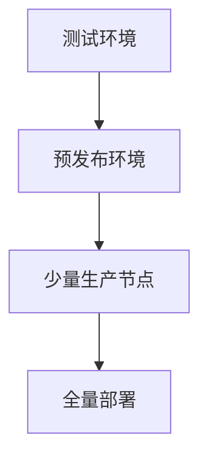

# OpenTelemetry 升级策略

## 介绍

OpenTelemetry（简称OTel）是一个开源的观测性框架，用于生成、收集和管理遥测数据（指标、日志、追踪）。随着项目快速发展，版本升级是不可避免的。本文将指导初学者制定安全的升级策略，避免破坏性变更对生产环境的影响。

## 为什么需要升级策略？

1. **获取新功能**：如更高效的采样算法或新的导出器<br />
2. **安全修复**：修补已知漏洞<br />
3. **性能优化**：如减少内存占用<br />
4. **弃用兼容**：平滑过渡到新API

:::note 关键原则
- 测试环境优先验证
- 阅读版本变更说明
- 分阶段逐步升级
:::

## 升级前准备

### 1. 版本兼容性检查

使用 `opentelemetry-bootstrap` 工具检查当前依赖：

```bash
opentelemetry-bootstrap --action=check
```

示例输出：
```
Checking compatibility...
[✓] OpenTelemetry SDK 1.15.0
[!] Collector Contrib 0.45.0 (requires >=0.50.0)
```

### 2. 变更日志分析

重点关注：
- `CHANGELOG.md` 中的 Breaking Changes
- 官方博客的升级指南
- GitHub Milestone 中的已知问题

## 分阶段升级策略



### 阶段1：SDK升级

以Python为例，升级前后对比：

```python
# 升级前 (v1.14.0)
from opentelemetry import trace
tracer = trace.get_tracer(__name__)

# 升级后 (v1.20.0)
from opentelemetry import trace
tracer_provider = trace.get_tracer_provider()
tracer = tracer_provider.get_tracer(__name__)
```

:::caution 注意
v1.15.0 引入了 `TracerProvider` 的显式管理
:::

### 阶段2：Collector升级

使用Docker时的版本声明变更：

```diff
# docker-compose.yaml
services:
  otel-collector:
-   image: otel/opentelemetry-collector:0.45.0
+   image: otel/opentelemetry-collector:0.60.0
```

## 实际案例：电商平台升级

**场景**：  
某电商平台需要从OTel v1.12升级到v1.20以使用新的Prometheus导出器

**步骤**：
1. 在CI环境添加新版本测试套件
2. 对比新旧版本的CPU/内存指标
3. 逐步替换线上Pod的容器镜像
4. 监控错误率变化

```python
# 监控升级过程的指标示例
from opentelemetry.metrics import get_meter_provider
meter = get_meter_provider().get_meter("upgrade-monitor")
error_counter = meter.create_counter("upgrade.errors")
```

## 回滚方案

准备快速回滚的检查清单：
1. 旧版本Docker镜像标签保持可用
2. 配置管理工具保存历史版本
3. 验证回滚路径的数据库兼容性

## 总结

| 最佳实践 | 反模式 |
|----------|--------|
| 小步增量升级 | 跨多个主版本升级 |
| 监控核心指标 | 仅验证功能不验证性能 |
| 自动化测试覆盖 | 手动验证所有场景 |

## 延伸学习

1. 官方升级指南：[OpenTelemetry Upgrade Docs](https://opentelemetry.io/docs/)
2. 练习：在本地搭建双版本测试环境
3. 社区案例研究：CNCF技术案例库

:::tip 记住
"不是是否升级，而是何时以及如何安全地升级"
:::