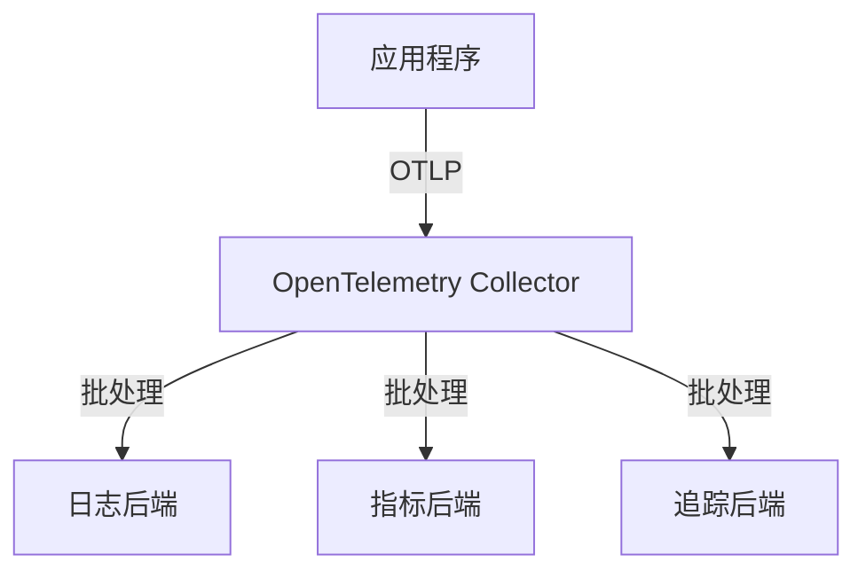

## 介绍

OpenTelemetry是一个开源的观测性框架，用于生成、收集和管理遥测数据（如指标、日志和追踪）。在设计OpenTelemetry实现时，可扩展性是一个关键考虑因素，因为它决定了系统能否随着应用程序的增长而高效运行。本文将介绍OpenTelemetry的可扩展性设计原则，帮助初学者构建适应性强、高性能的观测系统。

## 可扩展性设计原则

### 1. 模块化架构

OpenTelemetry的核心设计是模块化的，允许用户根据需要选择组件。例如，你可以单独使用追踪（Tracing）或指标（Metrics），而不必启用所有功能。

:::tip
模块化设计使得OpenTelemetry可以轻松集成到现有系统中，而不会引入不必要的开销。
:::

### 2. 采样策略

在高流量系统中，收集所有遥测数据可能会导致性能问题。OpenTelemetry支持多种采样策略，帮助减少数据量：

- **头部采样（Head-based Sampling）**：在请求开始时决定是否采样。
- **尾部采样（Tail-based Sampling）**：在请求完成后根据特定条件（如错误率或延迟）决定是否采样。

以下是一个头部采样的代码示例：

```python
from opentelemetry import trace
from opentelemetry.sdk.trace import TracerProvider
from opentelemetry.sdk.trace.export import BatchSpanProcessor
from opentelemetry.sdk.trace.sampling import TraceIdRatioBased

# 设置采样率为50%
sampler = TraceIdRatioBased(0.5)
trace.set_tracer_provider(TracerProvider(sampler=sampler))
```

### 3. 批处理和异步导出

OpenTelemetry默认使用批处理（Batching）和异步导出（Async Export）来减少对应用程序性能的影响。例如，`BatchSpanProcessor`会累积多个Span后再一次性导出：

```python
from opentelemetry.sdk.trace.export import ConsoleSpanExporter

# 使用批处理Span处理器
processor = BatchSpanProcessor(ConsoleSpanExporter())
trace.get_tracer_provider().add_span_processor(processor)
```

### 4. 可扩展的收集器（Collector）

OpenTelemetry Collector是一个独立的服务，用于接收、处理和导出遥测数据。它的可扩展性体现在：

- **接收器（Receivers）**：支持多种协议（如OTLP、Jaeger、Prometheus）。
- **处理器（Processors）**：支持过滤、转换和采样数据。
- **导出器（Exporters）**：支持将数据发送到多种后端（如Prometheus、Jaeger、Datadog）。

以下是一个简单的Collector配置示例（`otel-collector-config.yaml`）：

```yaml
receivers:
  otlp:
    protocols:
      grpc:
      http:

processors:
  batch:
    timeout: 5s
    send_batch_size: 100

exporters:
  logging:
    logLevel: debug

service:
  pipelines:
    traces:
      receivers: [otlp]
      processors: [batch]
      exporters: [logging]
```

## 实际案例

### 案例：电商平台的观测系统

假设你正在为一个电商平台设计观测系统，该平台每天处理数百万次请求。以下是可扩展性设计的步骤：

1. **采样策略**：使用尾部采样，仅保留错误请求和高延迟请求的追踪数据。
2. **Collector部署**：在多个区域部署Collector实例，减少网络延迟。
3. **批处理**：设置较大的批处理大小（如`send_batch_size: 1000`），减少导出频率。



## 总结

OpenTelemetry的可扩展性设计是构建高效观测系统的关键。通过模块化架构、采样策略、批处理和Collector的灵活配置，你可以轻松适应不同规模的应用程序需求。

## 附加资源

1. [OpenTelemetry官方文档](https://opentelemetry.io/docs/)
2. [OpenTelemetry Collector GitHub](https://github.com/open-telemetry/opentelemetry-collector)
3. [采样策略详解](https://opentelemetry.io/docs/concepts/sampling/)

## 练习

1. 尝试在本地运行OpenTelemetry Collector，并配置不同的采样率。
2. 使用`BatchSpanProcessor`导出数据，观察批处理对性能的影响。
3. 设计一个适合高流量系统的采样策略，并解释其优势。