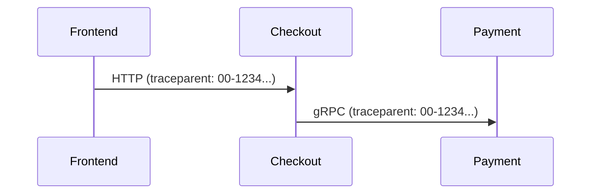
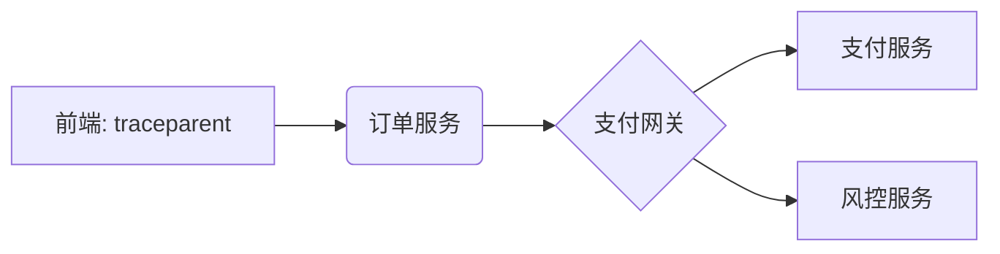

## 简介

OpenTelemetry 作为云原生可观测性的标准工具，在多团队协作的微服务架构中尤为重要。本文将从**命名规范**、**上下文传播**、**数据聚合**三个核心角度，讲解如何让不同团队开发的服务通过OpenTelemetry实现无缝协作。

:::note 为什么需要多团队协作？
现代微服务通常由多个团队独立开发，若每个团队使用不同的监控方案，会导致：
- 追踪链断裂
- 指标定义冲突
- 日志格式不一致
:::

## 1. 统一的命名规范

### 1.1 资源属性约定
所有团队必须遵守相同的资源属性命名规则：

```python
# 错误示例：团队A使用"service.name"，团队B使用"app"
resource = Resource.create({
    "service.name": "checkout-service",  # ✅ 标准属性
    "team": "payment-team",              # ✅ 统一自定义标签
    "env": os.getenv("ENVIRONMENT")      # ✅ 环境标识
})
```

### 1.2 Span命名规范
采用 `[HTTP方法].[服务名].[操作]` 格式：

```
GET.checkout.payment_validation  # ✅
validatePayment                 # ❌ 不明确
```

## 2. 上下文传播实践

### 2.1 跨服务追踪
通过W3C Trace Context标准传递头信息：



### 2.2 代码示例
Python和Go服务的协作示例：

```python
# Python团队 (Flask服务)
from opentelemetry.propagate import inject

@app.route("/order")
def create_order():
    headers = {}
    inject(headers)  # 注入追踪上下文
    requests.post("http://payment/process", headers=headers)
```

```go
// Go团队 (gRPC服务)
func ProcessPayment(ctx context.Context) {
    carrier := propagation.HeaderCarrier{}
    otel.GetTextMapPropagator().Inject(ctx, carrier)
    // 传递给下一个服务
}
```

## 3. 数据聚合策略

### 3.1 公共属性约定
所有团队应在资源中声明通用属性：

| 属性名       | 类型   | 示例值        | 负责团队 |
|--------------|--------|---------------|----------|
| company.id   | string | "acme-corp"   | 平台组   |
| data.center  | string | "us-west-1a"  | 运维组   |

### 3.2 指标命名冲突解决
采用分层命名法：

```
# 团队A (支付)
payment.transaction.count
payment.transaction.amount

# 团队B (库存)
inventory.stock.count
```

## 真实案例：电商平台协作

:::tip 实际场景
某电商平台三个团队协作时的OpenTelemetry实践：
1. **前端团队**：使用 `window.otel` 浏览器SDK
2. **订单团队**：Java + OpenTelemetry自动注入
3. **支付团队**：Go手动埋点
:::

解决方案：


关键措施：
- 共用同一个Collector实例
- 统一采样率配置（10%）
- 共享Kubernetes Sidecar的OTLP exporter

## 总结与练习

### 核心要点
- 命名规范是协作的基础
- W3C上下文传播标准必须严格遵守
- 资源属性需要跨团队协商

### 练习建议
1. 模拟两个团队的服务交互，观察追踪链
2. 尝试修改采样率，观察对聚合数据的影响
3. 创建冲突的span名称，体验排查难度

### 扩展阅读
- [W3C Trace Context规范](https://www.w3.org/TR/trace-context/)
- OpenTelemetry语义约定文档
- 您所在组织的内部监控规范（如有）
