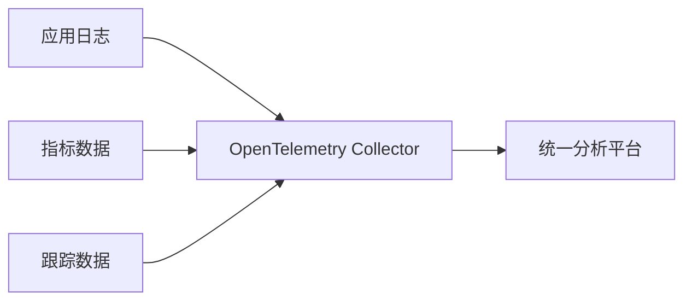

# OpenTelemetry 成熟度模型

## 介绍

OpenTelemetry成熟度模型是一个框架，用于评估组织在采用OpenTelemetry（简称OTel）进行可观测性实践时的进展阶段。它帮助团队从基础的数据收集逐步提升到高级的分析和自动化水平。对于初学者来说，理解这一模型可以明确学习路径，并为未来的实践提供方向。

成熟度模型通常分为几个关键阶段，每个阶段代表不同的能力和目标。下面我们将详细探讨这些阶段。

---

## 成熟度模型的阶段

### 1. 初始阶段（Ad-hoc）

**特征**：
- 零散的日志、指标和跟踪数据收集。
- 缺乏统一的工具或标准。
- 手动配置，无自动化。

**示例场景**：
```python
# 手动记录日志（非OTel标准）
import logging
logging.basicConfig(level=logging.INFO)
logger = logging.getLogger(__name__)
logger.info("User logged in")
```

:::caution
初始阶段的代码通常与特定语言或框架绑定，难以跨系统关联数据。
:::

---

### 2. 基础阶段（Instrumented）

**特征**：
- 使用OpenTelemetry SDK进行标准化数据收集。
- 初步实现跟踪（Tracing）和指标（Metrics）。
- 数据导出到后端（如Jaeger、Prometheus）。

**代码示例**：
```python
from opentelemetry import trace
from opentelemetry.sdk.trace import TracerProvider
from opentelemetry.sdk.trace.export import ConsoleSpanExporter

# 初始化跟踪
trace.set_tracer_provider(TracerProvider())
tracer = trace.get_tracer(__name__)

# 创建一个简单的Span
with tracer.start_as_current_span("example_span"):
    print("This is a traced operation")
```

**输出**：
```
{
  "name": "example_span",
  "context": {"trace_id": "xyz123", "span_id": "abc456"},
  "status": "OK"
}
```

---

### 3. 集成阶段（Integrated）

**特征**：
- 跨服务链路跟踪（Distributed Tracing）。
- 上下文传播（Context Propagation）。
- 与现有监控工具（如Grafana）集成。

**分布式跟踪示例**：
```python
from opentelemetry.propagate import inject, extract
from opentelemetry.trace.propagation.tracecontext import TraceContextTextMapPropagator

# 服务A：注入上下文
headers = {}
inject(headers)

# 服务B：提取上下文
context = extract(headers)
```

:::tip
上下文传播允许跟踪跨多个服务的请求，是微服务架构的关键能力。
:::

---

### 4. 高级阶段（Advanced）

**特征**：
- 自动化检测（Auto-instrumentation）。
- 智能告警和异常检测。
- 性能优化建议。

**自动化检测示例**（以Flask为例）：
```bash
# 通过OTel自动检测Flask应用
opentelemetry-instrument --traces_exporter console flask run
```

---

### 5. 成熟阶段（Optimized）

**特征**：
- 全栈可观测性（日志、指标、跟踪、事件）。
- 机器学习驱动的分析。
- 闭环反馈（如自动扩缩容）。



---

## 实际案例

### 案例：电商平台的成熟度演进
1. **初始阶段**：手动记录订单日志。
2. **基础阶段**：使用OTel跟踪订单创建流程。
3. **集成阶段**：关联支付、库存服务的跟踪数据。
4. **高级阶段**：自动检测延迟异常并触发告警。
5. **成熟阶段**：根据历史数据预测流量高峰。

---

## 总结

OpenTelemetry成熟度模型帮助团队：
- 评估当前可观测性水平。
- 规划下一步改进方向。
- 避免过度投资或工具碎片化。

:::note
**练习**：
1. 尝试用OTel SDK为你的项目添加基础跟踪。
2. 比较手动日志与OTel生成的数据差异。
:::

## 附加资源
- [OpenTelemetry官方文档](https://opentelemetry.io/docs)
- 《分布式系统可观测性》书籍（O'Reilly）