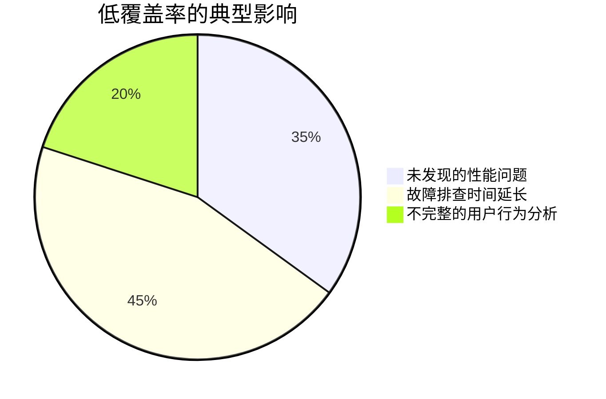
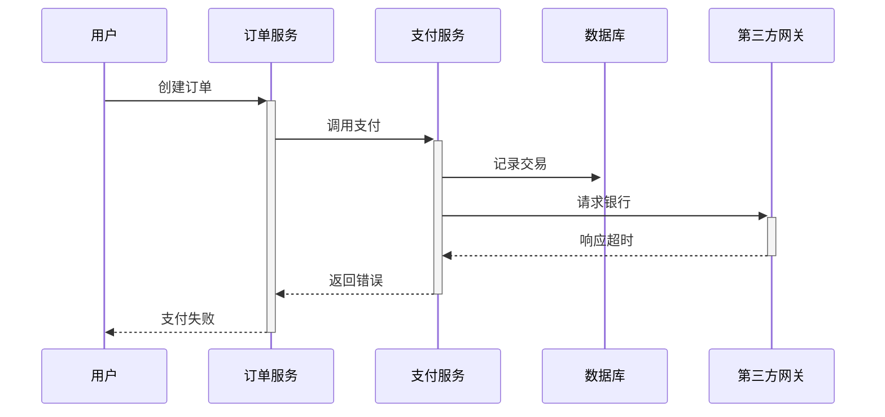

# OpenTelemetry 检测覆盖率

## 介绍

OpenTelemetry检测覆盖率（Instrumentation Coverage）是衡量分布式系统中**关键代码路径**和**服务组件**被OpenTelemetry工具覆盖程度的指标。高覆盖率意味着系统产生的遥测数据（如追踪、指标、日志）能够全面反映系统行为，帮助开发者快速定位问题。

对于初学者来说，理解这一概念有助于：
- 避免监控盲区
- 优化数据收集成本
- 建立有效的可观测性策略

:::note 核心概念
检测覆盖率 = (已检测的代码/服务数量) ÷ (总代码/服务数量) × 100%
:::

## 为什么需要检测覆盖率？



## 评估现有覆盖率

### 1. 代码级检测

检查关键函数是否添加了追踪span：

```python
from opentelemetry import trace

# 未检测的代码
def process_order(order_id):
    # 业务逻辑...

# 已检测的代码
tracer = trace.get_tracer(__name__)
def process_order(order_id):
    with tracer.start_as_current_span("process_order"):
        # 业务逻辑...
```

### 2. 服务级检测

确认所有微服务都已集成OpenTelemetry SDK：

```bash
# 示例：检查Kubernetes集群中的服务
kubectl get deployments -o json | jq '.items[].metadata.labels | has("opentelemetry.io/inject")'
```

## 提高覆盖率的方法

### 自动检测（推荐初学者）

使用OpenTelemetry的自动检测工具：

```javascript
// Node.js示例
require('@opentelemetry/auto-instrumentations-node/register');
```

支持的常见框架：
- Express
- MongoDB
- Redis
- HTTP模块

### 手动检测关键路径

对于核心业务逻辑添加自定义span：

```go
func HandleRequest(ctx context.Context) {
    tr := otel.Tracer("myapp")
    ctx, span := tr.Start(ctx, "HandleRequest")
    defer span.End()
    
    // 业务逻辑...
    span.AddEvent("处理完成")
}
```

## 实际案例：电商系统

**场景**：用户下单后支付超时

**低覆盖率系统**：
- 只能看到"支付服务超时"
- 无法追踪到数据库查询或第三方API调用

**高覆盖率系统**：


## 覆盖率检查工具

1. **OpenTelemetry Collector** 的 `servicegraph` 处理器
2. 使用Prometheus统计检测端点调用次数：
```promql
sum(rate(otel_span_count[5m])) by (service.name)
```

## 总结

| 覆盖率级别    | 特征   | 改进建议     |
|----------|------|----------|
| `<50%`   | 重大盲区 | 优先检测核心服务 |
| `50-80%` | 基本可用 | 补充业务逻辑检测 |
| `>80%`   | 生产就绪 | 优化采样策略   |

:::tip 练习
1. 在您的测试环境中运行自动检测示例
2. 使用`jaeger-ui`查看生成的追踪是否包含所有服务
3. 尝试手动为一个数据库查询操作添加span
:::

## 延伸阅读

- [OpenTelemetry官方文档 - 检测指南](https://opentelemetry.io/docs/concepts/instrumentation/)
- 《分布式系统可观测性》第4章
- 视频教程：OpenTelemetry自动检测实战