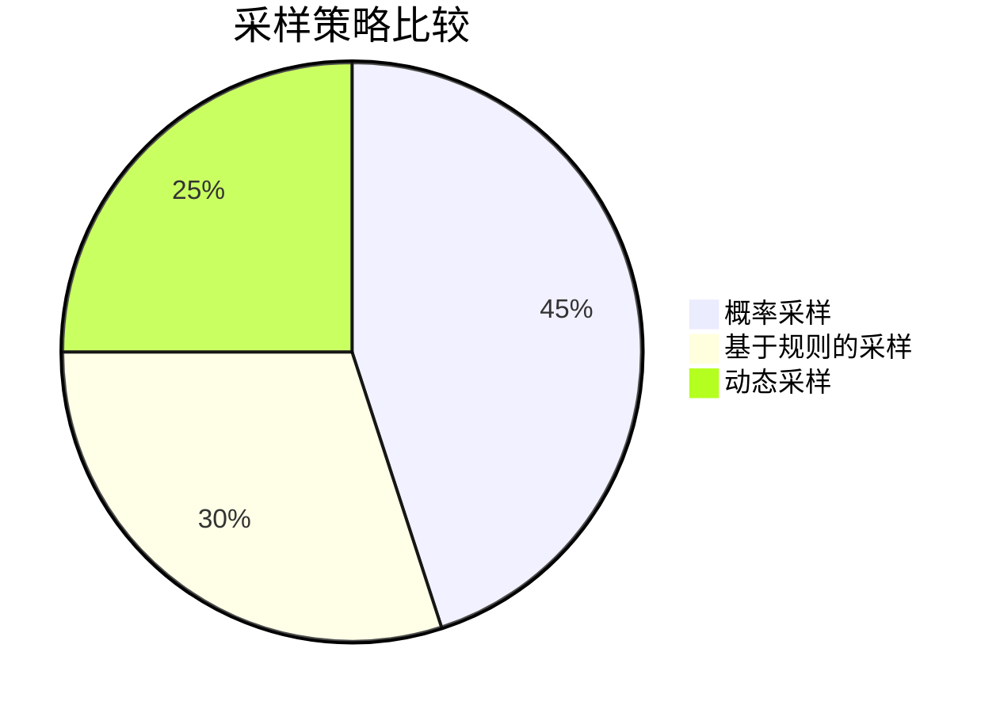

# OpenTelemetry 性能影响管理

## 介绍

OpenTelemetry是现代分布式系统中用于收集遥测数据（如跟踪、指标和日志）的标准工具集。虽然它功能强大，但如果不正确配置，可能会对应用程序性能产生显著影响。本文将介绍如何平衡数据收集需求与系统性能，确保观测性不会成为系统的瓶颈。

## 为什么性能管理很重要

在默认配置下，OpenTelemetry可能会：
- 增加请求延迟
- 提高CPU和内存使用率
- 产生大量网络流量

:::note
性能影响通常在以下场景中最为明显：
- 高吞吐量系统
- 资源受限的环境（如容器或Serverless）
- 收集高频度指标或详细跟踪数据
:::

## 关键性能优化策略

### 1. 采样策略

采样是减少收集数据量的最有效方法之一。OpenTelemetry提供了多种采样策略：

```javascript
// 示例：配置概率采样（只收集10%的请求）
const { NodeTracerProvider } = require('@opentelemetry/sdk-trace-node');
const { SimpleSpanProcessor } = require('@opentelemetry/sdk-trace-base');
const { ParentBasedSampler, TraceIdRatioBasedSampler } = require('@opentelemetry/core');

const provider = new NodeTracerProvider({
  sampler: new ParentBasedSampler({
    root: new TraceIdRatioBasedSampler(0.1) // 10%采样率
  })
});
```

采样策略比较：



### 2. 批处理与导出配置

批处理可以显著减少网络开销：

```python
# Python示例：配置批处理Span处理器
from opentelemetry import trace
from opentelemetry.sdk.trace import TracerProvider
from opentelemetry.sdk.trace.export import BatchSpanProcessor

provider = TracerProvider()
processor = BatchSpanProcessor(
    exporter, 
    max_queue_size=1000,  # 最大队列大小
    schedule_delay_millis=5000,  # 批处理延迟(ms)
    export_timeout_millis=30000  # 导出超时(ms)
)
provider.add_span_processor(processor)
trace.set_tracer_provider(provider)
```

:::tip
最佳实践批处理参数：
- `max_queue_size`: 系统内存的1-5%
- `schedule_delay_millis`: 500-5000ms(取决于延迟容忍度)
- `export_timeout_millis`: 批处理间隔的2-3倍
:::

### 3. 资源与属性限制

限制收集的数据量：
- 设置合理的属性(attribute)数量上限
- 限制Span事件和链接数量
- 过滤掉不必要的属性

```java
// Java示例：配置Span属性限制
SpanLimits spanLimits = SpanLimits.builder()
    .setMaxNumberOfAttributes(32)  // 每个Span最大属性数
    .setMaxNumberOfEvents(10)      // 每个Span最大事件数
    .build();

SdkTracerProvider tracerProvider = SdkTracerProvider.builder()
    .setSpanLimits(spanLimits)
    .addSpanProcessor(BatchSpanProcessor.builder(exporter).build())
    .build();
```

## 真实案例：电商平台优化

**问题**：某电商平台在促销期间发现API延迟增加了30%，追踪发现是OpenTelemetry收集了所有用户点击事件的详细跟踪数据。

**解决方案**：
1. 实施动态采样：正常流量下10%采样，高负载时降至1%
2. 限制每个Span的属性数量从无限制改为最多20个
3. 增加批处理间隔从1秒到5秒

**结果**：
- API延迟恢复到正常水平
- 数据存储成本降低60%
- 仍保留了关键业务路径的完整跟踪

## 监控OpenTelemetry自身性能

使用OpenTelemetry监控其自身性能：

```go
// Go示例：收集OpenTelemetry导出器的指标
import (
    "go.opentelemetry.io/otel/exporters/prometheus"
    "go.opentelemetry.io/otel/sdk/metric"
)

exporter, err := prometheus.New()
if err != nil {
    log.Fatal(err)
}

provider := metric.NewMeterProvider(
    metric.WithReader(exporter),
)
```

关键指标监控：
- 导出队列大小
- 导出失败率
- 处理延迟
- 内存使用量

## 总结

管理OpenTelemetry的性能影响需要平衡数据完整性和系统资源使用。通过实施适当的采样策略、优化批处理配置和限制资源使用，可以显著减少观测性系统的开销，同时仍能获得有价值的洞察。

## 进一步学习

1. OpenTelemetry官方性能调优指南
2. 分布式跟踪采样策略深入探讨
3. 使用基准测试工具测量不同配置的影响

**练习建议**：
1. 在测试环境中尝试不同的采样率，比较性能和数据完整性的平衡
2. 调整批处理参数，观察内存使用和网络流量的变化
3. 为你的应用设计一个自定义的采样策略

通过实践这些技术，你将能够构建既高效又具有观测性的系统。