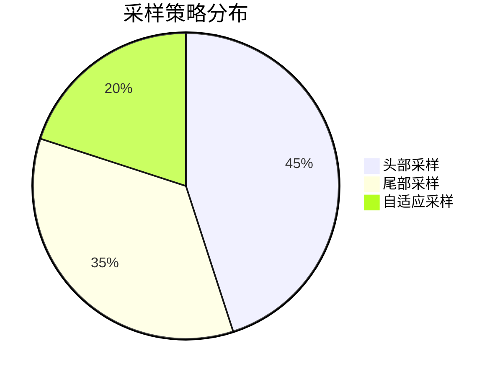

# OpenTelemetry 数据量管理

## 介绍

OpenTelemetry（简称OTel）是云原生应用的可观测性标准工具集，但在高流量系统中可能生成海量数据。**数据量管理**是确保监控系统高效运行的关键实践，包括采样、过滤和聚合等技术，帮助平衡数据完整性与资源消耗。

## 为什么需要数据量管理？

1. **成本控制**：存储和分析大量遥测数据费用高昂。<br />
2. **系统负载**：过多的数据可能压垮收集管道或后端系统。<br />
3. **信号噪声比**：关键问题可能被无关数据淹没。

:::tip 初学者提示
数据量管理的核心原则是：**保留足够信息用于问题诊断，同时丢弃低价值数据**。
:::

## 核心策略

### 1. 采样（Sampling）

采样决定哪些请求的遥测数据会被记录。OpenTelemetry支持多种采样策略：

```python
# 示例：基于概率的采样（Python SDK）
from opentelemetry.sdk.trace import TracerProvider
from opentelemetry.sdk.trace.export import BatchSpanProcessor
from opentelemetry.sdk.trace.sampling import TraceIdRatioBased

# 设置50%的采样率
sampler = TraceIdRatioBased(0.5)
tracer_provider = TracerProvider(sampler=sampler)
```

**常见采样类型**：
- **头部采样**：在请求开始时决定（如固定比率）
- **尾部采样**：根据请求结果决定（如仅记录错误）



### 2. 数据过滤

通过处理器过滤掉不需要的跨度（Span）或指标：

```go
// 示例：Go SDK的过滤器处理器
import (
    "go.opentelemetry.io/collector/processor/filterprocessor"
)

// 只保留持续时间超过100ms的跨度
cfg := &filterprocessor.Config{
    Spans: filterprocessor.SpanFilters{
        Include: &filterprocessor.MatchProperties{
            Attributes: []filterprocessor.Attribute{
                {Key: "duration", Value: ">100ms"},
            },
        },
    },
}
```

:::caution 注意
过度过滤可能导致关键问题难以诊断，建议保留错误和异常数据。
:::

### 3. 数据聚合

对指标数据进行预聚合减少数据量：

```yaml
# OpenTelemetry Collector配置示例
receivers:
  otlp:
    protocols:
      grpc:

processors:
  batch:
    timeout: 1s
    send_batch_size: 1000

exporters:
  prometheus:
    endpoint: "0.0.0.0:8889"

service:
  pipelines:
    metrics:
      receivers: [otlp]
      processors: [batch]
      exporters: [prometheus]
```

## 实际案例：电商平台

**场景**：某电商平台在双十一期间流量增长10倍，监控成本激增。

**解决方案**：
1. 对`/product`接口启用5%采样率
2. 对支付相关接口保持100%采样
3. 过滤掉健康检查请求（`/health`）
4. 使用Collector的批处理减少存储请求

**结果**：
- 数据量减少70%
- 关键业务监控不受影响
- 成本降低65%

## 总结

| 技术 | 适用场景 | 优点 | 缺点 |
|------|----------|------|------|
| 采样 | 高流量系统 | 大幅减少数据量 | 可能丢失关键信息 |
| 过滤 | 噪声数据 | 精准控制数据 | 配置复杂 |
| 聚合 | 指标数据 | 保留趋势信息 | 失去细粒度数据 |

## 扩展练习

1. 在本地OpenTelemetry环境中实现10%的采样率
2. 创建一个过滤规则，排除所有状态码为404的请求
3. 比较批处理前后导出的数据量差异

## 附加资源

- [OpenTelemetry官方采样文档](https://opentelemetry.io/docs/concepts/sampling/)
- [数据优化白皮书](https://opentelemetry.io/resources/)
- [实战案例研究](https://github.com/open-telemetry/opentelemetry-collector-contrib/tree/main/examples)