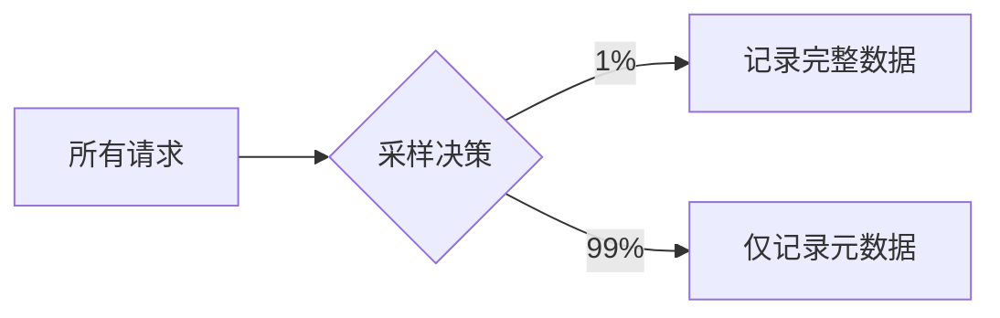

## 介绍

OpenTelemetry是一个开源的观测性框架，用于生成、收集和导出遥测数据（如指标、日志和追踪）。然而，在实际应用中，这些数据可能包含敏感信息（如用户ID、IP地址或API密钥）。隐私保护是确保这些数据不被滥用或泄露的关键环节。本文将介绍OpenTelemetry中的隐私保护策略，包括数据脱敏、过滤和访问控制。

:::note
隐私保护不仅是合规性要求（如GDPR或CCPA），也是建立用户信任的重要实践。
:::

---

## 核心隐私保护技术

### 1. 数据脱敏（Data Redaction）
在导出数据前，移除或替换敏感字段。例如，将用户邮箱替换为哈希值。

#### 代码示例：使用Processor脱敏
```python
from opentelemetry.sdk.trace import TracerProvider
from opentelemetry.sdk.trace.export import BatchSpanProcessor
from opentelemetry.sdk.trace.export import ConsoleSpanExporter

# 自定义处理器：脱敏email字段
def redact_email(span):
    if "user.email" in span.attributes:
        span.attributes["user.email"] = "[REDACTED]"
    return span

provider = TracerProvider()
provider.add_span_processor(BatchSpanProcessor(ConsoleSpanExporter(), 
                           processor=redact_email))
```

#### 输入/输出对比
- **原始数据**: `{"user.email": "test@example.com", "request.path": "/home"}`
- **脱敏后**: `{"user.email": "[REDACTED]", "request.path": "/home"}`

---

### 2. 数据过滤（Filtering）
通过规则排除特定数据。例如，忽略健康检查端点（如`/health`）的追踪。

#### 代码示例：过滤特定路径
```javascript
const { NodeTracerProvider } = require('@opentelemetry/sdk-trace-node');
const { SimpleSpanProcessor } = require('@opentelemetry/sdk-trace-base');

const provider = new NodeTracerProvider();
provider.addSpanProcessor(new SimpleSpanProcessor(exporter, {
  filter: (span) => !span.name.includes('/health') // 忽略/health请求
}));
```

---

### 3. 采样（Sampling）
减少数据量以降低隐私风险。例如，仅记录1%的低敏感度请求。



---

## 实际案例

### 案例：电商平台的用户行为追踪
**问题**：需要分析用户购物路径，但需隐藏支付信息。<br />
**解决方案**：
1. 使用脱敏处理器隐藏信用卡号。
2. 过滤管理员路径（如`/admin/*`）。
3. 对高流量路径（如`/products`）启用采样。

```yaml
# OpenTelemetry Collector配置示例
processors:
  redaction:
    actions:
      - key: "credit_card.number"
        action: "delete"
  filter:
    exclude:
      match_type: "regexp"
      patterns: ["/admin/.*"]
```

---

## 总结

OpenTelemetry的隐私保护可通过以下方式实现：
1. **脱敏**：直接修改或删除敏感字段。
2. **过滤**：按规则排除数据。
3. **采样**：平衡数据量与隐私风险。

:::tip 练习
尝试在本地OpenTelemetry项目中：
1. 添加一个脱敏处理器，隐藏HTTP请求头中的`Authorization`字段。
2. 配置采样率为10%的随机采样。
:::

## 附加资源
- [OpenTelemetry官方文档：数据安全](https://opentelemetry.io/docs/concepts/security/)
- [GDPR合规指南](https://gdpr-info.eu/)