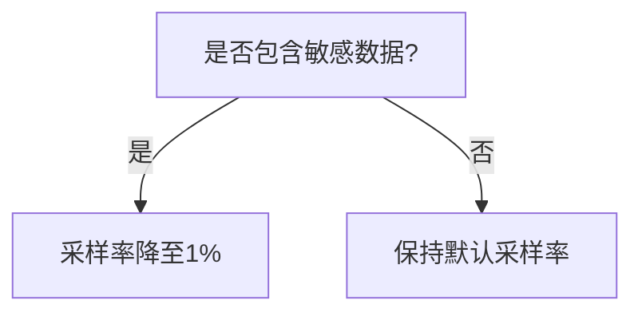

# OpenTelemetry 敏感数据处理

## 介绍

在分布式系统的可观测性实践中，OpenTelemetry是一个强大的工具，用于收集、处理和导出遥测数据（如跟踪、指标和日志）。然而，这些数据中可能包含敏感信息（如用户凭证、API密钥或个人身份信息）。本文将介绍如何在OpenTelemetry中安全地处理敏感数据，确保符合隐私法规（如GDPR）和企业安全策略。

:::note 关键概念
敏感数据处理通常涉及：
1. **数据识别**：明确哪些字段包含敏感信息。
2. **数据脱敏**：替换或删除敏感内容（如用`****`替换密码）。
3. **数据过滤**：完全移除某些字段或整个跨度（Span）。
:::

---

## 敏感数据识别

首先，需要识别哪些数据是敏感的。常见的敏感数据包括：
- HTTP请求头（如`Authorization`）
- 数据库查询参数
- 用户输入字段（如`email`、`credit_card`）

### 示例：HTTP请求中的敏感头
```python
from opentelemetry.sdk.trace import TracerProvider
from opentelemetry.sdk.trace.export import SimpleSpanProcessor

# 假设这是一个包含敏感头的Span
span.set_attribute("http.request.headers.authorization", "Bearer secret-token")
span.set_attribute("http.request.headers.cookie", "session_id=abc123")
```

---

## 数据脱敏技术

OpenTelemetry提供了多种方式处理敏感数据：

### 1. 使用Span处理器过滤属性
```python
from opentelemetry.sdk.trace import SpanProcessor

class RedactingSpanProcessor(SpanProcessor):
    def on_end(self, span):
        for attr in list(span.attributes.keys()):
            if "authorization" in attr.lower() or "cookie" in attr.lower():
                span.attributes[attr] = "****REDACTED****"

provider = TracerProvider()
provider.add_span_processor(RedactingSpanProcessor())
```

### 2. 使用OpenTelemetry转换器（示例：正则匹配脱敏）
```javascript
const { NodeTracerProvider } = require('@opentelemetry/sdk-trace-node');
const provider = new NodeTracerProvider();

provider.addSpanProcessor({
  onEnd(span) {
    span.attributes.forEach((value, key) => {
      if (/password|credit_card/i.test(key)) {
        span.attributes[key] = value.replace(/./g, '*');
      }
    });
  }
});
```

---

## 实际案例

### 场景：电子商务应用的支付处理
1. **问题**：支付服务Span记录了完整的信用卡号。
2. **解决方案**：通过Span处理器脱敏最后12位数字：
```python
class PaymentSpanProcessor(SpanProcessor):
    def on_end(self, span):
        if "payment.card_number" in span.attributes:
            card_num = span.attributes["payment.card_number"]
            span.attributes["payment.card_number"] = f"****-****-****-{card_num[-4:]}"
```

### 输出对比
| 处理前 | 处理后 |
|--------|--------|
| `4111-1111-1111-1111` | `****-****-****-1111` |

---

## 高级策略

### 1. 采样敏感操作


### 2. 结合上下文过滤
```python
# 仅在生产环境脱敏
if os.getenv("ENVIRONMENT") == "production":
    span.attributes["user.email"] = hash_email(span.attributes["user.email"])
```

:::warning 注意
脱敏可能影响调试！建议：
- 在开发环境保留原始数据（需加密存储）
- 记录脱敏操作的审计日志
:::

---

## 总结

| 技术 | 适用场景 | 工具示例 |
|------|----------|----------|
| 属性脱敏 | 部分敏感字段 | `SpanProcessor` |
| 完整Span过滤 | 高度敏感操作 | `Sampler` |
| 加密存储 | 法律合规需求 | Vault/HSM集成 |

**附加资源**：
1. [OpenTelemetry官方安全指南](https://opentelemetry.io/docs/concepts/security/)
2. 练习：为你的Web框架（如Flask/Django）编写一个中间件，自动脱敏`Authorization`头。

:::tip 下一步
尝试在本地环境中实现一个脱敏处理器，并验证它是否影响了Jaeger/Zipkin中的可视化效果！
:::