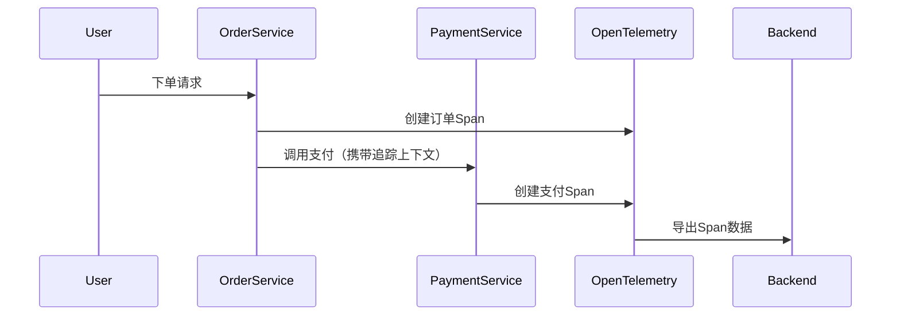

## 介绍

OpenTelemetry是一个开源的可观测性框架，用于生成、收集和导出遥测数据（如指标、日志和追踪）。在实现OpenTelemetry后，测试和验证是确保数据准确性和系统可靠性的关键步骤。本文将介绍如何测试和验证OpenTelemetry的实现，并提供实际案例和代码示例。

:::note
测试和验证OpenTelemetry的实现可以帮助你发现潜在的问题，例如数据丢失、错误的上下文传播或不正确的指标计算。
:::

## 测试OpenTelemetry的实现

### 1. 单元测试

单元测试是验证单个组件（如Span或Metric生成）是否按预期工作的基础方法。以下是一个使用OpenTelemetry JavaScript SDK的单元测试示例：

```javascript
const { trace } = require('@opentelemetry/api');
const { BasicTracerProvider } = require('@opentelemetry/tracing');

describe('OpenTelemetry Tracing', () => {
  let provider;

  beforeEach(() => {
    provider = new BasicTracerProvider();
    trace.setGlobalTracerProvider(provider);
  });

  it('should create a span with correct attributes', () => {
    const tracer = trace.getTracer('test-tracer');
    const span = tracer.startSpan('test-span');
    span.setAttribute('key', 'value');
    span.end();

    expect(span.attributes).toEqual({ key: 'value' });
  });
});
```

### 2. 集成测试

集成测试验证OpenTelemetry与其他组件（如导出器或后端系统）的交互。以下是一个验证数据是否成功导出到控制台的示例：

```javascript
const { ConsoleSpanExporter, SimpleSpanProcessor } = require('@opentelemetry/tracing');

describe('OpenTelemetry Export', () => {
  it('should export spans to console', () => {
    const exporter = new ConsoleSpanExporter();
    const processor = new SimpleSpanProcessor(exporter);
    provider.addSpanProcessor(processor);

    const tracer = trace.getTracer('test-tracer');
    const span = tracer.startSpan('test-span');
    span.end();

    // 验证控制台输出（通常通过模拟console.log实现）
  });
});
```

### 3. 端到端测试

端到端测试模拟真实用户场景，验证整个系统的可观测性数据流。例如，以下是一个模拟HTTP请求并验证追踪数据的示例：

```javascript
const http = require('http');
const { NodeTracerProvider } = require('@opentelemetry/node');

describe('End-to-End Tracing', () => {
  it('should trace HTTP requests', async () => {
    const provider = new NodeTracerProvider();
    trace.setGlobalTracerProvider(provider);

    const server = http.createServer((req, res) => {
      const span = trace.getTracer('http-server').startSpan('handle-request');
      res.end('OK');
      span.end();
    });

    server.listen(3000);
    const response = await fetch('http://localhost:3000');
    server.close();

    // 验证追踪数据是否包含HTTP请求的Span
  });
});
```

## 验证OpenTelemetry数据

### 1. 数据完整性验证

确保所有预期的遥测数据（如Span、Metric）都已生成并导出。以下是一个验证Span数量的示例：

```javascript
const { InMemorySpanExporter } = require('@opentelemetry/tracing');

describe('Data Integrity', () => {
  it('should export all spans', () => {
    const exporter = new InMemorySpanExporter();
    const processor = new SimpleSpanProcessor(exporter);
    provider.addSpanProcessor(processor);

    const tracer = trace.getTracer('test-tracer');
    tracer.startSpan('span-1').end();
    tracer.startSpan('span-2').end();

    expect(exporter.getFinishedSpans().length).toBe(2);
  });
});
```

### 2. 上下文传播验证

验证追踪上下文是否在服务之间正确传播。以下是一个验证HTTP头中追踪上下文的示例：

```javascript
describe('Context Propagation', () => {
  it('should propagate context via HTTP headers', () => {
    const tracer = trace.getTracer('propagation-test');
    const span = tracer.startSpan('parent-span');
    const context = trace.setSpan(trace.context.active(), span);

    const headers = {};
    propagator.inject(context, headers, defaultTextMapSetter);

    expect(headers['traceparent']).toBeDefined();
  });
});
```

## 实际案例

### 案例：电子商务应用的追踪验证

假设你正在开发一个电子商务应用，需要验证以下场景：
1. 用户下单时生成一个追踪Span。
2. 订单服务与支付服务之间的上下文传播。
3. 确保所有Span都导出到后端系统。



验证代码可能如下：

```javascript
describe('E-commerce Tracing', () => {
  it('should trace order flow', () => {
    // 模拟下单请求
    const orderSpan = tracer.startSpan('create-order');
    // 模拟调用支付服务
    const paymentSpan = tracer.startSpan('process-payment', {
      parent: orderSpan
    });
    paymentSpan.end();
    orderSpan.end();

    // 验证Span关系和数量
    const spans = exporter.getFinishedSpans();
    expect(spans.length).toBe(2);
    expect(spans[1].parentSpanId).toBe(spans[0].spanContext().spanId);
  });
});
```

## 总结

测试和验证OpenTelemetry的实现是确保可观测性数据准确性的关键步骤。通过单元测试、集成测试和端到端测试的组合，你可以验证从数据生成到导出的完整流程。关键点包括：
- 验证单个组件的正确性（如Span生成）。
- 确保数据在不同服务间正确传播。
- 验证数据的完整性和一致性。

## 附加资源与练习

### 练习
1. 为你的OpenTelemetry实现添加单元测试，验证自定义属性的设置。
2. 模拟一个微服务场景，验证上下文传播是否正常工作。
3. 使用内存导出器验证端到端流程中的数据完整性。

### 进一步学习
- OpenTelemetry官方文档中的[测试指南](https://opentelemetry.io/docs/concepts/testing/)。
- 学习使用[OpenTelemetry Collector](https://opentelemetry.io/docs/collector/)进行更复杂的数据验证。