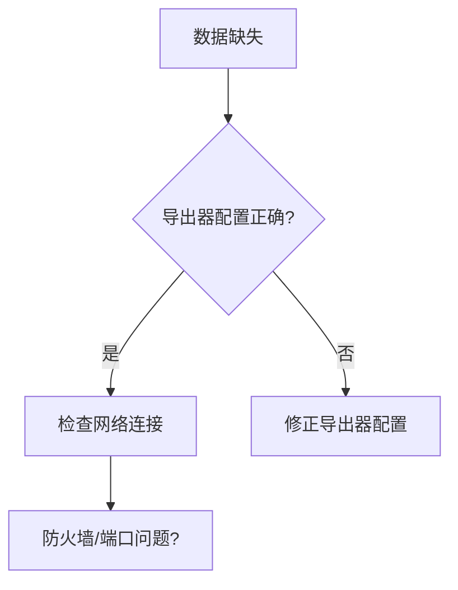

# OpenTelemetry 故障排除指南

## 简介

OpenTelemetry是一个强大的可观测性框架，但在实际使用中可能会遇到数据丢失、配置错误或性能问题。本指南将帮助你逐步识别和解决这些问题，适合刚接触OpenTelemetry的开发者。

## 常见问题分类

### 1. 数据未到达后端
**症状**：在Jaeger/Prometheus等工具中看不到数据。

**检查步骤**：
1. **验证导出器配置**：
   ```javascript
   const { NodeTracerProvider } = require('@opentelemetry/sdk-trace-node');
   const { ConsoleSpanExporter } = require('@opentelemetry/sdk-trace-base');

   const provider = new NodeTracerProvider();
   provider.addSpanProcessor(new SimpleSpanProcessor(new ConsoleSpanExporter()));
   provider.register();
   ```
   :::tip
   先用`ConsoleSpanExporter`确认基础数据是否生成，再切换为OTLP导出器。
   :::

2. **网络连接测试**：
   ```bash
   curl -v http://your-collector:4318/v1/traces
   ```

### 2. 采样率过高导致数据丢失
**解决方案**：调整采样策略
```javascript
const { AlwaysOnSampler } = require('@opentelemetry/core');
const provider = new NodeTracerProvider({
  sampler: new AlwaysOnSampler() // 改为ParentBasedSampler生产环境
});
```

### 3. 属性缺失问题
**案例**：HTTP请求中丢失`http.status_code`：
```javascript
const span = tracer.startSpan('http-request');
span.setAttribute('http.status_code', 200); // 手动补充
```

## 诊断工具

### OpenTelemetry 诊断日志
启用调试日志：
```bash
export OTEL_LOG_LEVEL=debug
```

### Mermaid诊断流程图


## 真实案例

**电商应用场景**：  
用户报告购物车加载缓慢，但APM中无相关trace。通过以下步骤排查：
1. 确认前端SDK已注入`window.otel`
2. 发现后端服务过滤器丢弃了`/cart`路由的trace
3. 修正Spring Boot的`@WebFilter`配置后恢复监控

## 总结与练习

**关键要点**：
- 始终从最简单的导出器（如Console）开始验证
- 分阶段启用组件（SDK→导出器→采集器→后端）
- 合理设置采样率平衡开销与数据量

**练习任务**：
1. 故意错误配置OTLP端点，观察SDK日志
2. 创建一个属性不全的span，然后在Jaeger中查找它

## 延伸阅读
- [OpenTelemetry官方诊断文档](https://opentelemetry.io/docs/concepts/diagnostics/)
- 《Distributed Tracing in Practice》第6章
``` 

注：实际使用时请移除最外层的