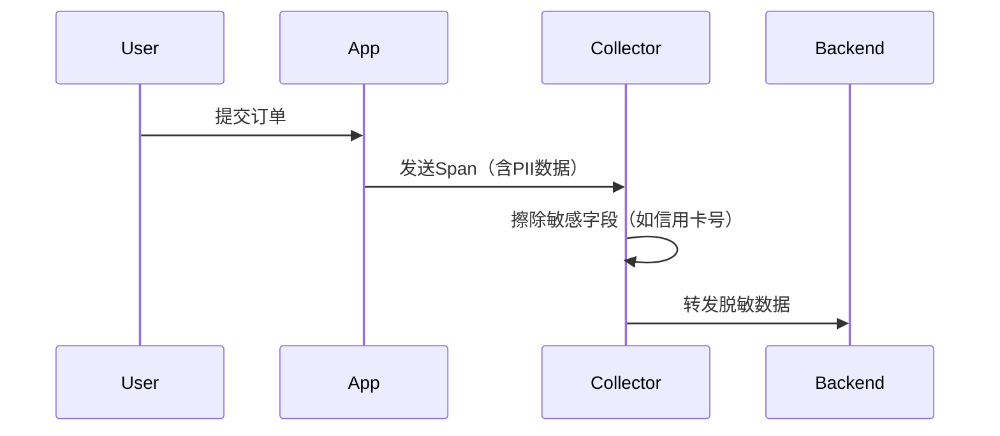

## 引言

OpenTelemetry（简称OTel）作为云原生可观测性的标准工具集，其安全性直接影响追踪（Tracing）、指标（Metrics）、日志（Logs）等数据的可靠性。本文将介绍OpenTelemetry的安全模型、常见风险及防护措施，帮助开发者在实践中构建安全的可观测性流水线。

---

## 核心安全机制

### 1. 数据传输加密
OpenTelemetry支持通过TLS/SSL加密传输数据，防止中间人攻击。以下是配置TLS的代码示例：

```python
# 使用Python SDK配置TLS
from opentelemetry.exporter.otlp.proto.grpc.trace_exporter import OTLPSpanExporter
from opentelemetry.sdk.resources import Resource
from opentelemetry.sdk.trace import TracerProvider

exporter = OTLPSpanExporter(
    endpoint="https://collector.example.com:4317",
    insecure=False,  # 启用TLS
    credentials=ChannelCredentials(credentials.ssl_channel_credentials())
)
```

:::note
生产环境必须禁用`insecure`模式（设为`False`），否则数据会以明文传输。
:::

### 2. 身份认证
支持多种认证方式确保数据来源可信：

| 认证方式       | 适用场景                |
|----------------|-------------------------|
| API Key        | 简单服务间通信          |
| OAuth2.0       | 需要动态令牌的场景      |
| mTLS           | 双向身份验证的高安全需求|

```yaml
# Collector配置示例（mTLS）
receivers:
  otlp:
    protocols:
      grpc:
        tls:
          cert_file: server.crt
          key_file: server.key
          client_ca_file: ca.crt  # 验证客户端证书
```

---

## 实际案例：电商系统的安全观测

假设一个电商系统使用OpenTelemetry收集用户行为数据，需满足GDPR合规要求：



:::warning
处理包含PII（个人身份信息）的数据时，必须：
1. 在客户端或Collector层进行数据脱敏
2. 明确告知用户数据收集范围
3. 提供数据删除接口以满足"被遗忘权"
:::

---

## 合规性要求

### 主要标准对照表
| 标准         | OpenTelemetry对应措施                  |
|--------------|---------------------------------------|
| GDPR         | 数据最小化、匿名化处理                 |
| HIPAA        | 加密存储医疗健康数据                   |
| SOC2         | 完整的审计日志和访问控制               |

---

## 总结与练习

### 关键点回顾
- 始终启用传输层加密（TLS）
- 根据业务需求选择适当的认证方式
- 敏感数据应在采集最早阶段脱敏

### 动手练习
1. 使用`openssl`生成自签名证书配置mTLS
2. 编写一个Processor过滤Span中的邮箱字段
3. 在Collector中设置基于IP的访问控制规则

### 扩展阅读
- [OpenTelemetry安全白皮书](https://opentelemetry.io/docs/concepts/security/)
- NIST SP 800-53安全控制框架
- CNCF安全审计报告

:::tip
调试时可临时使用`insecure`模式，但必须通过环境变量而非代码硬编码敏感配置。
:::