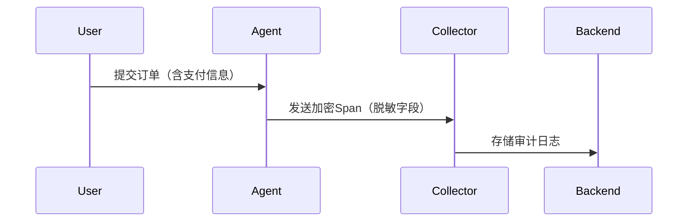

# OpenTelemetry 安全审计

## 介绍

OpenTelemetry是一个开源的观测性框架，用于生成、收集和管理遥测数据（如指标、日志和追踪）。随着其在分布式系统中的广泛应用，**安全审计**成为确保数据完整性和系统可靠性的关键环节。本文将介绍OpenTelemetry安全审计的核心概念、实施步骤和实际案例。

安全审计的主要目标包括：
- 验证数据的来源和传输过程是否安全。
- 确保敏感数据（如用户信息）不被泄露。
- 检测配置错误或潜在的安全漏洞。

:::note
安全审计不仅是合规性要求（如GDPR、HIPAA），也是系统稳定性的保障。
:::

---

## 安全审计的关键步骤

### 1. 数据收集与传输安全
OpenTelemetry支持通过TLS/SSL加密数据传输。以下是一个配置安全导出的代码示例（使用Python SDK）：

```python
from opentelemetry import trace
from opentelemetry.sdk.trace import TracerProvider
from opentelemetry.sdk.trace.export import BatchSpanProcessor
from opentelemetry.exporter.otlp.proto.grpc.trace_exporter import OTLPSpanExporter

# 启用TLS加密的OTLP导出器
exporter = OTLPSpanExporter(
    endpoint="https://your-collector:4317",
    insecure=False,  # 强制使用TLS
)
provider = TracerProvider()
processor = BatchSpanProcessor(exporter)
provider.add_span_processor(processor)
trace.set_tracer_provider(provider)
```

### 2. 敏感数据过滤
通过处理器过滤敏感字段（如`user.email`）：
```python
from opentelemetry.sdk.trace import SpanProcessor

class RedactionProcessor(SpanProcessor):
    def on_end(self, span):
        if "user.email" in span.attributes:
            span.attributes["user.email"] = "[REDACTED]"
```

### 3. 访问控制与权限管理
使用OpenTelemetry Collector的配置限制数据访问：
```yaml
receivers:
  otlp:
    protocols:
      grpc:
        auth:
          authenticator: bearer_token

extensions:
  bearer_token:
    token: "your-secure-token"
```

---

## 实际案例：电商平台的安全审计

### 场景
一个电商平台使用OpenTelemetry追踪用户订单流程，但发现未加密的追踪数据可能泄露支付信息。

### 解决方案
1. **启用传输加密**：在Collector和Agent间配置TLS。
2. **数据脱敏**：在Span处理器中自动脱敏`payment.card_number`字段。
3. **审计日志**：记录所有对追踪数据的访问行为。



---

## 总结

OpenTelemetry安全审计需要关注：
- **传输安全**：始终使用TLS/SSL。
- **数据最小化**：仅收集必要数据并脱敏敏感字段。
- **访问控制**：通过令牌或RBAC限制访问权限。

:::tip 练习
1. 尝试在本地部署OpenTelemetry Collector，并配置TLS加密。
2. 编写一个自定义Span处理器，脱敏字段`credit_card.last_four`。
:::

## 扩展资源
- [OpenTelemetry官方安全指南](https://opentelemetry.io/docs/concepts/security/)
- [NIST安全审计框架](https://csrc.nist.gov/projects/risk-management)