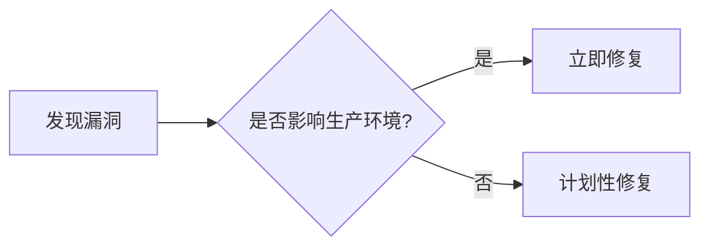

## 引言

OpenTelemetry 作为现代可观测性的核心工具，其安全性直接影响整个系统的稳定性。**漏洞管理**是确保OpenTelemetry组件免受攻击的关键实践。本文将介绍漏洞的生命周期、常见类型及如何通过工具和流程降低风险。

---

## 什么是OpenTelemetry漏洞管理？

漏洞管理是指识别、评估、修复和监控OpenTelemetry组件中安全弱点的系统化过程。它包括：
- **漏洞扫描**：定期检查依赖库和配置。
- **风险评估**：确定漏洞的严重性和影响范围。
- **补丁应用**：通过升级或配置变更修复问题。

:::note
OpenTelemetry本身是开源项目，其漏洞可能来自：
- 核心库（如`opentelemetry-java`）
- 导出器（如OTLP导出器）
- 第三方集成（如Prometheus或Jaeger适配器）
:::

---

## 常见漏洞类型

### 1. 依赖库漏洞
OpenTelemetry依赖的第三方库（如gRPC或Protobuf）可能存在已知漏洞。例如：

```bash
# 使用Trivy扫描镜像中的漏洞
trivy image otel/opentelemetry-collector:latest
```
输出会显示CVE编号和受影响版本。

### 2. 配置错误
错误的配置可能导致数据泄露或拒绝服务。例如：
```yaml
# 不安全的接收器配置示例（暴露未加密端口）
receivers:
  otlp:
    protocols:
      http:
        endpoint: 0.0.0.0:55681  # 未启用TLS
```

### 3. 数据注入攻击
攻击者可能伪造遥测数据污染监控指标。例如：
```python
# 恶意构造的Span（Python示例）
from opentelemetry import trace
tracer = trace.get_tracer("attacker")
with tracer.start_as_current_span("fake_span") as span:
    span.set_attribute("user.password", "stolen_data")  # 注入敏感信息
```

---

## 漏洞管理流程

### 步骤1：识别漏洞
- 使用工具如`dependabot`或`OWASP Dependency-Check`扫描依赖项。
- 订阅OpenTelemetry安全公告（如[GitHub Advisory Database](https://github.com/advisories)）。

### 步骤2：评估影响


### 步骤3：修复与验证
- **补丁升级**：修改`go.mod`或`pom.xml`文件更新版本。
- **配置加固**：启用TLS并限制IP访问：
```yaml
receivers:
  otlp:
    protocols:
      http:
        endpoint: 192.168.1.100:4318
        tls:
          cert_file: server.crt
          key_file: server.key
```

---

## 实际案例：Log4j漏洞（CVE-2021-44228）

**场景**：OpenTelemetry Collector的Java依赖项包含易受攻击的Log4j版本。

**解决方案**：
1. 升级到Log4j 2.17.0+：
```xml
<!-- Maven示例 -->
<dependency>
  <groupId>org.apache.logging.log4j</groupId>
  <artifactId>log4j-core</artifactId>
  <version>2.17.1</version>
</dependency>
```
2. 添加JVM参数禁用漏洞功能：
```bash
-Dlog4j2.formatMsgNoLookups=true
```

---

## 总结与练习

### 关键点总结
- 定期扫描依赖项和配置。
- 遵循最小权限原则（如限制导出器访问）。
- 监控官方安全通告。

### 练习建议
1. 使用`trivy`扫描本地OpenTelemetry Collector镜像。
2. 在测试环境中模拟数据注入攻击并观察影响。
3. 尝试修复一个过时的依赖项（如升级`opentelemetry-sdk`版本）。

### 扩展资源
- [OpenTelemetry安全文档](https://opentelemetry.io/docs/concepts/security/)
- [CVE数据库](https://cve.mitre.org/)
- [OWASP Top 10](https://owasp.org/www-project-top-ten/)