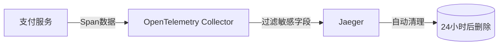

# OpenTelemetry 安全最佳实践

## 介绍

OpenTelemetry 是一个开源的观测性框架，用于生成、收集和管理遥测数据（如指标、日志和跟踪）。随着微服务架构的普及，确保这些数据的安全性和合规性变得至关重要。本文将介绍 OpenTelemetry 的安全最佳实践，帮助你在不牺牲性能的前提下保护敏感数据。

---

## 1. 数据保护

### 敏感数据过滤
在收集遥测数据时，可能会无意中捕获敏感信息（如用户密码、API密钥）。OpenTelemetry 提供了处理器来过滤或脱敏这些数据。

**示例：使用 `attributes` 处理器删除敏感字段**
```python
from opentelemetry.sdk.trace.export import BatchSpanProcessor
from opentelemetry.sdk.trace import TracerProvider
from opentelemetry.trace import Span

# 创建处理器以删除敏感属性
span_processor = BatchSpanProcessor(
    exporter=exporter,
    # 过滤掉名为 "credit_card" 的属性
    attributes_filter=lambda span: {k: v for k, v in span.attributes.items() if k != "credit_card"}
)
```

:::caution
确保在生产环境中测试过滤规则，避免意外删除关键数据。
:::

---

## 2. 访问控制

### 基于角色的访问控制（RBAC）
限制对 OpenTelemetry 收集器和后端系统的访问权限。例如：
- **只读权限**：分配给监控团队。
- **写入权限**：仅限受信任的服务账户。

**Kubernetes RBAC 示例**
```yaml
apiVersion: rbac.authorization.k8s.io/v1
kind: Role
metadata:
  name: otel-reader
rules:
- apiGroups: [""]
  resources: ["traces", "metrics"]
  verbs: ["get", "list"]
```

---

## 3. 传输安全

### 启用 TLS 加密
确保所有数据传输（如从 SDK 到收集器）都使用 TLS 加密。

**配置 OpenTelemetry Collector 的 TLS**
```yaml
receivers:
  otlp:
    protocols:
      grpc:
        tls:
          cert_file: server.crt
          key_file: server.key
```

:::tip
使用工具如 `openssl` 生成自签名证书进行测试，但生产环境应使用受信任的 CA 签发证书。
:::

---

## 4. 合规性策略

### GDPR 和 HIPAA 合规
- **数据最小化**：仅收集必要的遥测数据。
- **保留策略**：设置自动删除旧数据的规则。

**示例：配置 Jaeger 的存储保留时间**
```yaml
storage:
  trace:
    ttl: 168h # 保留7天
```

---

## 实际案例

### 案例：电子商务平台的支付跟踪
一个电商平台使用 OpenTelemetry 跟踪支付流程，但需要避免记录信用卡号。  
**解决方案**：
1. 在 Span 处理器中过滤 `payment.card_number` 属性。
2. 对用户 ID 进行哈希处理（如使用 SHA-256）。
3. 将 Jaeger 的存储限制为 24 小时。



---

## 总结

| 实践领域       | 关键措施                          |
|----------------|-----------------------------------|
| 数据保护       | 过滤敏感字段、脱敏                |
| 访问控制       | RBAC、最小权限原则                |
| 传输安全       | TLS 加密、证书管理                |
| 合规性         | 数据最小化、保留策略              |

---

## 附加资源

1. [OpenTelemetry 官方安全文档](https://opentelemetry.io/docs/concepts/security/)
2. 练习：配置一个本地 OpenTelemetry 收集器，实现字段过滤和 TLS。
3. 工具推荐：`openssl`、`vault`（密钥管理）。

:::note
安全是一个持续的过程，定期审计你的 OpenTelemetry 实现以确保合规性。
:::