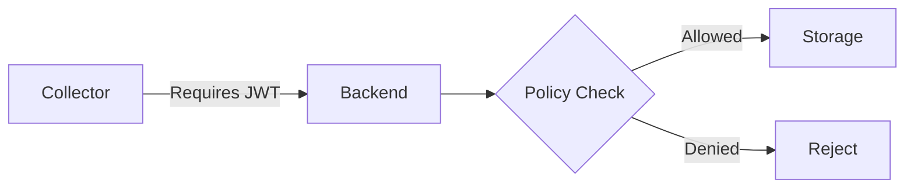

## 引言

OpenTelemetry（简称OTel）作为云原生可观测性标准，其隐私设计是确保敏感数据安全的关键。本文将介绍OTel如何通过**数据脱敏**、**访问控制**和**传输加密**等机制保护隐私，并通过实际案例展示最佳实践。

## 核心隐私设计原则

### 1. 数据最小化
OTel默认仅收集必要的遥测数据（如指标、日志、链路），开发者可通过配置明确过滤敏感字段：
```python
from opentelemetry import trace
from opentelemetry.sdk.trace import TracerProvider
from opentelemetry.sdk.trace.export import BatchSpanProcessor

# 创建自定义处理器过滤敏感信息
def filter_attributes(span):
    if "credit_card" in span.attributes:
        del span.attributes["credit_card"]

provider = TracerProvider()
processor = BatchSpanProcessor(span_filter=filter_attributes)
provider.add_span_processor(processor)
trace.set_tracer_provider(provider)
```

### 2. 传输安全
OTel使用TLS加密所有数据传输，配置示例：
```yaml
receivers:
  otlp:
    protocols:
      grpc:
        endpoint: 0.0.0.0:4317
        tls:
          cert_file: server.crt
          key_file: server.key
```

### 3. 访问控制
通过RBAC限制数据访问权限：


## 实际应用案例

### 案例：电商用户行为追踪
某电商平台需要追踪用户点击流但需隐藏PII（个人身份信息）：
1. **前端SDK配置**：自动移除`user.email`等字段
2. **Collector处理**：添加哈希处理器替换`user.id`
3. **后端验证**：审计日志记录所有数据访问

:::tip 隐私保护技巧
使用`attributes_processor`在数据出口处批量脱敏：
```go
import (
    "go.opentelemetry.io/collector/processor/attributesprocessor"
)

// 移除所有邮件地址
config := &attributesprocessor.Config{
    Actions: []attributesprocessor.ActionKeyValue{
        {Key: "user.email", Action: attributesprocessor.DELETE},
    },
}
```
:::

## 总结

OpenTelemetry通过分层设计实现隐私保护：
1. **采集层**：数据过滤与采样
2. **传输层**：TLS/mTLS加密
3. **存储层**：访问控制与审计

## 扩展学习

- 官方文档：[OpenTelemetry Security](https://opentelemetry.io/docs/concepts/security/)
- 实践练习：配置一个过滤`password`字段的Span处理器
- 工具推荐：使用`opentelemetry-collector-contrib`中的`filterprocessor`