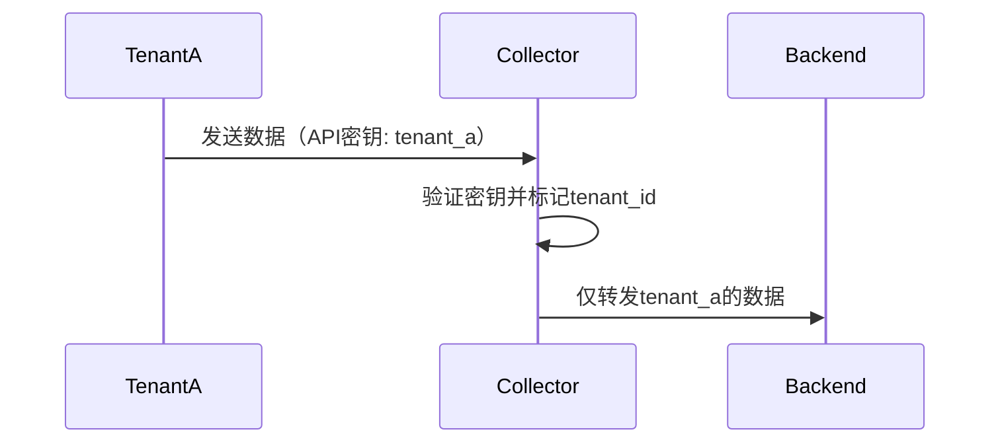

# OpenTelemetry 访问控制

## 介绍

OpenTelemetry（简称OTel）是用于生成、收集和管理遥测数据（如指标、日志和跟踪）的开源工具集。**访问控制**是确保只有授权用户或系统能够访问这些敏感数据的关键机制。本文将介绍如何在OpenTelemetry中实现访问控制，涵盖身份验证、授权以及实际配置示例。

---

## 为什么需要访问控制？

1. **防止数据泄露**：未经授权的访问可能导致敏感数据（如请求头、用户ID）暴露。<br />
2. **合规性要求**：如GDPR、HIPAA等法规要求对数据访问进行严格管控。<br />
3. **资源保护**：避免恶意用户过度消耗收集器资源（如高频发送垃圾数据）。

---

## 核心概念

### 1. 身份验证（Authentication）
验证请求者的身份，常见方式：
- **API密钥**：在请求头中传递密钥（如 `Authorization: Bearer <token>`）。
- **mTLS（双向TLS）**：客户端和服务端通过证书互相验证。

#### 示例：API密钥验证
```yaml
# OpenTelemetry Collector 配置示例
receivers:
  otlp:
    protocols:
      http:
        auth:
          authenticator: api_key_auth

extensions:
  basicauth/api_key_auth:
    client_auth:
      username: "user"
      password: "secure-password"
```

---

### 2. 授权（Authorization）
定义已验证用户能执行的操作，通常通过**RBAC（基于角色的访问控制）**实现。

#### 示例：限制特定角色的访问
```yaml
# 使用OpenTelemetry Collector的RBAC配置
processors:
  attributes/role_filter:
    actions:
      - key: "user.role"
        action: delete
        conditions:
          - value: "guest"
```

---

## 实际案例

### 场景：多租户SaaS平台的访问控制
假设一个SaaS平台需要为不同客户（租户）隔离遥测数据：

1. **身份验证**：每个租户使用唯一的API密钥。<br />
2. **授权**：租户只能访问自己的数据，通过资源属性（如 `tenant_id`）过滤。



---

## 最佳实践

:::tip
- **最小权限原则**：仅授予必要权限。<br />
- **定期轮换密钥**：降低长期暴露风险。<br />
- **审计日志**：记录所有访问尝试。
:::

:::warning
避免在代码中硬编码密钥！使用环境变量或密钥管理服务（如Vault）。
:::

---

## 总结

OpenTelemetry访问控制通过身份验证和授权保护遥测数据。关键步骤包括：
1. 配置身份验证（如API密钥、mTLS）。<br />
2. 定义授权规则（如RBAC）。<br />
3. 实施租户隔离等实际策略。

---

## 延伸学习

- [OpenTelemetry官方安全文档](https://opentelemetry.io/docs/concepts/security/)<br />
- 练习：在本地部署中配置mTLS并测试访问限制。