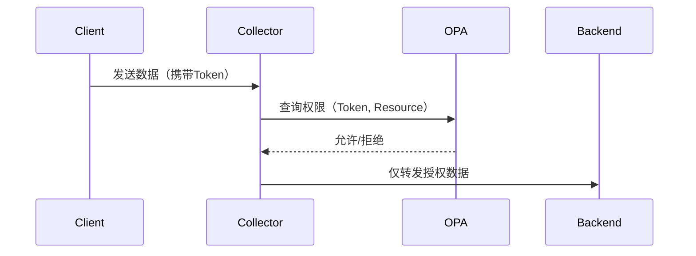

# OpenTelemetry 认证与授权

## 介绍

OpenTelemetry是一个开源的可观测性框架，用于生成、收集和管理遥测数据（如指标、日志和跟踪）。在生产环境中，确保这些数据的安全传输和访问控制至关重要。本文将介绍OpenTelemetry中的**认证（Authentication）**与**授权（Authorization）**机制，帮助初学者理解如何保护可观测性数据。

:::note 关键概念
- **认证**：验证客户端或服务的身份（例如使用API密钥或证书）。
- **授权**：确定已验证身份的用户或服务是否有权限执行特定操作（如访问特定资源）。
:::

---

## 认证机制

### 1. 基础认证
OpenTelemetry支持通过HTTP Basic Auth或TLS证书进行认证。以下是配置示例：

#### 示例：gRPC导出器使用TLS
```yaml
# OpenTelemetry Collector配置（config.yaml）
receivers:
  otlp:
    protocols:
      grpc:
        tls:
          cert_file: server.crt
          key_file: server.key
```

#### 客户端代码示例（Python）
```python
from opentelemetry.exporter.otlp.proto.grpc.trace_exporter import OTLPSpanExporter
from opentelemetry.sdk.trace import TracerProvider
from opentelemetry.sdk.trace.export import BatchSpanProcessor

exporter = OTLPSpanExporter(
    endpoint="https://your-collector:4317",
    credentials=ChannelCredentials(
        root_certificates=open("ca.crt").read()
    )
)
tracer_provider.add_span_processor(BatchSpanProcessor(exporter))
```

:::caution 注意
- TLS证书需由可信CA签发或配置双向验证（mTLS）。
- 避免在代码中硬编码密钥，应使用环境变量或密钥管理服务。
:::

---

### 2. Token认证
某些后端（如Jaeger或Prometheus）支持Bearer Token认证：

```yaml
exporters:
  otlphttp:
    endpoint: "https://your-backend:4318"
    headers:
      Authorization: "Bearer YOUR_TOKEN"
```

---

## 授权机制

### 1. 基于角色的访问控制（RBAC）
OpenTelemetry Collector可以与外部系统（如OpenPolicyAgent）集成实现细粒度授权：



#### 配置示例
```yaml
extensions:
  oauth2client:
    client_id: "otel-collector"
    client_secret: "${env:OAUTH2_SECRET}"

processors:
  attributes:
    actions:
      - key: "user.role"
        action: upsert
        value: "viewer" # 从Token解析的角色
```

---

## 实际案例：电商平台的可观测性安全

### 场景需求
- 开发团队需要访问生产环境的追踪数据，但禁止访问财务相关服务。
- 第三方监控服务只能读取特定命名空间的指标。

### 解决方案
1. **认证**：所有客户端必须使用mTLS证书。
2. **授权**：
   - 开发人员Token绑定`role: developer`，通过Collector过滤器排除`payment-service`。
   - 第三方Token限制为`metrics_only`策略。

```yaml
# OPA策略示例
default allow = false
allow {
    input.role == "developer"
    not startswith(input.span_name, "payment")
}
```

---

## 总结

| 机制       | 适用场景                  | 实现方式示例               |
|------------|---------------------------|----------------------------|
| TLS/mTLS   | 服务间通信                | gRPC导出器+证书            |
| Token      | 人工访问或第三方集成      | HTTP头注入Bearer Token     |
| RBAC       | 细粒度权限控制            | Collector+OPA集成          |

:::tip 最佳实践
1. 始终启用传输层加密（TLS）。
2. 定期轮换证书和Token。
3. 遵循最小权限原则配置授权策略。
:::

---

## 延伸学习

1. **练习**：在本地部署OpenTelemetry Collector，配置mTLS并测试数据提交。
2. **资源**：
   - [OpenTelemetry安全文档](https://opentelemetry.io/docs/concepts/security/)
   - [OPA策略语言指南](https://www.openpolicyagent.org/docs/latest/policy-language/)