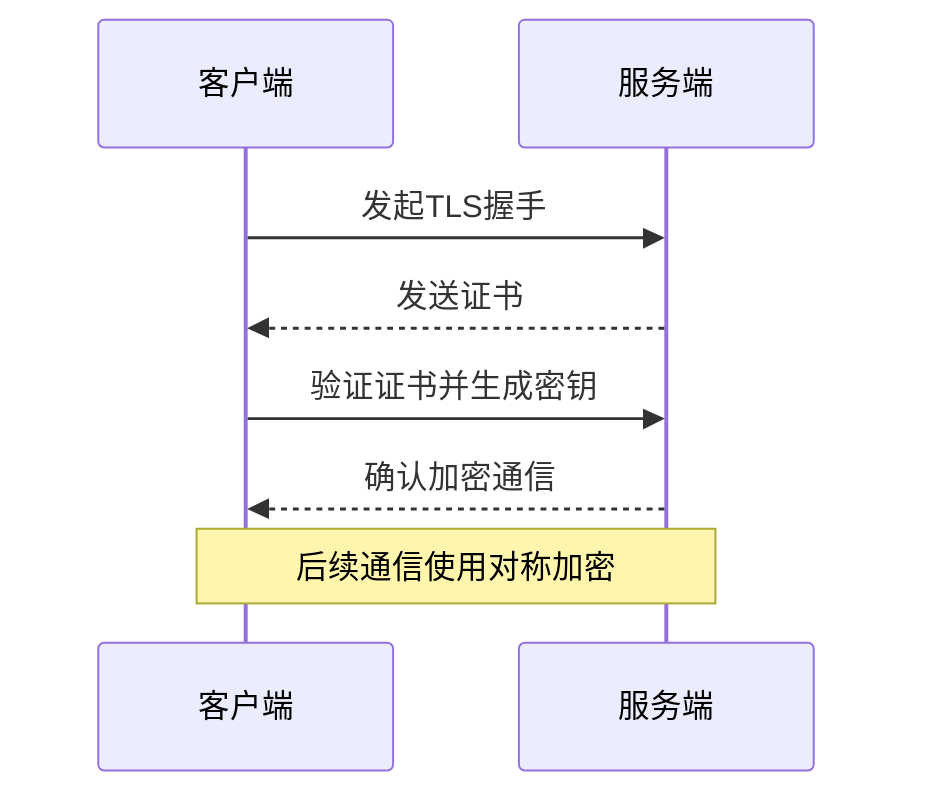

## 介绍

OpenTelemetry是一个开源的观测性框架，用于生成、收集和导出遥测数据（如指标、日志和跟踪）。在数据传输过程中，**加密**是确保敏感信息不被窃取或篡改的关键手段。本文将介绍如何在OpenTelemetry中配置加密传输（如TLS），并通过实际案例演示其应用。

:::note 为什么需要加密？
- 防止中间人攻击（MITM）。
- 保护敏感数据（如请求头、用户信息）。
- 满足合规性要求（如GDPR、HIPAA）。
:::

---

## 加密传输基础

OpenTelemetry支持通过**TLS/SSL**协议加密数据传输。以下是核心概念：

1. **TLS证书**：用于验证通信双方身份。
2. **密钥交换**：协商加密算法（如AES、RSA）。
3. **数据加密**：传输过程中数据以密文形式存在。



---

## 配置OpenTelemetry加密传输

### 1. 生成TLS证书
使用OpenSSL生成自签名证书（仅限测试环境）：
```bash
openssl req -x509 -newkey rsa:4096 -keyout key.pem -out cert.pem -days 365 -nodes
```

### 2. 配置OpenTelemetry Collector
修改Collector配置文件（`otel-collector-config.yaml`）启用TLS：
```yaml
receivers:
  otlp:
    protocols:
      grpc:
        tls:
          cert_file: cert.pem
          key_file: key.pem
exporters:
  otlphttp:
    endpoint: "https://example.com:4318"
    tls:
      insecure: false  # 生产环境必须设为false
```

### 3. 客户端代码示例（Python）
```python
from opentelemetry.exporter.otlp.proto.grpc.trace_exporter import OTLPSpanExporter
from opentelemetry.sdk.trace import TracerProvider
from opentelemetry.sdk.trace.export import BatchSpanProcessor

exporter = OTLPSpanExporter(
    endpoint="https://collector.example.com:4317",
    insecure=False,  # 启用TLS
    credentials=ChannelCredentials(credentials.ssl_channel_credentials())
)
tracer_provider.add_span_processor(BatchSpanProcessor(exporter))
```

---

## 实际案例：金融行业合规需求

**场景**：某银行需要将交易跟踪数据发送至中央监控平台，需符合PCI DSS标准。

**解决方案**：
1. 使用权威CA签发的证书（如DigiCert）。
2. 配置双向TLS（mTLS）验证：
   ```yaml
   receivers:
     otlp:
       protocols:
         grpc:
           tls:
             client_ca_file: ca.pem  # 验证客户端的CA证书
             require_client_cert: true
   ```

---

## 总结

- **必选项**：生产环境必须启用TLS，禁用`insecure`模式。
- **证书管理**：优先使用可信CA证书，自签名证书仅限测试。
- **进阶安全**：结合mTLS和网络策略（如防火墙规则）。

---

## 延伸学习

1. **练习**：尝试用Wireshark捕获未加密的OTLP流量，对比加密后的结果。
2. **资源**：
   - [OpenTelemetry安全文档](https://opentelemetry.io/docs/concepts/security/)
   - [TLS握手详解](https://www.cloudflare.com/learning/ssl/what-happens-in-a-tls-handshake/)