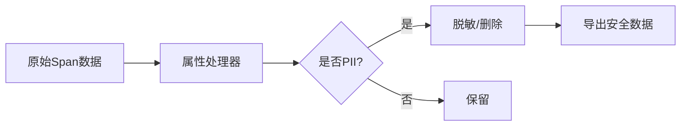

## 介绍

在分布式系统中，OpenTelemetry用于收集、处理和导出遥测数据（如跟踪、指标和日志）。当这些数据包含**个人身份信息（PII）**（例如用户ID、邮箱、IP地址等）时，必须谨慎处理以避免隐私泄露或合规风险。本文将介绍如何在OpenTelemetry中识别、过滤和保护PII。

:::note 什么是PII？
个人身份信息（PII）是指任何可以单独或结合其他数据识别特定个人的信息，例如：
- 姓名、地址、电话号码
- 邮箱、用户名
- IP地址、设备ID
:::

---

## PII处理的核心原则

### 1. 最小化收集
仅收集业务必需的数据。例如，如果不需要用户邮箱来诊断性能问题，则不应记录它。

### 2. 数据脱敏
对敏感字段进行脱敏处理（如哈希化、截断或替换）。OpenTelemetry提供了处理器来实现这一点。

### 3. 访问控制
确保只有授权人员可以访问原始数据（例如通过加密或权限管理）。

---

## 实践方法

### 方法1：使用属性处理器过滤PII
OpenTelemetry的处理器（如`attributes`处理器）可以删除或修改敏感属性。

```python
# 示例：Python SDK中配置属性处理器
from opentelemetry.sdk.trace.export import BatchSpanProcessor
from opentelemetry.sdk.trace import TracerProvider
from opentelemetry.sdk.resources import Resource
from opentelemetry import trace

# 创建处理器以删除"user.email"属性
span_processor = BatchSpanProcessor(
    exporter=ConsoleSpanExporter(),
    # 使用属性过滤器
    processor=SpanLimits(
        max_attributes=1000,
        max_events=1000,
        attribute_filter=lambda attr_key, attr_value: attr_key != "user.email"
    )
)

tracer_provider = TracerProvider(resource=Resource.create(), active_span_processor=span_processor)
trace.set_tracer_provider(tracer_provider)
```

### 方法2：日志数据脱敏
在日志中替换敏感信息（如用`***`替换邮箱）：

```go
// 示例：Go日志脱敏
import "go.opentelemetry.io/otel"

func logUserAction(userEmail string) {
    sanitizedEmail := "***" // 实际场景应使用正则或库脱敏
    otel.GetTracerProvider().
        Tracer("app").
        Start(ctx, "user_action").
        SetAttributes(attribute.String("user.email", sanitizedEmail))
}
```

---

## 实际案例

### 案例：电子商务平台的用户行为跟踪
假设一个电商平台需要跟踪用户点击行为，但需避免记录完整IP地址：

1. **问题**：原始数据包含 `{"user.ip": "192.168.1.100", "action": "click_product"}`。
2. **解决方案**：使用OpenTelemetry处理器将IP匿名化为 `{"user.ip": "192.168.1.0/24"}`。



---

## 总结与最佳实践

1. **审计数据流**：定期检查Span/Log中的属性，识别意外收集的PII。
2. **默认脱敏**：为敏感字段（如`user.*`）配置自动脱敏规则。
3. **合规检查**：确保符合GDPR、CCPA等法规要求。

:::warning 注意
即使数据在内部使用，也应假设它可能被意外导出（如调试日志或第三方服务）。
:::

---

## 扩展资源

1. [OpenTelemetry官方安全指南](https://opentelemetry.io/docs/concepts/security/)
2. [GDPR与遥测数据白皮书](https://ico.org.uk/)
3. 练习：尝试在本地OpenTelemetry项目中配置一个属性过滤器，阻止记录`credit_card`字段。