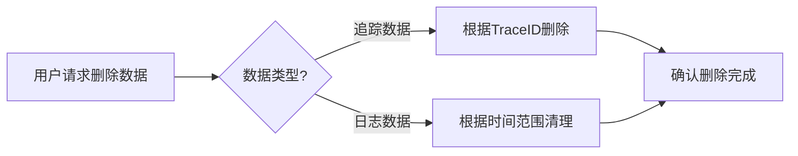

## 简介

OpenTelemetry 是一个开源的观测性框架，用于生成、收集和导出遥测数据（如指标、日志和追踪）。当这些数据涉及欧盟用户时，必须遵守《通用数据保护条例》（GDPR）。本文将介绍如何在OpenTelemetry中实现GDPR合规，包括数据处理原则、用户权利保障和实际配置示例。

## GDPR核心要求与OpenTelemetry

GDPR的关键原则包括：
1. **数据最小化**：仅收集必要数据。
2. **目的限制**：明确数据使用目的。
3. **存储限制**：数据保留时间不应超过必要期限。
4. **用户权利**：如访问权、被遗忘权等。

在OpenTelemetry中，需通过以下方式实现合规：

### 1. 数据过滤与脱敏
使用处理器（Processors）过滤或脱敏敏感数据。例如，移除HTTP请求中的`Authorization`头：

```python
from opentelemetry.sdk.trace import TracerProvider
from opentelemetry.sdk.trace.export import BatchSpanProcessor
from opentelemetry.sdk.trace.export import ConsoleSpanExporter
from opentelemetry.sdk.resources import Resource

# 自定义处理器（伪代码示例）
def sanitize_attributes(span):
    if "http.headers.authorization" in span.attributes:
        del span.attributes["http.headers.authorization"]

provider = TracerProvider(resource=Resource.create({"service.name": "gdpr-demo"}))
provider.add_span_processor(BatchSpanProcessor(ConsoleSpanExporter(), preprocess=sanitize_attributes))
```

### 2. 数据保留策略
在导出器中配置批处理间隔和队列大小，避免长期存储：

```yaml
# OpenTelemetry Collector配置示例
exporters:
  logging:
    logLevel: debug
  otlp:
    endpoint: "otlp.example.com:4317"
    timeout: 30s

service:
  pipelines:
    traces:
      exporters: [otlp, logging]
      processors: [batch]
      # 批处理配置
      batch:
        timeout: 5s
        send_batch_size: 100
```

## 实际案例：电商平台合规改造

**场景**：某电商平台使用OpenTelemetry追踪用户订单流程，需避免记录用户个人信息（如邮箱、地址）。

**解决方案**：
1. 在Span处理器中删除`user.email`属性：
   ```go
   // Go示例：属性过滤
   func filterAttributes(span sdktrace.ReadOnlySpan) sdktrace.ReadOnlySpan {
       attributes := make(map[string]interface{})
       for k, v := range span.Attributes() {
           if k != "user.email" {
               attributes[k] = v
           }
       }
       return span.WithAttributes(attributes...)
   }
   ```
2. 使用采样器降低数据量：
   ```python
   from opentelemetry.sdk.trace.sampling import TraceIdRatioBased
   sampler = TraceIdRatioBased(0.5)  # 仅采样50%的请求
   ```

## 用户权利保障

:::note
GDPR赋予用户以下权利，需在OpenTelemetry中支持：
- **访问权**：提供数据导出接口。
- **被遗忘权**：实现数据删除机制（如日志清理脚本）。
:::



## 总结与资源

### 关键点总结
- 使用处理器过滤敏感字段。
- 配置合理的批处理和采样策略。
- 实现用户数据访问和删除机制。

### 扩展练习
1. 尝试在本地OpenTelemetry Collector中配置一个脱敏处理器。
2. 编写脚本模拟根据TraceID删除特定追踪数据。

### 附加资源
- [GDPR官方指南](https://gdpr-info.eu)
- [OpenTelemetry安全文档](https://opentelemetry.io/docs/concepts/security/)