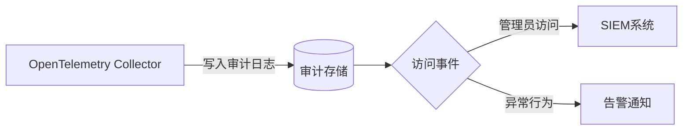

# OpenTelemetry HIPAA合规

## 介绍

HIPAA（健康保险流通与责任法案）是美国保护患者敏感健康信息的核心法规。当你在医疗健康领域使用OpenTelemetry（简称OTel）收集应用的可观测性数据（如日志、指标、追踪）时，必须确保这些数据不会泄露受保护的健康信息（PHI）。本文将介绍如何配置OpenTelemetry以满足HIPAA的基本要求。

:::note 关键术语
- **PHI (Protected Health Information)**：任何可关联到个体的健康信息，如姓名、病历号、诊断结果等。
- **OpenTelemetry Collector**：处理、转换和导出遥测数据的核心组件。
:::

---

## 1. 识别潜在的PHI风险

OpenTelemetry默认不会主动过滤数据，因此需检查以下可能包含PHI的字段：
- **Span Attributes**：HTTP请求路径（如`/patients/12345`）、数据库查询（如`SELECT * FROM patients WHERE name='Alice'`）
- **Logs**：错误消息中可能包含患者ID或诊断代码
- **Resource Attributes**：部署环境标签（如`hospital-prod`）

:::warning 示例：危险的Span属性
```json
// 非合规的Span属性示例
{
  "http.route": "/api/patients/789",
  "db.statement": "UPDATE records SET diagnosis='Diabetes' WHERE patient_id='789'"
}
```
:::

---

## 2. 数据脱敏与过滤

通过OpenTelemetry Collector的[处理器](https://opentelemetry.io/docs/collector/configuration/#processors)实现PHI过滤：

### 方案1：使用`attributes`处理器删除敏感字段
```yaml
# collector-config.yaml
processors:
  attributes/delete:
    actions:
      - key: "http.target"
        action: delete
      - key: "db.statement"
        action: delete
```

### 方案2：使用`transform`处理器替换敏感内容
```yaml
processors:
  transform/redact:
    log_statements:
      - context: span
        statements:
          - set(attributes["http.target"], replace_pattern(attributes["http.target"], "/patients/\\d+", "/patients/[REDACTED]"))
```

---

## 3. 安全传输与存储

HIPAA要求数据传输必须加密，存储需要访问控制：

### 启用TLS加密
```yaml
exporters:
  otlphttp:
    endpoint: "https://your-backend:4318"
    tls:
      cert_file: server.crt
      key_file: server.key
```

### 使用合规的存储后端
选择支持HIPAA的云服务商（如AWS/GCP的HIPAA认证服务），并配置最小权限访问。

---

## 4. 审计与访问控制



实现要求：
- 记录所有对PHI数据的访问
- 使用RBAC限制团队访问权限（如通过OpenTelemetry Collector的`bearertokenauth`扩展）
- 定期审查日志

---

## 实际案例：电子健康记录(EHR)系统

**场景**：一个医院预约系统需要监控API性能，但`/api/appointments`路径包含患者ID。

**解决方案**：
1. 在Span处理器中配置路径脱敏：
   ```yaml
   processors:
     transform/redact:
       log_statements:
         - context: span
           statements:
             - set(attributes["http.target"], replace_pattern(attributes["http.target"], "/api/appointments/\\d+", "/api/appointments/[REDACTED]"))
   ```
2. 使用加密导出到HIPAA兼容的日志服务（如Azure Log Analytics with HIPAA BAA）

---

## 总结

实现OpenTelemetry的HIPAA合规需要：
1. **识别**：扫描所有遥测数据中的潜在PHI
2. **脱敏**：使用处理器删除或替换敏感字段
3. **保护**：加密传输数据并选择合规存储
4. **监控**：实施审计日志和访问控制

---

## 延伸阅读
- [OpenTelemetry安全指南](https://opentelemetry.io/docs/concepts/security/)
- [HIPAA官方安全规则摘要](https://www.hhs.gov/hipaa/for-professionals/security/laws-regulations/index.html)
- [AWS HIPAA合规白皮书](https://aws.amazon.com/compliance/hipaa-compliance/)

## 练习
1. 在本地OpenTelemetry Collector中配置一个属性过滤器，删除所有`credit_card`字段
2. 使用`replace_all_patterns`处理器将日志中的电子邮件地址替换为`[REDACTED_EMAIL]`